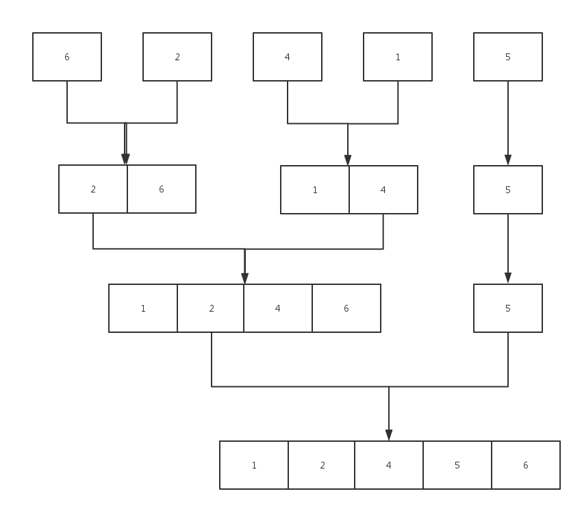

@[toc]

# 归并排序


原理如下:


我们发现**归并排序**原理就是:对原来**已经有序**的两个数组进行合并操作(取两个头部比较)后还是有序的.

简单的说归并排序就是:**从两个有序数组的头部开始取,谁小就取谁**

那我们的代码如下:

```c
#include <cstdio>

int a[] = {1,3,7};
int b[] = {2,5,6};
int tmp[100];

int merge(){
    int i=0,j=0;//i,j分别指向a,b的头部
    int k=0;//k是tmp数的下标
    int len_a = sizeof(a)/sizeof(a[0]); //a的长度
    int len_b = sizeof(b)/sizeof(b[0]);//b的长度

    while(i< len_a && j< len_b){
        if(a[i] < b[j]){
            tmp[k]=a[i];i++;k++;
        } else{
            tmp[k]=b[j];j++;k++;
        }
    }
    while(i<len_a) {tmp[k++] = a[i];i++;}; //复制a数组的剩余
    while(j<len_b) {tmp[k++] = b[j];j++;}; //复制b数组的剩余
}

int main(){
    
    merge();
    
    int i;
    int len_a = sizeof(a)/sizeof(a[0]); //a的长度
    int len_b = sizeof(b)/sizeof(b[0]);//b的长度
    for(i=0;i<len_a+len_b;i++)
        printf("%d ",tmp[i]);
    return 0;
}
```


这里有一个问题:如果我们的数组只有一个,如何使用归并排序?

很简单,我们只要把数组tmp里的值再赋值给原数组就可以了!




更好的演示:


完整的代码

```c
/* 
 *  算法思想:
 *      分治
 * */

#include <cstdio>

int a[] ={1,7,3,6,5,2};
int tmp[100]; //临时存储的中间数组

void merge_sort(int s,int t){
        //s =start t=T
    int mid,i,j,k;

    if(s==t) return ; //如果区间只有一个数,就返回

    mid = (s+t)>>1; //取中间的点
    merge_sort(s,mid);
    merge_sort(mid+1,t);
    
    i=s;
    j=mid+1;
    k=s;

    while(i<=mid && j<=t){
        if( a[i] <=a[j]){
            tmp[k]=a[i];k++;i++;
        } else {
            tmp[k]=a[j];j++;k++;
        }
    }

    while(i<=mid) { tmp[k]=a[i];k++;i++;}
    while(j<=t)   { tmp[k]=a[j];k++;j++;}

    for(i=s;i<=t;i++)
        a[i]=tmp[i];
}

int main()
{
    merge_sort(0,sizeof(a)/sizeof(a[0])-1);
    int i;
    for(i=0;i<sizeof(a)/sizeof(a[0]);i++)
        printf("%d ",a[i]);
    return 0;
}
```

核心代码
<!-- template start -->
```c
void merge_sort(int s,int t){
        //s =start t=T
    int mid,i,j,k;

    if(s==t) return ; //如果区间只有一个数,就返回

    mid = (s+t)>>1; //取中间的点
    merge_sort(s,mid);
    merge_sort(mid+1,t);
    
    i=s,k=s,j=mid+1;

    while(i<=mid && j<=t){
        if( a[i] <=a[j]){
            tmp[k]=a[i];k++;i++;
        } else {
            tmp[k]=a[j];j++;k++;
        }
    }

    while(i<=mid) { tmp[k]=a[i];k++;i++;}
    while(j<=t)   { tmp[k]=a[j];k++;j++;}

    for(i=s;i<=t;i++)
        a[i]=tmp[i];
}
```
<!-- template end -->


# 归并排序求逆序对
归并排序是将数列a[l,h]分成两半a[l,mid]和a[mid+1,h]分别进行归并排序，然后再将这两半合并起来。

在合并的过程中（设`l<=i<=mid，mid+1<=j<=h`），当`a[i]<=a[j]`时，并不产生逆序数；当`a[i]>a[j]`时，在前半部分中比a[i]大的数都比a[j]大，将a[j]放在a[i]前面的话，逆序数要加上mid+1-i。因此，可以在归并排序中的合并过程中计算逆序数.

## 代码

题目[luogu1908](https://www.luogu.org/problemnew/show/1908)


```c
#include <cstdio>

#define N 40010
int n;
int a[N];
int tmp[N]; //临时存储的中间数组
int cnt = 0; //计数

void merge_sort(int s,int t){
        //s =start t=T
    int mid,i,j,k;

    if(s==t) return ; //如果区间只有一个数,就返回

    mid = (s+t)>>1; //取中间的点
    merge_sort(s,mid);
    merge_sort(mid+1,t);

    i=s;
    j=mid+1;
    k=s;

    while(i<=mid && j<=t){
        if( a[i] <=a[j]){
            tmp[k]=a[i];k++;i++;
        } else {
            tmp[k]=a[j];j++;k++;
            cnt += mid - i + 1;
        }
    }

    while(i<=mid) { tmp[k]=a[i];k++;i++;}
    while(j<=t)   { tmp[k]=a[j];k++;j++;}

    for(i=s;i<=t;i++)
        a[i]=tmp[i];
}

int main()
{
    scanf("%d",&n);
    int i;
    for(i=1;i<=n;i++)
        scanf("%d",&a[i]);
    merge_sort(1,n);

    printf("%d",cnt);
    return 0;
}

```

## 练习题目

 - luogu P1116 车厢重组
 - luogu P1309 瑞士轮 
 - luogu P1626 象棋比赛 
 - [排序工作量之新任务](https://www.luogu.org/problemnew/show/2528)
 - [最接近神的人_NOI导刊2010提高](https://www.luogu.org/problemnew/show/1774)
 - [火柴排队](https://www.luogu.org/problemnew/show/1966)
