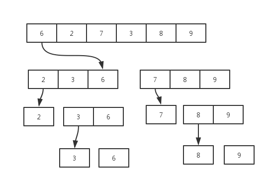
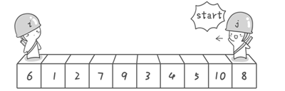
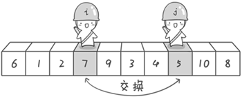
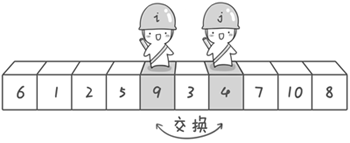
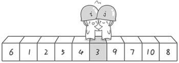
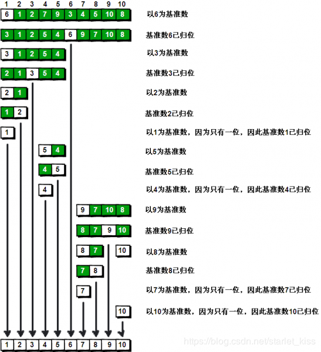
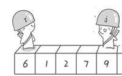
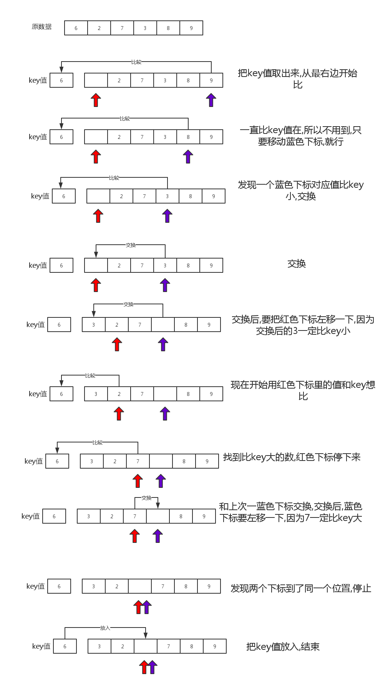

## 基本思想

**快速排序的基本思想:** 通过一趟排序将数组分成两个部分,其中一个部分都比**关键字**小,另一个部分都比**关键字**大,然后再分别对这两部分进行这种操作,最后就可以达到全部有序.通常我们取待排序部分的第一个值为**关键字**.



## 快速排序

假设我们现在对`6 1 2 7 9 3 4 5 10 8`这个10个数进行排序。首先在这个序列中随便找一个数作为基准数（不要被这个名词吓到了，就是一个用来参照的数，待会你就知道它用来做啥的了）。为了方便，就让第一个数6作为基准数吧。接下来，需要将这个序列中所有比基准数大的数放在6的右边，比基准数小的数放在6的左边，类似下面这种排列。

$$
3\ 1\ 2\ 5\ 4\ 6\ 9\ 7\ 10\ 8
$$

在初始状态下，数字$6$在序列的第$1$位。我们的目标是将$6$挪到序列中间的某个位置，假设这个位置是$k$。现在就需要寻找这个$k$，并且以第$k$位为分界点，左边的数都小于等于$6$，右边的数都大于等于$6$。想一想，你有办法可以做到这点吗？


方法其实很简单：分别从初始序列`6  1  2 7  9  3  4  5 10  8`两端开始“探测”。先从右往左找一个小于6的数，再从左往右找一个大于6的数，然后交换他们。这里可以用两个变量$i$和$j$，分别指向序列最左边和最右边。我们为这两个变量起个好听的名字“哨兵$i$”和“哨兵$j$”。刚开始的时候让哨兵i指向序列的最左边（即i=1），指向数字6。让哨兵j指向序列的最右边（即j=10），指向数字8



首先哨兵$j$开始出动。因为此处设置的基准数是最左边的数，所以需要让哨兵$j$先出动，这一点非常重要（请自己想一想为什么）。哨兵$j$一步一步地向左挪动（即$j--$），直到找到一个小于$6$的数停下来。接下来哨兵$i$再一步一步向右挪动（即$i++$），直到找到一个数大于$6$的数停下来。最后哨兵$j$停在了数字$5$面前，哨兵$i$停在了数字$7$面前。

现在交换哨兵i和哨兵j所指向的元素的值。交换之后的序列如下。





到此，第一次交换结束。接下来开始哨兵$j$继续向左挪动（再友情提醒，每次必须是哨兵$j$先出发）。他发现了$4$（比基准数$6$要小，满足要求）之后停了下来。哨兵$i$也继续向右挪动的，他发现了$9$（比基准数$6$要大，满足要求）之后停了下来。此时再次进行交换，交换之后的序列如下。



第二次交换结束，“探测”继续。哨兵j继续向左挪动，他发现了3（比基准数6要小，满足要求）之后又停了下来。哨兵i继续向右移动，糟啦！此时哨兵i和哨兵j相遇了，哨兵i和哨兵j都走到3面前。说明此时“探测”结束。我们将基准数6和3进行交换。交换之后的序列如下。




到此第一轮“探测”真正结束。此时以基准数6为分界点，6左边的数都小于等于6，6右边的数都大于等于6。回顾一下刚才的过程，其实哨兵j的使命就是要找小于基准数的数，而哨兵i的使命就是要找大于基准数的数，直到i和j碰头为止。


 OK，解释完毕。现在基准数6已经归位，它正好处在序列的第6位。此时我们已经将原来的序列，以6为分界点拆分成了两个序列，左边的序列是“3  1 2  5  4”，右边的序列是“9  7  10  8”。接下来还需要分别处理这两个序列。因为6左边和右边的序列目前都还是很混乱的。不过不要紧，我们已经掌握了方法，接下来只要模拟刚才的方法分别处理6左边和右边的序列即可。现在先来处理6左边的序列现吧。

左边的序列是“3  1  2 5  4”。请将这个序列以3为基准数进行调整，使得3左边的数都小于等于3，3右边的数都大于等于3。好了开始动笔吧。

如果你模拟的没有错，调整完毕之后的序列的顺序应该是。
$$
2\ 1\ 3\ 5\ 4
$$

OK，现在3已经归位。接下来需要处理3左边的序列“2 1”和右边的序列“5 4”。对序列“2 1”以2为基准数进行调整，处理完毕之后的序列为“1 2”，到此2已经归位。序列“1”只有一个数，也不需要进行任何处理。至此我们对序列“2 1”已全部处理完毕，得到序列是“1 2”。序列“5 4”的处理也仿照此方法，最后得到的序列如下。
1  2  3 4  5  6 9  7  10  8

对于序列“9  7  10  8”也模拟刚才的过程，直到不可拆分出新的子序列为止。最终将会得到这样的序列，如下。
1  2  3 4  5  6  7  8 9  10
    到此，排序完全结束。细心的同学可能已经发现，快速排序的每一轮处理其实就是将这一轮的基准数归位，直到所有的数都归位为止，排序就结束了。下面上个霸气的图来描述下整个算法的处理过程。




快速排序之所比较快，因为相比冒泡排序，每次交换是跳跃式的。每次排序的时候设置一个基准点，将小于等于基准点的数全部放到基准点的左边，将大于等于基准点的数全部放到基准点的右边。这样在每次交换的时候就不会像冒泡排序一样每次只能在相邻的数之间进行交换，交换的距离就大的多了。因此总的比较和交换次数就少了，速度自然就提高了。当然在最坏的情况下，仍可能是相邻的两个数进行了交换。因此快速排序的最差时间复杂度和冒泡排序是一样的都是O(N2)，它的平均时间复杂度为O(NlogN)。


### 代码

```c
<%-include("qs_normal.cpp")%>
```

### 为什么要从右边开始



如上图，6在左，9在右  我们将6作为基数。

假设从左边开始（与正确程序正好相反）
```c
while (nums[i] <= index && i < j) { 
    i++; 
}
while (nums[j] >= index && j > i) {
    j--;
}
```


按照这个代码逻辑，走一遍，i 就会移动到现在的 数字 7 那个位置停下来，而  j 原来在 数字 9 那个位置

于是，j 也会停留在数字7 那个位置，然后 i == j了，这时候交换基准数和nums[i]

交换后的数组为：`7 1 2 6 9`

这时候，你会发现问题来了，这结果不对呀！！！

问题在于当我们先从在边开始时，**那么i所停留的那个位置肯定是大于基数6的**

而在上述例子中，为了满足 i<j 于是 j也停留在7的位置，但最后交换回去的时候，7就到了左边

不行，因为我们原本 交换后数字6在边应该是全部小于6，右边全部大于6，但现在不行了。

所以，我们必须从右边开始，**也就是从基准数的对面开始**。


## 快速排序-优化(更快)


我们能不能把步骤想的更具体一点,怎么样做才能把数分成这样的两个部分?



上面的图片解释了一趟快速排序的原理,如果你有足够的想想象力,可以把红色,蓝色下标想象成两个**机器人,它们不停的移动去判断值,一但符合条件,就把箱子里的值仍给另一个机器人,自己停止,另一个机器人又开始工作**,这样的不停往返的下去,就可以把数分成两个部分了.


快速排序代码

```c
/* 
 *   快速排序本质:
 *      用key值,把数据分成两个部分,一部分比较key小,一部分比key大
 * */

#include <cstdio>

int a[]={6,2,7,3,8,9};

void quicksort(int l,int r){
    if( l < r) {
    int s=l,t=r;
    int key =a[l]; // 取第一个值为key
    
    while(s < t){
        while( s <t && a[t] >= key) --t;// 如果a[t] >= key,t下标不停变小,直到a[t] < key
        if(s < t) a[s++] = a[t];        //停下来的时候,看一看,是不是到中点,如果不是 交换值
        while(s<t && a[s] <= key) ++s;  //如果a[s] <= key  s的下标不停变大,直到a[s] > key
        if(s<t ) a[t--] = a[s];         //停下来的时候,看一看,是不是到了中点,如果不是,交换值
    }
    a[s] = key;  //上面while停止的时候,一定是s ==t
    quicksort(l,s-1);
    quicksort(s+1,r);
}
}

int main(){
    int len_a = sizeof(a)/sizeof(a[0]);
    quicksort(0,len_a-1);
    return 0;
}

```


## 练习题目

 - luogu P3887 [GDOI2014]世界杯
 - luogu P2909 [USACO08OPEN]牛的车Cow Cars
 - luogu 三值的排序 Sorting a Three-Valued Sequence
 - luogu P2920 [USACO08NOV]时间管理Time Management 
 - luogu P2777 [AHOI2016初中组]自行车比赛
 - luogu P2878 [USACO07JAN]保护花朵Protecting the Flowers USACO 2007 普及/提高-
 - luogu P3111 [USACO14DEC]牛慢跑Cow Jog_Sliver
 - luogu P2255 [USACO14JAN]记录奥林比克Recording the M…

## 参考

 - [快速排序（过程图解 参考啊哈算法）](https://blog.csdn.net/starlet_kiss/article/details/86010904)
 - [快速排序法为什么一定要从右边开始的原因](https://blog.csdn.net/lkp1603645756/article/details/85008715)
