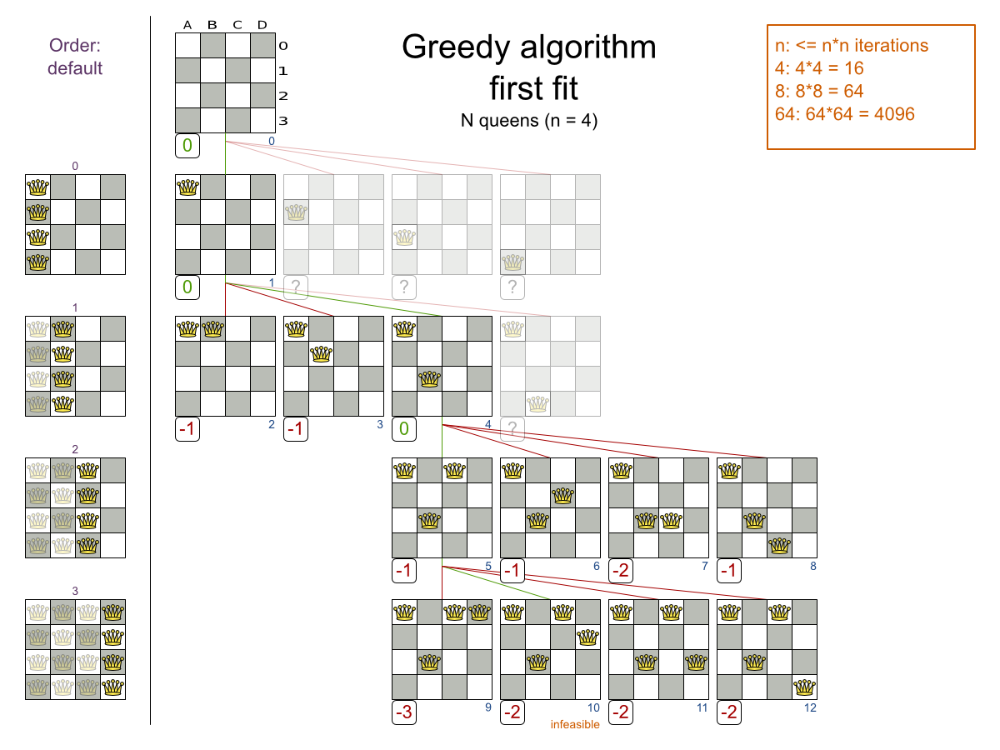
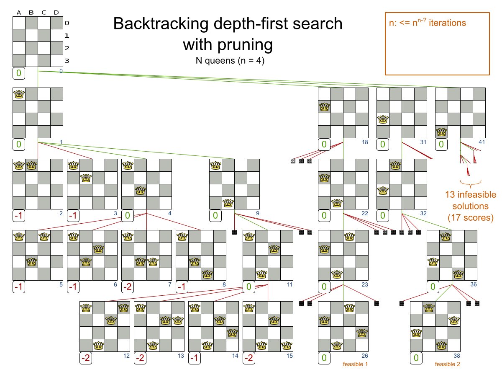

@[toc]


## 八皇后


## 题目描述

八皇后问题，是一个古老而著名的问题，是回溯算法的典型案例。该问题是国际西洋棋棋手马克斯·贝瑟尔于1848年提出：在`8×8`格的国际象棋上摆放八个皇后，使其不能互相攻击，即任意两个皇后都不能处于同一行、同一列或同一斜线上，问有多少种摆法。

高斯认为有76种方案。1854年在柏林的象棋杂志上不同的作者发表了40种不同的解，后来有人用图论的方法解出92种结果。计算机发明后，有多种计算机语言可以解决此问题。


[4/8皇后的游戏与演示](https://friendly-borg-fff51b.netlify.com/#/)

## 思考

因为8皇后的可能性太多了,我们考虑少一点的4皇后.



上图表达了搜索尝试的过程:**先放第0列,然后放第1列,第2列,第3列.**如果某一列可以放下去,那就在此基础上去深度下一列



## 代码1: 找出总方案数


```c
/* 8皇后-DFS算法 -by Rainboy 2018-04-03 17:10 */
#include <cstdio>

#define queen_size 8 //queen的数量
int n;
int map[100][100] = {0}; //棋盘,0表示没有queen
int cnt = 0; //记录共有多少方案数

bool hang[100] ={0}; //标记第i行是否有queen
bool lie[100] ={0};  //标记第i列是否有queen
bool xie1[100] ={0};  //标记 / 行否有queen
bool xie2[100] ={0};  //标记 \ 行否有queen


// 放置queen在(x,y),设置对应的标记
void set(int x,int y){
    hang[x]= 1; lie[y] = 1;
    xie1[x+y] = 1; xie2[x-y+n] =1;
}

// 取消放置queen在(x,y),设置对应的标记
void un_set(int x,int y){
    hang[x]= 0; lie[y] = 0;
    xie1[x+y] = 0; xie2[x-y+n] =0;
}


// 坐标x,y 能否放queen
bool is_right(int x,int y){
    if( hang[x] == 0 && lie[y] == 0 && xie1[x+y] ==0 && xie2[x-y+n] == 0)
        return true;
    return false;
}


//参数x 表示在第x行尝试放一个queen
void dfs(int x){
    if(x > n){ // 边界:来到n+1行,表示前n行都放好了
        cnt++; //记录一次成功的方案
        return ;
    }
    int i;
    for(i = 1;i <= n;i++){
        if( is_right(x,i)){ //可以放
            set(x,i);
            dfs(x+1);
            un_set(x,i);
        }
    }
}


int main(){
    scanf("%d",&n);//读取 queen的数量
    dfs(1);
    printf("the total : %d\n",cnt);
    return 0;
}
```


## 代码2:输出所有的方案


```c
/* 8皇后-DFS算法 -by Rainboy 2018-04-03 17:10 */
/* 输出所有的方案 */
#include <cstdio>

#define queen_size 8 //queen的数量
int n;
int map[100][100] = {0}; //棋盘,0表示没有queen
int cnt = 0; //记录共有多少方案数

bool hang[100] ={0}; //标记第i行是否有queen
bool lie[100] ={0};  //标记第i列是否有queen
bool xie1[100] ={0};  //标记 / 行否有queen
bool xie2[100] ={0};  //标记 \ 行否有queen


// 放置queen在(x,y),设置对应的标记
void set(int x,int y){
    hang[x]= 1; lie[y] = 1;
    xie1[x+y] = 1; xie2[x-y+n] =1;
}

// 取消放置queen在(x,y),设置对应的标记
void un_set(int x,int y){
    hang[x]= 0; lie[y] = 0;
    xie1[x+y] = 0; xie2[x-y+n] =0;
}


// 坐标x,y 能否放queen
bool is_right(int x,int y){
    if( hang[x] == 0 && lie[y] == 0 && xie1[x+y] ==0 && xie2[x-y+n] == 0)
        return true;
    return false;
}

void print_map(){
    int i,j;
    for(i=1;i<=n;i++){
        for(j=1;j<=n;j++){
            printf("%d",map[i][j]);
        }
        printf("\n");
    }
    printf("\n"); printf("\n"); printf("\n"); printf("\n");
}


//参数x 表示在第x行尝试放一个queen
void dfs(int x){
    if(x > n){ // 边界:来到n+1行,表示前n行都放好了
        cnt++; //记录一次成功的方案
        printf("%d\n",cnt);
        print_map();
        return ;
    }
    int i;
    for(i = 1;i <= n;i++){
        if( is_right(x,i)){ //可以放
            set(x,i);
            map[x][i] = 1;
            dfs(x+1);
            map[x][i] = 0;
            un_set(x,i);
        }
    }
}


int main(){
    scanf("%d",&n);//读取 queen的数量
    dfs(1);
    printf("the total : %d\n",cnt);
    return 0;
}
```

## 作业

 - [luogo-八皇后](https://www.luogu.org/problemnew/show/P1219)

## luogo-八皇后 代码

```c
#include <cstdio>

int n;
int map[20][20];

int cnt = 0; // 记录答案数
int zong=0; //输出了几个答案

bool lie[20] ={0};
bool xie1[100] = {0};
bool xie2[100] = {0}; // +20


int stack[20];
int idx=0; //表示栈顶的位置

void push(int i){
    stack[idx++] = i;
}

void pop(){
    idx--;
}

void print_stack(){
    int i;
    for(i=0;i<idx;i++){
        printf("%d ",stack[i]);
    }
    printf("\n");
}


bool kyf(int x,int y){
    if( lie[y] == 0 && xie1[x+y] == 0 && xie2[x-y+20] == 0)
        return true;
    return false;
}

void set(int x,int y){
    lie[y] =1; xie1[x+y] = 1; xie2[x-y+20] = 1;
}

void unset(int x,int y){
    lie[y] =0; xie1[x+y] = 0; xie2[x-y+20] = 0;
}

void dfs(int h){ //从哪一行开始放

    if( h > n){
        cnt++;
        if(zong < 3){
            print_stack();
            zong++;
        }
        return;
    }

    int i;
    for(i=1;i<=n;i++){
        if(kyf(h,i)){
            set(h,i);
            push(i);
            dfs(h+1);
            pop();
            unset(h,i);
        }
    }

}

int main(){
    scanf("%d",&n);
    dfs(1);
    printf("%d",cnt);
    return 0;
}

```

## 状态压缩

具体看 `其它算法/状态压缩/八皇后`
