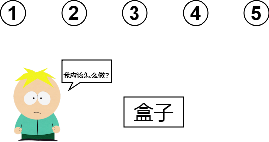

## 题目一:组合

### 题目描述

现在有n(n<=20)个不同的编号的球,编号`1->n`,Butters手里有1个盒子,他想选`k`个球,问有多少种选法,并按字典序输出

**注意:**只要结果一样,选球的顺序没有关系.例如选`1,2`和`2,1`一样的



### 输入格式

一行两个数n,k


### 输出格式

第一行输出多少种选法x,然后输出x行的选法.

### 样例输入

```
3 2
```

### 样例输出

```
3
1 2
1 3
2 3
```

### 思路解析

这个题目的本质是组合:从`n`个数里选`k`个数,不考虑顺序,结果有多少种?

你先在纸上写的4个数$$1,2,3,4$$选$$2$$个的组合

```c
1 2
1 3
1 4
2 3 
2 4
3 4
```

你应该发现了:为了避免出现选了$$1,2$$,然后再选$$2,1$$的情况(重复),**你选的数的位置应该在前一个选的数的位置的后面**,你可以自己列出一些数据在纸上验证一下

**感性的理解:**如果选2个数,你可以想象成有2个Butters依次去选球,每个Butters选一个球,**第2个Butters必须在第1个Butters选球的位置的后面的位置去选**

### 难点:选第x个数的时候,可选的下标范围?


```math
n-k+step
```


### 代码

```c
#include <cstdio>

int a[100]; //选的数
int b[100]; //原来的数字
int n,k;
int ans=0;

//idx 从这个下标开始选
//step 正选第几个数
void dfs(int idx,int step){
    int i;
    if( step ==k+1){ // 边界,到k+1 说明已经选了k个数
        //输出结果
        for(i=1;i<=k;i++)
            printf("%d ",a[i]);
        printf("\n");
        return ;
    }

    for(i=idx;i<=n-k+step;i++){
        a[step] = b[i]; //记录选的数
        //从idx+1开始,选第step+1个数
        dfs(i+1,step+1);
    }
}

//计算结果数
void dfs1(int idx,int step){
    int i;
    if( step ==k+1){ // 边界,到k+1 说明已经选了k个数
        ans++;
        return ;
    }

    for(i=idx;i<=n-k+step;i++){
        a[step] = b[i]; //记录选的数
        //从idx+1开始,选第step+1个数
        dfs1(i+1,step+1);
    }
}
int main(){
    scanf("%d%d",&n,&k);
    int i,j;
    for(i=1;i<=n;i++)
        b[i] = i; //要选的数
    dfs1(1,1);
    printf("%d\n",ans);
    dfs(1,1);
    return 0;
}

```

## 题目二:全组合

### 题目描述 

现在Butters想知道分别选$$1,2,...n$$个球的方法加起来有多少?

### 思路1

### 思路1的优化

根据公式:

```math
C_n^k =C_n^{n-k}
```

### 思路2:

如何题目要求按字典序输出,例如按字典序输出$$1,2,3$$的全排列(不输出空集).

那么答案是:

```
1
1 2
1 2 3
1 3
2
2 3
3
```

怎么样才能实现?

你找两个同学玩一个游戏,规则如下:

 1. 说出前面的人已经选的数
 2. 选剩下的第一个数
 3. 选剩下的第二个数
 4. ....
 5. 选剩下的最后一个数结束

假如有三个人:分别是$$1,2,3$$

### 代码

```c
/* 不使用数组 */
#include <cstdio>

//输出1->n的全组合
int n;
int choose[100]; //已经选过的数

//v代表可以选的最小值,depth代表深度
void dfs(int v,int depth){
    int i;
    //先说出来
    for(i=1;i<depth;i++)
        printf("%d ",choose[i]);

    if( depth != 1) //最开始的空集不输出
        printf("\n");

    //选数
    for(i=v;i<=n;i++){
        choose[depth] = i;
        dfs(i+1,depth+1);
    }
}

int main(){
    n =3;
    dfs(1,1);
    return 0;
}
```

有一组元素:`S A C`,输出它们的排列,规定位置在前的小.


```c
/* 不使用数组 */
#include <cstdio>

//输出1->n的全组合
int n;

char a[] = {0,'S','A','C'};
char choose[100]; //已经选过的数

//v代表可以选的最小值,depth代表深度
void dfs(int v,int depth){
    int i;
    //先说出来
    for(i=1;i<depth;i++)
        printf("%c ",choose[i]);
    if( depth != 1)
        printf("\n");

    //选数
    for(i=v;i<=n;i++){
        choose[depth] = a[i]; //只要这里变一点
        dfs(i+1,depth+1);
    }
}

int main(){
    n =3;
    dfs(1,1);
    return 0;
}
```
