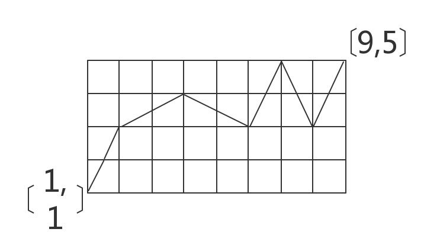
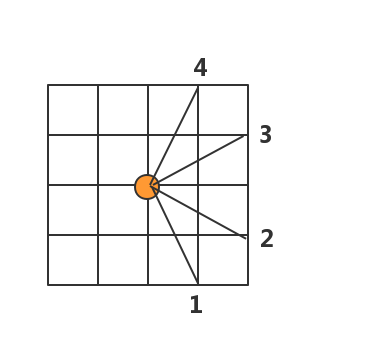

## 骑士遍历1:

### [问题描述]

在下面的棋盘上，从起点A出发,达到B点.输出一条路径.注意:骑士按象棋中的`马走日`的规则走,方向只能向右且尝试的顺序为下图所示:1,2,3,4.
输入两个值x,y代表终点B的坐标,起点A的坐标为(1,1).输出路径(每一次走的方向)





### 题目分析

题目本身很简单.因为有4个方法,所以我们设4个方向的量为:

```c
int fx[4][2] = {{1,-2},{2,-1},{2,1},{1,2}};
```

### 代码:


```c
#include <cstdio>

int fx[4][2] = {{1,-2},{2,-1},{2,1},{1,2}};
int x,y;//终点
int stack[100];//存路径
int size=0;

bool dfs(int x1,int y1){

    if(x1 == x && y1 == y) //到终点
        return true;
    int i;
    
    for(i=0;i<4;i++){
        int nx = x1+fx[i][0];
        int ny = y1+fx[i][1];
        if(nx <= x && ny <= y && nx >=1 && ny >=1) //在内部
        {
            stack[++size] = i+1;
            if( dfs(nx,ny))
                return true;
        }
    }
    size--;
    return false;
}

int main(){
    scanf("%d%d",&x,&y);
    
    dfs(1,1);
    int i;
    for(i=1;i<=size;i++)
        printf("%d ",stack[i]);
    return 0;
}
```

### 骑士遍历1的剪枝优化:

如果数据规模很大的时候,上面的代码一定会超时.

根据`马走日`的特点我们发现:如果向上的剩余步数大于2倍的向右的步数时,无解.我们可以利用这个来进行剪枝优化.

```c
#include <cstdio>

int fx[4][2] = {{1,-2},{2,-1},{2,1},{1,2}};
int x,y;//终点
int stack[100];//存路径
int size=0;


bool dfs(int x1,int y1){

    if(x1 == x && y1 == y) //到终点
        return true;
    int i;
    
    for(i=0;i<4;i++){
        int nx = x1+fx[i][0];
        int ny = y1+fx[i][1];
        if(nx <= x && ny <= y && nx >=1 && ny >=1) //在内部
        {
            if(y-ny > 2*(x-nx)) //无解的情况,不需要往下去算了
                continue;
            stack[++size] = i+1;
            if( dfs(nx,ny))
                return true;
        }
    }
    size--;
    return false;
}

int main(){
    scanf("%d%d",&x,&y);
    
    dfs(1,1);
    int i;
    for(i=1;i<=size;i++)
        printf("%d ",stack[i]);
    return 0;
}
```
[============]

## 问题2


## 问题3

## 说明

抄自`<<算法竞赛宝典>>`
