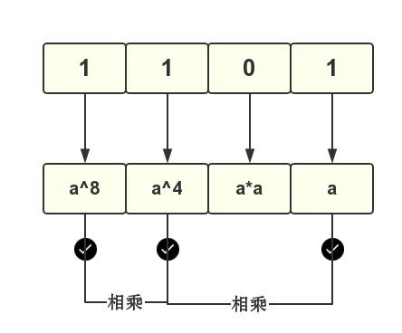

# 快速幂

## 问题

如何求$$a^n$$ 其中$$n$$很大,怎么求最快.


## 朴素写法

不停的乘$$a$$

```c
s=1;
for(i=1;i<=n;i++)
	s=s*a;
```

## 朴素快速幂

我们当然可以写的更快,根据公式:$$a^{2n} = a^n \times a^n$$,例如

这种利用的是二分思想

 - $$2^{13}$$可以写成递归的形式
  - $$2^{13} = 2^1 \times 2^6 \times 2^6 $$	第一层
  - $$2^6 = 2^3 \times 2^3 $$ 第二层
  - $$2^3 = 2 \times 2^2 $$ 第三层
  - $$2^2 = 2^1 \times 2^1$$ 第四层
  - $$2^1 = 2 $$ 边界 


所以我们可以总结出下面的递归的方程:

```math

a^n = \left\{\begin{matrix}
 a &n =1 \\ 
a ^{n/2} \times a^{n/2} & n \bmod 2= 0 \\
a ^{n/2} \times a^{n/2} \times a & n \bmod 2= 1
\end{matrix}\right.
```

**代码:**
```c
typedef long long LL;

/* 求a^b*/
LL pow(LL a, LL b){
	if(b == 1)
		return a;
		
	LL c = pow(a,b>>1);//递归,得出分成一半的值
	if(b & 1 ==0) //判断奇偶性
		return c*c;
	else
		return c*c*a;

}
```

## 位优化的快速幂

我们知道任何整数都可以写成2进制的形式,如果我们把指数写成2进制的形式,会形成什么规律?


```math
a^{13} = a^{1101} = a^{1000} \times a^{100} \times a^{00} \times a^{1}
```

也就是这样：

```math
a^{13} = a^{1101} = a^{2^3} \times a^{2^2} \times a^{0} \times a^1 
```


```math
a^{13} = a^{1101} = 1a^{8} \times 1a^{4} \times 0a^{2} \times 1a^1  
```

从低往高看，你就看到了规律：a不停的倍增,二进制的对应位决定了**乘还是不乘**

<center><strong>
一句话算法(口决):是1就乘,base增增
</center></strong>



**如何从低到高输出$$n$$的二进制的各位数字?**
```c
int n=初始值;
for(;n;n=n>>1){
    if(n & 1)
        printf("1 ");
    else
        printf("0 ");
}
```


```c
typedef long long LL;

/* 求 a^n */
LL pow(LL a,LL n){
	LL base = a;
	LL ret =1;

	for(; n ; n = n >> 1){
		if(n & 1)//取最低位, 是不是很像判断奇偶
			ret = ret * base; //是1就乘
		base = base*base;     //base增增
	}

	return ret;
}
```

ps:快速幂算法可以用在**一个数同时被乘以多次的问题**


## 快速幂取余


根据`mod`公式:

```math
(a \times b)\ mod\ p= (a\ mod\ p \times\ b\ mod\ p )\ mod\ p
```

我们只要稍微改一下上面的代码就ok了

```c
typedef long long LL;
/* 求 a^n */
LL pow(LL a,LL n,LL p){
	LL base = a;
	LL ret =1;
	
	for( ;n ;n=n >> 1){
		if(n & 1)//取最低位, 是不是很像判断奇偶
			ret = ret * base % p;
		base = base*base % p;
	}

	return ret % p;
}
```

## 练习题目

 -  P1226 【模板】快速幂||取余运算
