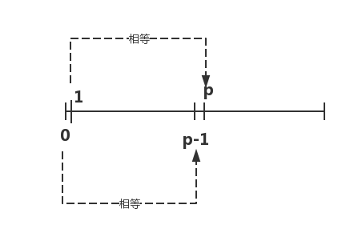

# BSGS baby steps giant steps


## 引入

### 问题描述

有如下公式:

```math
a^x \equiv b( \bmod p)
```
其中$$a,b,p$$为正整数,$$p$$为素数,求出最小的非负整数$$x$$

### 样例输入


```
2 15 17
```


### 样例输出

```
5
```


## 分析

### 阶段一: 

首先我们证明:

```math
a^{k \bmod p-1} \equiv a^k(\bmod p)
```

我们写出公式:

根据费马小定理:当$$p$$为素数且$$gcd(a,b)=1$$(互质)时:

```math
a^{p-1} \equiv 1(\bmod p)
```

也就是说下面公式成立:

```math
(a^{p-1})^m \equiv 1(\bmod p)
```

根据:**除以一个数取模等于乘以这个数的逆元取模**,$$(a^{p-1})^m$$的逆元为$$1$$,那么下面公式成立:

```math
\frac{a^k}{a^{m(p-1)}} \equiv a^k \cdot (\bmod p)
```

也就是说:

```math
a^{k-m(p-1)} \equiv a^k(\bmod p)
```

那就是说:

```math
a^{k \bmod p-1} \equiv a^k(\bmod p)
```

最终说明:当$$p$$为素数且$$gcd(a,b)=1$$(互质)时,$$a^k \bmod p$$的值是循环的,循环范围是$$[0,p-1]$$,下证

```math
\begin{matrix}
a^{p} = a^{p \bmod p-1} \bmod p = a^{1} \\
a^{p-1} = a^{p-1 \bmod p-1} = a^{0}
\end{matrix}
```



### 阶段二

我们令$$x=i \cdot m -j,m=\left \lceil  \sqrt{p}\right \rceil$$,得到

```math
a^{im-j} \equiv b(\bmod\ p)
```

移项:

```math
(a^m)^i \equiv b\cdot a^j(\bmod\  p)
```


当$$i,j$$取值如下时,我们得到以下表格,其中显然$$m^2 =p $$

| i   | j     | i*m-j                        |
|-----|-------|------------------------------|
| 1   | [0,m] | [m,m-1,m-2,....0]            |
| 2   | [0,m] | [2m,2m-1,2m-2,...m]          |
| 3   | [0,m] | [3m,3m-1,3m-2,...2m]         |
| ... | ...   | ...                          |
| m   | [0,m] | [m^2,m^2-1,m^2-2,...m*(m-1)] |

这表示$$i$$取$$[1,m]$$,$$j$$取$$[0,m]$$后,$$i\cdot m -j$$的取值是$$[0,p]$$,又加上公式$$ (a^m)^i \equiv b\cdot a^j(\bmod\  p)$$,我们可以**先枚举$$b \cdot a^j \bmod p$$的值,存到hash表中,然后枚举$$(a^m)^i \bmod p$$的值,如果到hash表中找到对应的值,那这个时候对应的j和i就是最小x值$$i\cdot m -j $$**

注意:因为我们在写代码的时候m是`sqrt(b)`向上取整,所以我们算出的$$i \cdot m -j$$ 有可能会超过p,所以我们最终结果要$$(i \cdot m -j) \bmod p$$


## 代码

```c
#include <cstdio>
#include <cmath>
#include <map>

using namespace std;

typedef long long ll;

map<ll,int> hash_table;

ll a,b,p,ans;

ll quick_pow(ll a,ll b){
    ll ret=1; 
    ll base =a;
    for( ;b;b = b >>1){
        if( b & 1)
            ret =ret * base %p;
        base = base *base %p;
    }
    return ret %p;
}


int main(){
    scanf("%lld%lld%lld",&a,&b,&p);
    if( a % p == 0 ){ // 不互质 没有解
        printf("No Solution.");
        return 0;
    }
    int m = ceil(sqrt(p));
    int i;
    int v = b %p;
    hash_table[v] = 1; // a^0
    for(i =1;i <=m;i++){
        v = v*a %p;
        hash_table[v] = i+1; // a^i*b mod p = v;
    }

    int t = quick_pow(a,m); // a^m
    v = 1;
    for(i = 1;i <=m ;i++){
        v = v *t % p;
        int k = hash_table[v];

        if(k){ // 找到了
            printf("%lld",(i*m % p-(k-1)) %p);
            return 0;
        }
    }
    printf("No Solution.");
    return 0;
}

```
## 练习题目
 - [poj2417 Discrete Logging]https://vjudge.net/problem/poj-2417


经典的裸题SDOI2011 计算器

题目解析 http://hzwer.com/5878.html


## 拓展BSGS
todo!!
http://tonyfang.is-programmer.com/posts/178997.html
