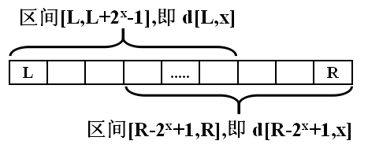

@[toc]

## 基本常识

 - 从1开始数10个数,停下的数是:10,**10=10+1-1**
 - 从1开始数99个数,停下的数是:99,**99=99+1-1**
 - 从2开始数99个数,停下的数是:100,**100=99+2-1**
 - 从n开始数m个数,停下的数是:**n+m-1**
 - 从10开始往前数3个数,停下的数是:8,**8=10-3+1**
 - 从n开始往前数m个数,停下的数是:**n-m+1**

## 关键字

 - 不带修改的区间最值：rmq
 - 特点：重叠并不会对区间最大值产生影响

## rmq原理:ST表（sparse-table）

我们设$f[i,j]$表示**从第i个元素开始的长度为$2^j$个元素的最值**

由于元素个数为$2^j$个，所以从中间平均分成两部分，每一部分的元素个数刚好为$2^{j-1}$个，如下图:


整个区间的最大值一定是左右两部分最大值的较大值，满足动态规划的最优子结构

状态转移方程：

$$
f[i,j]=max(f[i,j-1],f[i+2^{j-1},j-1])
$$

边界条件为$f[i,0]=a[i]$

这样就可以在$O(nlogn)$的时间复杂度内预处理f数组:

```c
for(i=1;i<=n;i++) f[i][0] = a[i]; //初始化

for(j=1;(1<<j)<=n;j++){ //1<<j 表示处理的范围
    for(i=1;i+(1<<j)-1<=n;i++) // i+(1<<j)-1<=n 表示所求的范围的最后一个值在原数组范围内
        f[i][j] = max (f[i][j-1],f[i+(1<<(j-1))][j-1]);
}
```

其中`i+(1<<j)-1`表示$i+2^j-1$表示所求的范围的最后一个值在原数组范围内


## query查询

想一想:我们有1==>10个元素,我们想查$[1,8]$范围内的最值怎么查?查$[1,9]$范围内的最值怎么查?

如果查$[1,8]$那就是$f[1][3]$
如果查$[1,9]$那就是$f[1][3]$和$f[2][3]$

对于查询区间$[L,R]$，令$x$为满足$2^x<=R-L+1$的最大整数,即$x=int(log(R-L+1)/log(2))$

$[L,R]=[L,L+2^x-1] \cup [R-2^x+1,R]$，两个子区间元素个数都是$2^x$个，如图:



$$
RMQ(L,R)=max(f[L,x],f[R-2^x+1,x])
$$

```c
int query(int l,int r){
    //第一种方法
    int x = int( log(r-l+1)/log(2));

    //第二种方法,这种写法比上面的写法慢
    // 例如，luogu3865 就过不了
    int k =0;
    while( (1<<(k+1)) <=(r-l+1) ) k++; // 最后2^{k+1} > r-l+1

    //return max(f[l][k],f[r-(1<<k)+1][k]);
    return max(f[l][x],f[r-(1<<x)+1][x]);
}
```

每次用 [std::log](https://en.cppreference.com/w/cpp/numeric/math/log) 重新计算 log 函数值并不值得，建议进行如下的预处理：

$$
\left\{\begin{aligned}
Logn[1] &=0, \\
Logn\left[i\right] &=Logn[\frac{i}{2}] + 1.
\end{aligned}\right.
$$

## 时间复杂度

 - 对于预处理是$O(nlogn)$
 - 对于查询是$O(1)$

## 代码模板

<!-- template start -->
```c
template<typename T,int N = maxn,typename Comp = greater<T>> //long long or int
struct Rmq {
    T f[N][50]; //f[i][j] --> i+2^j-1
    int logn[N] = {0,0,1};
    Comp comp;
    Rmq(){ memset(f,0,sizeof(f)); }
    
    inline T good(const T &a,const T &b) {
        return comp(a,b) ? a : b;
    }

    void init(int n){
        for(int i=3;i<=n;++i) logn[i] = logn[i/2] +1;
        //for(int i=1;i<=n;++i) f[i][0] = a[i];
        for(int j=1; (1<<j) <= n ;j++) //得到f[i][j]
            for(int i=1; i+(1<<j)-1 <=n;i++) //i+(1<<j)-1<=n 表示所求的范围的最后一个值在原数组范围内
                f[i][j] = good(f[i][j-1],f[i+(1<<(j-1))][j-1]);
    }

    T query(int l,int r){ //查询区间最值
        int k = logn[r-l+1];
        return good(f[l][k],f[r-(1<<k)+1][k]);
    }
};
Rmq<int> rmq;
```
<!-- template end -->

## 具体代码

数据:

```
10 3
1 5 7 2 9 7 2 5 9 6
1 5
6 9
1 10
```

代码:

```c
<%- include("code/1.cpp") %>
```

## 题目1:  luogu P3865 ST表

模板题目：直接做
```c
#include <cstdio>
#include <cmath>

#define N 100005

int a[N];
int f[N][32];

int n,m;//n个数,m次查询


int max(int a,int b){
    if( a > b )
        return a;
    return b;
}

int query(int l,int r){
    int x = int( log(r-l+1)/log(2));
    return max(f[l][x],f[r-(1<<x)+1][x]);
}

void rmq(){ //预处理
    int i,j;
    for(j=1;(1<<j)<=n;j++)
        for(i=1;i+(1<<j)-1 <=n;i++){
            f[i][j] = max(f[i][j-1],f[i+(1<<(j-1))][j-1]);
        }
}

int main(){
    int i,j;
    scanf("%d%d",&n,&m);
    //读入
    for (i=1;i<=n;i++)
        scanf("%d",&f[i][0]);
    rmq();
    for (i=1;i<=m;i++){
        int t1,t2;
        scanf("%d%d",&t1,&t2);
        printf("%d\n",query(t1,t2));
    }
    return 0;
}
```

## 题目2:luogu P1440 求m区间内的最小值

todo

## 参考/引用

- [ST 表 - OI Wiki](https://oi-wiki.org/ds/sparse-table/)


## 练习题目

 - luogu P1440 求m区间内的最小值
 - luogu P1816 忠诚
 - luogu P3865 ST表
 - luogu P2048 [NOI2010]超级钢琴
 - luogu P2214 [USACO14MAR]哞哞哞Mooo Moo
 - luogu P2216 [HAOI2007]理想的正方形
 - luogu P2251 质量检测
 - luogu P2471 [SCOI2007]降雨量
 - luogu P2880 [USACO07JAN]平衡的阵容Balanced Lineup
 - luogu P3763 [TJOI2017]DNA
 - luogu P4085 [USACO17DEC]Haybale Feas
