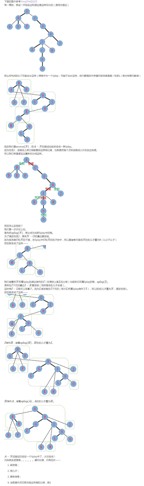

@[toc]

## 前置知识

```viz-dot
digraph title {
    node[shape=plaintext fixedsize=true  fillcolor=white colorscheme=accent8 ];
    { "Splay", "树链剖分" }->"link cut tree"
}
```

## 题目引入

[P3690 【模板】Link Cut Tree （动态树）](https://www.luogu.org/problem/P3690)

**题目理解**:

 - 不停的连接两个点,会形成多棵树组成的**森林**或者**一棵树**
 - 操作$0$其实是询问树上的两个点之间的点权xor和,xor操作满足结合率

## 基础

性质:

1. 对于某一个结点U,它只存在于一个Splay中
2. 每个Splay中的结点的深度按中序遍历的顺序递增


基础代码:

```c
const int maxn = 1e5+5;
struct Node
{
    int fa,ch[2],val,res;   //res是异或结果
    bool flag;               //翻转懒标记
}spl[maxn];
//因为被毒瘤数据卡得TLE一个点，所以全部换成了#define。都是字面意思
#define ls(x) (spl[x].ch[0])
#define rs(x) (spl[x].ch[1])
#define fa(x) (spl[x].fa)
#define ident(x,f) (rs(f)==x)       //和下面的connect都是Splay的辅助函数
#define connect(x,f,s) spl[fa(x)=f].ch[s]=x
#define update(x) spl[x].res=spl[ls(x)].res^spl[rs(x)].res^spl[x].val
#define ntroot(x) (ls(fa(x))==x||rs(fa(x))==x)  //判断结点是否为Splay的根
#define reverse(x) std::swap(ls(x),rs(x)),spl[x].flag^=1
```

### 实链剖分

同样将某一个儿子的连边划分为**实边**，而连向其他子树的边划分为**虚边**。
区别在于虚实是可以动态变化的，因此要使用更高级、更灵活的Splay来维护每一条由若干实边连接而成的**实链**。

LCT建立在实链剖分的基础上,LCT维护的对象其实是一个森林:

在实链剖分的基础下，LCT资磁更多的操作

- 查询、修改链上的信息（最值，总和等）
- 随意指定原树的根（即换根）
- 动态连边、删边
- 合并两棵树、分离一棵树（跟上面不是一毛一样吗）
- 动态维护连通性
- 更多意想不到的操作（可以往下滑一滑）

### 主要性质

1. 每一个Splay维护的是一条**从上到下按在原树中深度严格递增的路径**，且**中序遍历Splay得到的每个点的深度序列严格递增**。

比如有一棵树，根节点为1（深度1），有两个儿子2,3（深度2），那么Splay有3种构成方式：

- {1−2},{3}
- {1−3},{2}
- {1},{2},{3}（每个集合表示一个Splay）

而不能把1,2,3同放在一个Splay中（存在深度相同的点）

2. 每个节点包含且仅包含于一个Splay中

3. 边分为实边和虚边，实边包含在Splay中，而虚边总是由一棵Splay指向另一个节点（指向该Splay中中序遍历最靠前的点在原树中的父亲）。
因为性质2，当某点在原树中有多个儿子时，只能向其中一个儿子拉一条实链（只认一个儿子），而其它儿子是不能在这个Splay中的。
那么为了保持树的形状，我们要让到其它儿子的边变为虚边，由对应儿子所属的Splay的根节点的父亲指向该点，而从该点并不能直接访问该儿子（认父不认子）。

## 操作

### 最最基本的操作:Access(x)


Access(x)原树上的根到root拉一条实链,是其它操作的基础

> 

1. 伸展$x$到根
2. 把x的右儿子修改为上一个x,如果是第一次就是0(虚实转换)
3. 对x的父亲重复以上步骤

**代码**

```c
inline void access(int x)           //从x到原树根结点拉一条实链
{
    for(int y=0;x;x=fa(y=x))        //y为上一个Splay的根
    {
        splaying(x);                //伸展到当前Splay的根
        rs(x)=y;                    //右儿子连上上一个Splay的根
        push_up(x);                 //别忘更新＞﹏＜
    }
}
```

### MakeRoot(x)

只是把根到某个节点的路径拉起来并不能满足我们的需要。更多时候，我们要获取指定两个节点之间的路径信息。
然而一定会出现路径不能满足按深度严格递增的要求的情况。根据性质1，这样的路径不能在一个Splay中。

$MakeRoot(x)$作用:给原树换根为x

1. $Access(x)$
2. 伸展$x$
3. 翻转整棵Splay(把深度翻转)

makeroot定义为换根，让指定点成为原树的根。
这时候就利用到access(x)和Splay的翻转操作。
access(x)后x在Splay中一定是深度最大的点对吧。
splay(x)后，x在Splay中将没有右子树（性质1）。于是翻转整个Splay，使得所有点的深度都倒过来了，x没了左子树，反倒成了深度最小的点（根节点），达到了我们的目的。
代码

**代码**

```c
inline void makeroot(int x)           //给原树换根
{
    access(x);                      //先拉实链，拉好后x一定在Splay的最右（深度最大）
    splaying(x);                    //再伸展，伸展后x必定没有右儿子
    reverse(x);                     //翻转拉出来这条实链，使深度顺序翻转
}
```

### FindRoot(x)

FindRoot(x)作用:找x结点在原树的根结点是哪位

1. Access(x)
2. Splaying(x)
3. 找到x所在的Splay的最左点的那个点u,它就是原树的根结点
4. 为了防止数据卡链保证时间复杂度,还需要再Splay(u)

**代码**

```c
```

### Link(x,y)

作用:$x,y$两个点直接连边

1. MakeRoot(x)
2. 如果FindRoot(y)是x,那说明x和y在同一个树上,数据不合法就不要连边,不然可能出现环
3. 把x的父亲置为y连一条虚边

**代码**

```c
```

### Cut(x,y)

作用:断掉x和y之间的边

1. MakeRoot(x)
2. 判断数据合法性:如果FindRoot(y)不是x或者x和y不是相邻的(y的父亲不是x,或者y有左孩子)
3. 双向断边: x的右儿子和y的父亲置为NULL
4. 更新信息(异或和,大小等)

**代码**

```c
```

### split(x,y)

作用:把x到y的路径拆成一棵方便操作的SPlay出来

1. MakeRoot(x)
2. Access(y)
3. splay(y)


## 题目列表

 - bzoj2049洞穴勘测

## 工具/脚本

 - :arrow_down: [数据生成器](./tools/data_generator.py)

## 模板代码 
<!-- template start -->
```c
TODO
```
<!-- template end -->

## 引用资料

 - [【AgOHの算法胡扯】Link/Cut Tree](https://www.bilibili.com/video/av65682026)
 - [ LCT总结——概念篇+洛谷P3690 模板 Link Cut Tree(动态树)（LCT，Splay）](https://www.cnblogs.com/flashhu/p/8324551.html)
 - [LCT总结——应用篇（附题单）（LCT）](https://www.cnblogs.com/flashhu/p/9498517.html)
 - [QTREE解法的一些研究 Yang Zhe 论文](https://wenku.baidu.com/view/75906f160b4e767f5acfcedb)
 - [LCT（Link-Cut Tree）详解（蒟蒻自留地）](https://blog.csdn.net/saramanda/article/details/55253627)
