# 堆heap


## 什么是堆，堆的理解

**问题1:**有一队人,身高都一不样,每次队里取出最高的人,怎么做?

答:排序输出

**问题2:**有一队人,身高都一不样,每次队里取出最高的人,但是有人迟到了,在取出队里的人的时候,陆续到来,怎么做?

答:优先队列

**什么是优先队列:**


**什么是堆:** 建立是完全二叉树上的优先队列


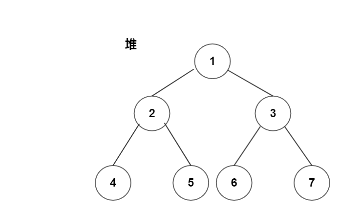


### 数组存完全二叉树的相关性质

使用数组来存储
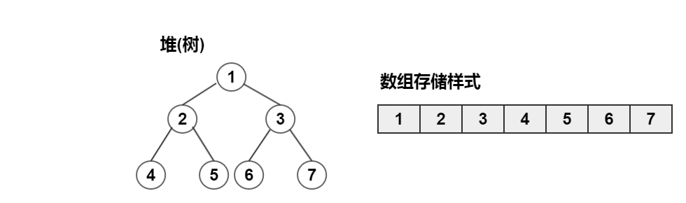

性质
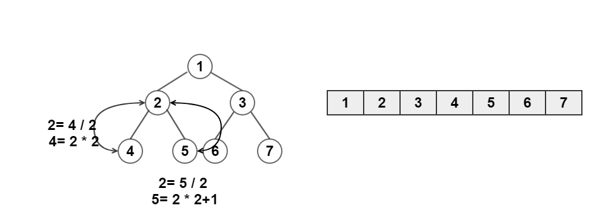

设父亲结点的下标:$$fa$$,左孩子的坐标$$lc$$,右孩子的坐标$$rc$$

 - $$fa=lc \div 2$$
 - $$fa=rc \div 2$$
 - $$lc = fa \times 2$$
 - $$rc = fa \times 2 + 1$$


### 堆的插入(上升)


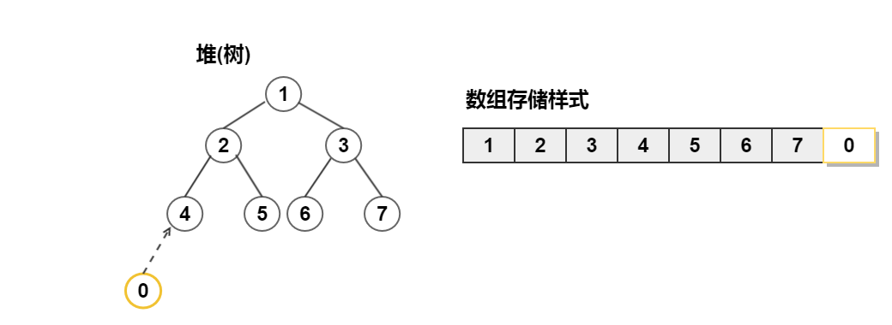
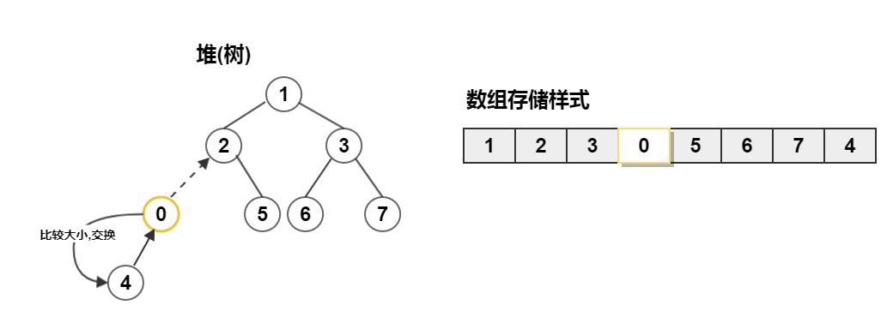
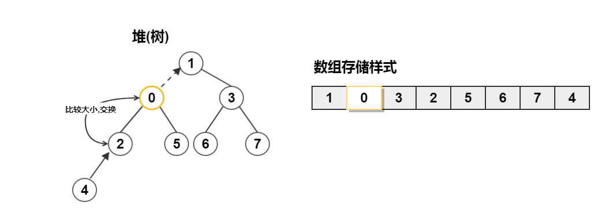
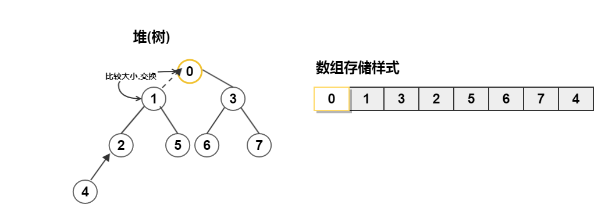

### 堆的删除(取堆顶,下降)


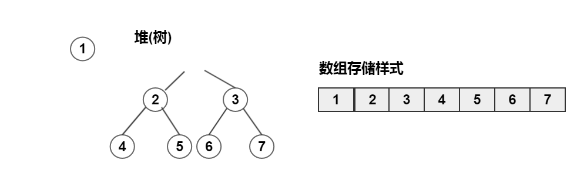
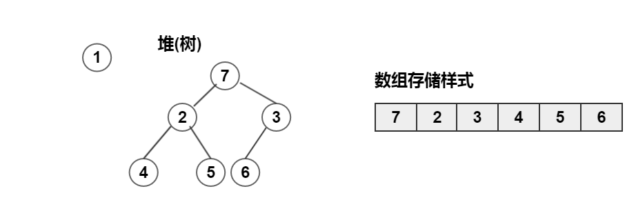
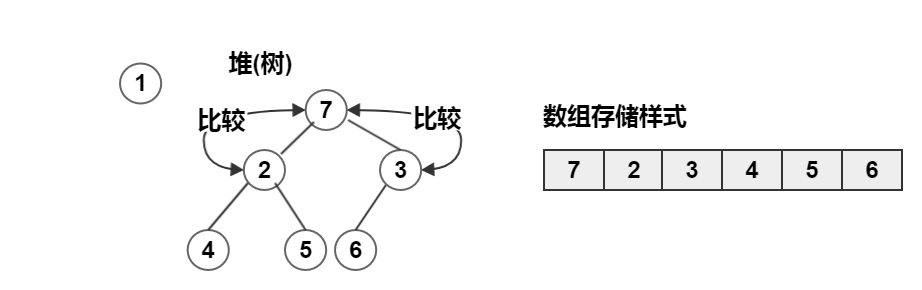
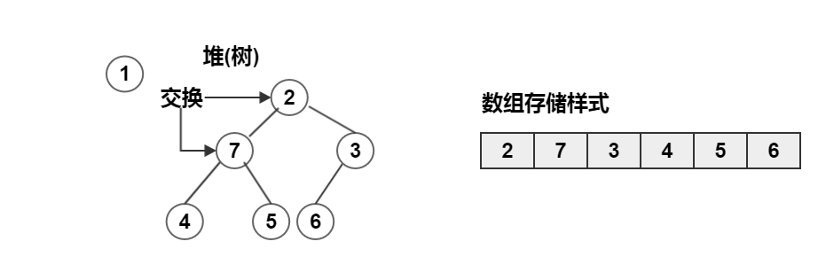
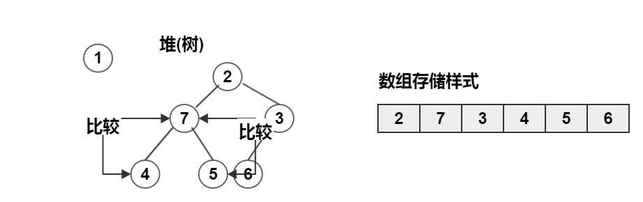


和左右孩子中较小的那个比较,如果比较小的那个大,就下降,如果比它小,就不动.

### 堆的建立

## 堆的实现


堆有两种实现

 - STL中的优先队列(priority_queue),要自己写一个仿函数来判断比较原则
 - 通过数组自己实现，所有的东西完全自己掌握，但是代码会打很多


### 自己实现的堆

堆的核心操作

 - 建立堆tree
 - up操作
 - down操作


记忆核心：

 - 上升：点比父点小，就和父点交换，否则停止
 - 下降：两个点中小的那个值，比我还小，我就交换


```c
#include <cstdio>

int fa(int p){  return p>>1; }
int lson(int p){ return p<<1;}
int rson(int p){ return (p<<1)|1;}


#define max =1000
int a[] = {1,28,3,9,3,8,23,63,2};

int tree[100]; //堆树
int heap_size=0;//表明堆的大小 


/* 把一个点放到尾部，然后上升 */
void up( int heap[],int x ){
    heap_size++;
    int rt=heap_size;
    while (rt>1) { 
        //如果这个点比父节点小
        if( x < heap[fa(rt)])
            heap[rt] = heap[fa(rt)],rt=fa(rt);
        else 
            break; //这个时候就可以停止了
    }
    /* 停下来的时候，赋值 */
    heap[rt] = x;
}


/* 把一个点放到root点，然后下降 */
int pop(int heap[]){
    int t=heap[1],rt=1,tmp,key=heap[heap_size];
    heap_size--;

    while( lson(rt) <= heap_size){ //这个成立的时候，lson一定存在
        /* rson存在且rson的值比lson的值还小时 */
        if( rson(rt) <=heap_size && heap[rson(rt)] < heap[lson(rt)])
            tmp = rson(rt);
        else
            tmp = lson(rt);
        //和下面一样
        //tmp = (rson(rt)<heap_size && heap[rson(rt)]<heap[lson(rt)]?rson(rt):lson(rt));
        
        /* lson,rson两者中的最小点比key大，
         * 那就交换
         * 否则结束
         * */
        if(heap[tmp] <key)
            heap[rt]=heap[tmp],rt=tmp;
        else
            break;
    }

    /* 停下来的rt就是key的位置 */
    heap[rt]=key;
    return t;
}


/* 创建一个heap tree
 * - 在原有的数组上进行：那就是排序(不停的up)
 * - 申请一个新的数组，进行
 * */

/* 新的数组 */
void CreateHeap( int head[] ){
    int len = sizeof(a)/sizeof(a[0]);
    int i;
    for(i=0;i<len;i++)
        up(head,a[i]);
}


int main(){
    int i;
    int len = sizeof(a)/sizeof(a[0]);
    for(i=0;i<len;i++)
        printf("%d ",a[i]);
    printf("\n");
    CreateHeap(tree);
    for(i=1;i<=len;i++)
       printf("%d ",pop(tree));
    return 0;
}
```
### STL的中priority_queue
