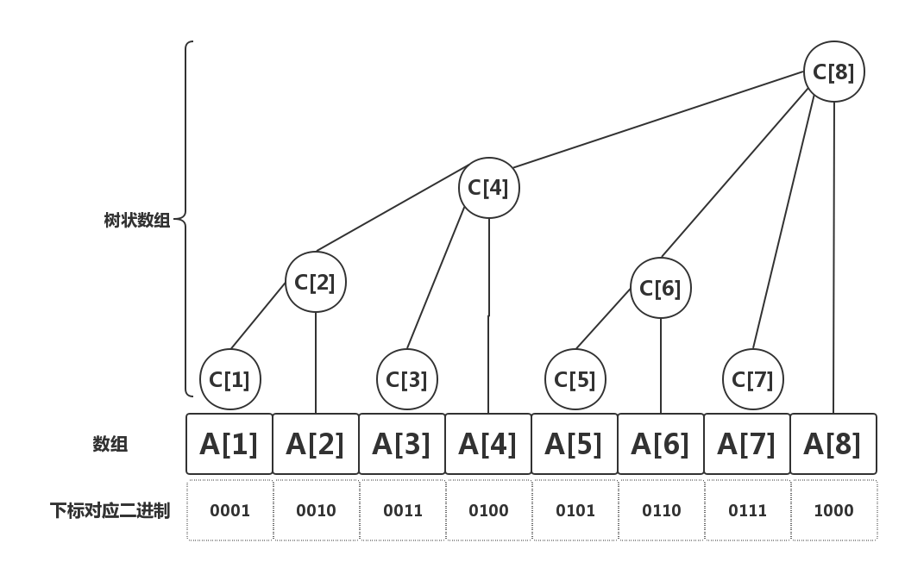

@[toc]
## 原理



## 规律

 - 下标$i$管辖的区域大小:$i$对应的二进制保留最低位的$1$,其它位全部置$0$.
 - $c[i]$的父亲的下标:用$lowbit(i)$表示$i$的管辖区域,那么$i+lowbit(i)$就表示$i$父亲结点的下标
 - $c[i]$左边的仅挨着自己管辖区间的点的下标:$i-lowbit(i)$


**问题1:**我们如何去求$lowbit(i)$ :`i & (-i)`就会把i的二进制除最低位1外全部置0。例如:

 - 所有的数字在内存中都是补码存储的
 - 数字4的补码是$00000100$
 - 数字-4的补码是$11111100$

$4\&(-4) = 00000100\&(11111100b) = 100b = 4$

这个运算我们就叫做$lowbit(i)$,正好可以得到下标$i$的管辖区域


**问题2:** 如何求一段区域的和(前缀和):

 - 如果我们要求$S[12] = A[1]+A[2]+......+A[12]$
 - 我们知道:$C[12]=A[12]+A[11]+A[10]+A[9]$因为:$lowbit(12)= 4$,表示$C[12]$管辖大小:$4$
 - $12-lowbit(12) = 12-4=8$
 - $lowbit(8) = 8$ 所以 $8-lowbit(8)=0$
 - 所以: $A[1]+A[2]+......+A[12] =C[12] + C[8]$

## 核心操作

### 管辖区域范围:$lowbit(i)$

```c++
int lowbit( int x){
    return (x & -x);
}

//---inline--
inline int lowbit( int x){
    return (x & -x);
}
```

### 单点更新(不停的更新父亲)

```c++
void update(int pos,int num){
    while(pos<=n){  //n代码数组A的长度
        c[pos]+=num;
        pos+=lowbit(pos);
    }
}
```


### 区间求值(前缀和)

```c++
int query(int pos){
    int sum = 0;
    while(pos > 0 ){
        sum+=c[pos];
        pos -= lowbit(pos);
    }
    return  sum;
}
```

**注意:**

 - 上面这三个操作就是树状数组最重要的操作了,是其它操作的基础
 - $pos+pos \& (-pos)$ 得到pos父亲的位置
 - $pos-pos\&(-pos)$就得到了下一个无联系的节点(也就是pos管辖区域没有覆盖的结点)

## 代码模板

<!-- template start -->
```c
template<typename T,int N=maxn>
struct Bit {
    T c[N];
    //Bit(){}
    inline int lowbit(int x) { return x & -x;      }
    inline int fa(int p)     { return p+lowbit(p); }
    inline int left(int p)   { return p-lowbit(p); }

    void update(int p, T v){
        for( ; p <= N; p = fa(p) ) c[p] += v;
    }

    T query(int p){ //前缀合
        T sum=0;
        for( ;p > 0 ; p = left(p)) sum+= c[p];
        return sum;
    }
};
Bit<ll> bit;
```
<!-- template end -->

## 模板题目
<wc-pcs-list-by-tags base="<%- USER.pcs%>" match="ids" tags="luogu-P3374" preifx=""></wc-pcs-list-by-tags>

## **练习题目:**

 - luogu P3374 【模板】树状数组 
 - luogu P3368 【模板】树状数组
 - luogu P1774 最接近神的人_NOI导刊2010提高（02）
