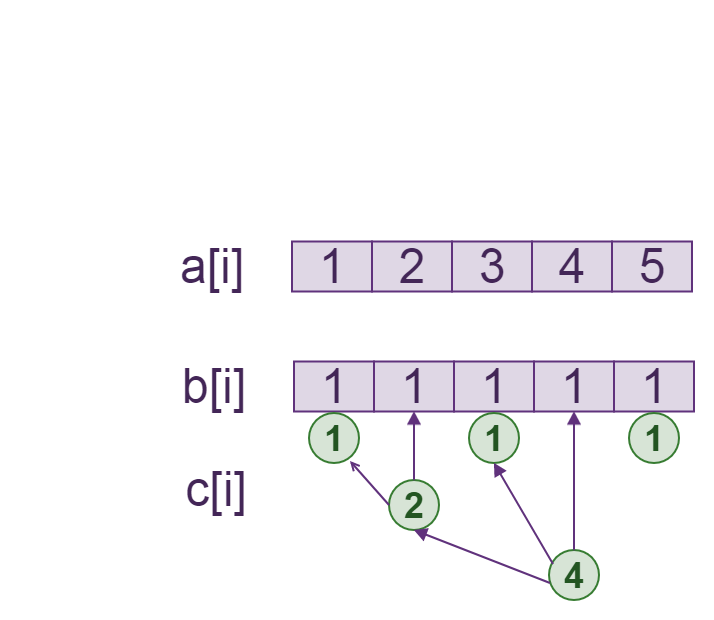
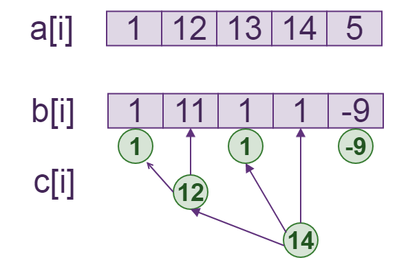

@[toc]

## 区间修改,单点查询


题意: 有10000个数,可以任意对一段区间里的值进行加减,问,进行这种操作n次后,某个点的值是多少.

 - 原数组:a[i],每一个元素的值
 - 差分数组:b[i],下标i的元素存放a[i]-a[i-1]的差值,b[1]=a[1]
 - 树状数组:c[i],针对数组b行成的树状数组

我们就行成了下面的这种数据结构:



我们发现对于树状数组$C[i]$来说,$query(i) = a[i]$,也就是对应数的值.

如果我们想`2->4`的数加10怎么办?我们只要修改`b[i]`数组如下(想一想):

 - $b[2]+10$
 - $b[4+1]-10$

我们就行成了下面的数据:



我们发现,这时:

```math
query(i) = a[i]
```

所以按这种操作我们可以进行,区间修改,单点查询。

## 手动练习

当你可以快速的手算出答案，你就变强了

 - 数据生成 [:arrow_down: data2.py](./code/data2.py)
   将会生成如下格式的数据
   1. 第一行$n$，$m$表示n个数据，m个的询问
   2. n个数
   3. 询问
    - $1,x,y,z$在区间$[x,y]$内加$z$
    - $2,x,y$查询区间$[x,y]$的和
 - 暴力程序，输出答案，用来验证[:arrow_down: check2.cpp](./code/check2.cpp)

下载上面的两个程序，手动模拟建立Bit，计算，直到你觉得完全熟悉为止。


## 代码模板

```c
template<typename T,int N=maxn>
struct Bit_range_point {
    T c[N+5];
    //Bit(){}
    inline int lowbit(int x) { return x & -x;      }
    inline int fa(int p)     { return p+lowbit(p); }
    inline int left(int p)   { return p-lowbit(p); }

    void update(int p, T v){
        for( ; p <= N; p = fa(p) ) c[p] += v;
    }
    //只是比基础Bit多了一个update_range
    void update_range(int l,int r,T v){
        update(l,v);
        update(r+1,-v);
    }

    T query(int p){ //前缀和
        T sum=0;
        for( ;p > 0 ; p = left(p)) sum+= c[p];
        return sum;
    }
};
Bit_range_point<ll> bit;
```

## 模板题目

<wc-pcs-list-by-tags base="<%- USER.pcs%>" tags="luogu-P3368" match="ids" preifx=""></wc-pcs-list-by-tags>
