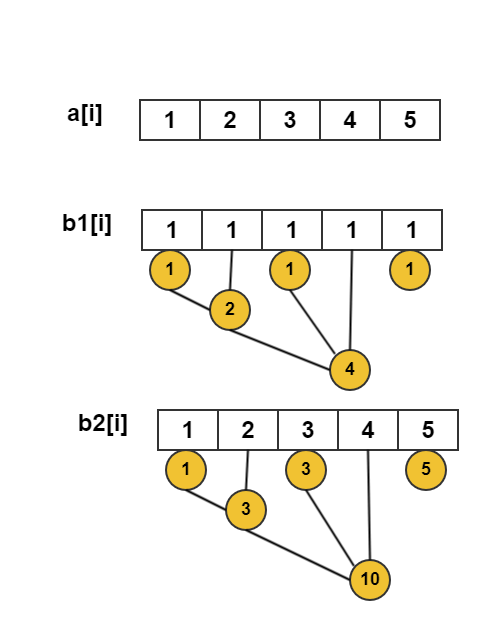
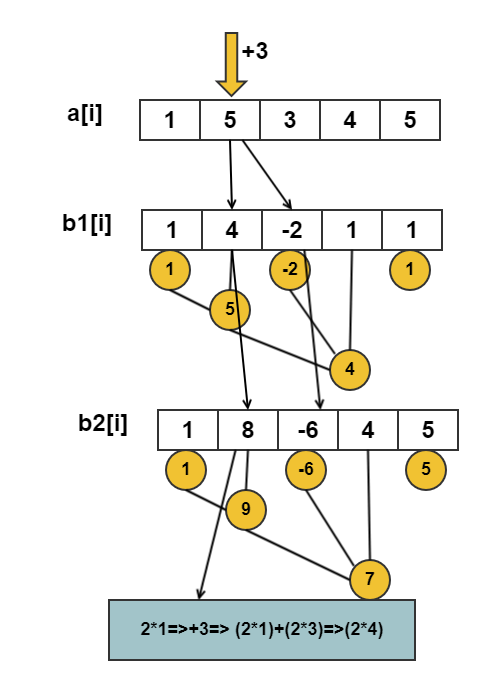

@[toc]

## 区间增减 区间查询

 - 原数组:a[i],每一个元素的值
 - 差分数组:b[i],下标i的元素存放`a[i]-a[i-1]`的差值,`b[1]=a[1]`

我们可以得到下面的公式:


$$
\begin{align*} a[1] +a[2]+......+a[n]&=(b[1]) +(b[1]+b[2]) +......+(b[1]+b[2]+......+b[n]) \\ &=n \times b[1]+(n-1) \times b[2]+(n-2) \times b[3]+....1 \times b[n]\\ &=n \times (b[1]+b[2]+......+b[n]) - (0 \times b[1] +1*\times b[2]+2\times b[3]+......+(n-1) \times b[n])\\ &=(n+1)(b[1]+b[2]+......+b[n]) -(1 \times b[1] +2*\times b[2]+3\times b[3]+......+n \times b[n])\\ &=(n+1)\sum \limits_{i=1}^n b[i] - \sum \limits_{i=1}^n i \times b[i] \end{align*}
$$

于是,我们得到了一个**重要的公式**:

$$
\sum \limits_{i=1}^n a[i]= (n+1)\sum \limits_{i=1}^n b[i] - \sum \limits_{i=1}^n i \times b[i]
$$

我们设:

 - b1[i]数组表示:b1[i] = a[i]-a[i-1],差分数组
 - b2[i]数组表示:b2[i] = i*b1[i]
 - c1[i]针对b1的树状数组
 - c2[i]针对b2的树状数组




## 手动练习

当你可以快速的手算出答案，你就变强了

 - 数据生成 [:arrow_down: data3.py](./code/data3.py)
   将会生成如下格式的数据
   1. 第一行$n$，$m$表示n个数据，m个的询问
   2. n个数
   3. 询问
    - $1,x,y,z$在区间$[x,y]$内加$z$
    - $2,x,y$查询区间$[x,y]$的和
 - 暴力程序，输出答案，用来验证[:arrow_down: check3.cpp](./code/check3.cpp)

下载上面的两个程序，手动模拟建立Bit，计算，直到你觉得完全熟悉为止。

## 代码模板

```c
template<typename T,int N=maxn>
struct Bit {
    T c[N],ic[N];// 建立在b[i]与ixb[i]上的bit
    //Bit(){}
    inline int lowbit(int x) { return x & -x;      }
    inline int fa(int p)     { return p+lowbit(p); }
    inline int left(int p)   { return p-lowbit(p); }

    void update(int p, T v){
        for(T t = p ; p <= N; p = fa(p) ) 
            c[p] += v,ic[p]+=t*v;
    }

    void update_range(int l,int r,T v){
        update(l,v);
        update(r+1,-v);
    }

    T query_c(int p ,T c[]){
        T sum = 0;
        for( ; p > 0 ; p = left(p)) sum+=c[p];
        return sum;
    }

    T query(int p){ //前缀合
        return (p+1)*query_c(p,c) - query_c(p,ic);
    }
};
Bit<ll> bit;
```

## 模板题目


## 练习题目

 - poj 4047
 - codevs 1082
 - luogu p3373
