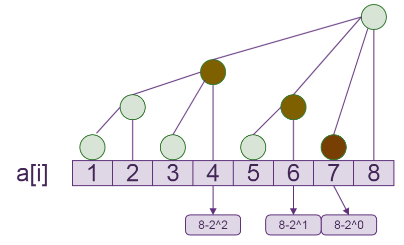

@[toc]

## 区间最值



可以发现：对于$x$，可以直接转移到$x$的点只有，$x-2^0$，$x-2^1$，$x-2^2$，.......，$x-2^k$ ($k$满足$2^k < lowbit(x)$且$2^{k+1}>=lowbit(x)$)

### 数学原理

若$x = 1010000$

$$
\begin{matrix}
&=& 1001000 &+& lowbit(1001000) &=& 1001000 &+& 1000 &=& 1001000 &+& 2^3 \\
&=& 1001100 &+& lowbit(1001100) &=& 1001100 &+& 100  &=& 1001100 &+& 2^2 \\
&=& 1001110 &+& lowbit(1001110) &=& 1001110 &+& 10   &=& 1001110 &+& 2^1 \\
&=& 1001111 &+& lowbit(1001111) &=& 1001111 &+& 1    &=& 1001111 &+& 2^0\\
\end{matrix}
$$

## 建立 / 尾插入

利用上面的性质,在树状数组的尾部插入数据,来**建立**一个树状数组

<<<< viz-gallery(title="尾插入演示",engine="neato")

<% for(let i = 1;i<=8;i++) {
    let page = 'dot/tail_push_'+i+'.dot'
%>
```
<%- include(page) %>
```
<%}%>

<<<<

```c
void push(int pos){
    int i,lb = lowbit(pos);
    c[pos] = a[pos];
    for(i=1;i<lb;i <<=1){
        c[pos] = max(c[pos],c[pos-i]);
    }
}
```


## update 维护树上的值

<<<< viz-gallery(title="单点更新演示",engine="neato")

``` 利用尾插入建立树
<%- include("dot/max_update_1.dot") %>
```

``` 修改a[4]为100
<%- include("dot/max_update_2.dot") %>
```

``` c[4]=a[4]
<%- include("dot/max_update_3.dot") %>
```

``` 更新自己,c[4]=max{c[4],c[4]的所有孩子}
<%- include("dot/max_update_4.dot") %>
```

``` 更新c[4]的所有父亲
<%- include("dot/max_update_5.dot") %>
```

<<<< 


```c
/* pos 位置,v 数值 */
void update(int pos,int v){
    int i,lb;
    a[pos] = v;
    lb = lowbit(pos);
    for(i=1;i<lb;i <<=1){ //利用孩子更新自己
        if( v <= c[pos-i]) //v 并不是最大的点
            return;
    }
    c[pos] = v;
    pos+=lowbit(pos);//父亲的位置

    /* 更新父亲 */
    while(pos <= n){
        if( c[pos] < v){ //更新的父亲
            c[pos] = v;
            pos +=lowbit(pos);
        }           //没有更新父亲
        else break;
    }
}
```


## query 查询区间最值

设$query(x,y)$求区间$[x,y]$之间的最值,
已知$c[x]$表示$[x-lowbit(x)+1,x]$之间的最值,那如何求区间$[x,y]$的最值呢?

```viz-neato
<%- include("dot/max_update_1.dot") %>
```

想一想:

 - 如果求区间$[1,8]$的最值, 就需要点$c[8]$
 - 如果求区间$[1,7]$的最值, 就需要点$c[7],c[6],c[4]$
 - 如果求区间$[2,7]$的最值, 就需要点$c[7],c[6],a[4],c[3],a[2]$
 - 如果求区间$[2,2]$的最值, 就需要点$a[2]$
 - 如果求区间$[2,8]$的最值, 就需要点$a[8],c[7],c[6],a[4],c[3],a[2]$


所以,我们发现下面的规律, 因为$y-lowbit(y)+1$表示$c[y]$结点所管辖范围的最左边的点

 - 若$y-lowbit(y)+1 >=x$,则$query(x,y) = max(c[y],query(x,y-lowbit(y)))$;
 - 若$y-lowbit(y)+1 <x$,则$query(x,y) = max(a[y],query(x,y-1))$;
 - 边界$x > y$

```c
//求区间[x,y]的最大值
int query(int x,int y){

    int res = -1;
    while(x <= y){
        int nx = y - lowbit(y)+1; //最左边的点
        if(nx >= x ){
            res = res < c[y] ? c[y] :res;
            y = nx-1; // 下一个求解区间
        }
        else { // nx < x
            res = res < a[y] ? a[y] :res;
            y--;
        }
    }
    return res;
}
```


## 说明

我在上面的模板代码中,尽量没有用函数`max,min`,因为三元运算符:` ? :`的运行效率比较高

## 模板题目

### 题目地址

[hdu1754 I Hate It](https://vjudge.net/problem/hdu-1754)


### 代码

```c
<%- include("hdu1754.cpp") %>
```


