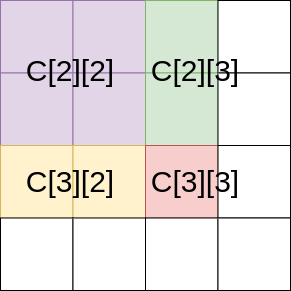
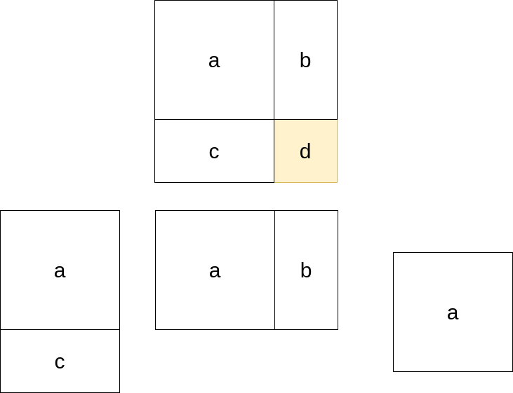

@[toc]
## 二维树状数组

问题：一个由数字构成的大矩阵，能进行两种操作

1. 对矩阵里的某个数加上一个整数（可正可负）
2. 查询某个子矩阵里所有数字的和,要求对每次查询，输出结果。

一维树状数组很容易扩展到二维，在二维情况下:数组a[][]的树状数组定义为：

$C[x][y] = \sum a[i][j]$, 其中，

- $x-lowbit(x) + 1 <= i <= x$,
- $y-lowbit(y) + 1 <= j <= y$.

来看看$C[][]$的组成。


<<<< viz-gallery(title="管辖范围",engine="dot",height="200")

<% 
var log =[]
var engine = "dot"
for(let i=1;i<=16;i++){
    var page = `dot/2dim_${i}.dot`
%>

``` <%= engine || ""%> <%= `C[${parseInt((i-1)/4)+1}][${(i-1) %4+1 }]` %>
<%- include(page) %>
```
<%}%>

<<<<

通过上面的动画可以直观得感受到二维树状$C[i][j]$的管辖范围的规律.

### 初始化

```c
memset(c,0,sizeof(c));
```

### 单点修改

$a[i][j]$被谁管辖?

```
a[1][3]-> C[1][3] C[1][4]
          C[2][3] C[2][4]
          C[4][3] C[4][4]
```

横管横,纵管纵

```c
void update(int x,int y,int val){
    a[x][y] += val;
    int i,j;
    for(i= x; i <= 横高度; i += lowbit(i) )
        for( j = y ;j <= 纵宽度 ;j += lowbit(j))
            C[i][j] += val;
}
```

### 子矩阵求和

```
Sum(1,1) = C[1][1]
Sum(1,2) = C[1][2]
Sum(1,3) = C[1][3] + C[1][2]

Sum(2,1) = C[2][1]
Sum(2,2) = C[2][2]
Sum(2,3) = C[2][3] + C[2][2]

Sum(3,1) = C[3][1] + C[2][1]
Sum(3,2) = C[3][2] + C[2][2]
==>Sum(3,3) = C[3][3] + C[3][2] + C[2][3] + C[2][2]

最终可以按这个顺序来计算
===>Sum(3,3) = C[3][3] + C[2][3] + C[3][2] + C[2][2]
```



模板

```c
int query(int x,int y){
    int i,j,sum = 0;
    for(i = x ; i >0 ; i -= lowbit(i) )
        for(j=y;j>0;j-=lowbit(j))
            sum += c[i][j];
    return sum;
}
```

### 求子矩阵
sum(x,y,xx,yy): 求数组中下标为(x, y)与(xx, yy)为对角线顶点的区域元素之和


```c
int sum(int x,int y,int xx,int yy){
    return query(xx,yy) - query(x,yy) - query(xx,y) +query(x,y);
}
```

## 例题

- [poj-2155 Matrix](<%- USER.pcs_site %>POJ-2155)
- [luogu P4514 上帝造题的七分钟]()

## 参考/引用

- [彻底弄懂二维树状数组](https://blog.csdn.net/zzti_xiaowei/article/details/81053094)
- [二维树状数组](https://menyf.gitbooks.io/acm-icpc-template/4_%E6%95%B0%E6%8D%AE%E7%BB%93%E6%9E%84/%E6%A0%91%E7%8A%B6%E6%95%B0%E7%BB%84/%E6%A0%91%E7%8A%B6%E6%95%B0%E7%BB%84.html)
