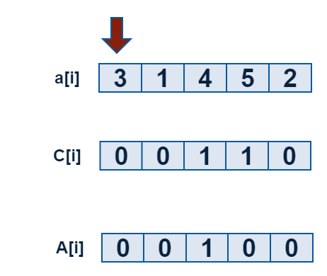
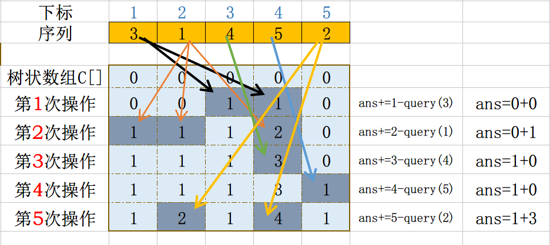

## 求逆序对

### 什么是逆序对

设 A 为一个有 n 个数字的有序集 (n>1),其中所有数字各不相同。
如果存在正整数 i, j 使得 1 ≤ i < j ≤ n 而且 A[i] > A[j],则 <A[i], A[j]> 这个有序对称为 A 的一个逆
序对,也称作逆序数。
例如,数组(3,1,4,5,2)的逆序对有(3,1),(3,2),(4,2),(5,2),共4个。


### 利用树状数组求逆序对原理


我们有以下的设定

  - `a[]={0,3,1,4,5,2}`其中`3,1,4,5,2`是我们求逆序对序列
  - `c[6]={0}`是一个树状数组,初始为空
  - `A[i]` 表示大小为$i$的数出现了几次

如图:





核心:**在我操作第i个数的时候,已经有k个数比第i个数大,那这个时刻我们知道有k个逆序对.**

**怎么求k?**,$k = i - query(a[i])$

**想一想:**

如果我们进行下面的操作

```c
for(i=1;i<=5;i++){
    update(a[i],1);
}
```

 - `i=1`的时候,`c[3]=1,c[4]=1`,那么`query(3)=1,query(4)=1`
 - `query(3)=1`表示`1->3`范围内的数字有一个
 - `query(3)=1`也可以表示,前1个数中,`<=3`的数有一个
 - `1-query(3)=0`表示:前1个数中,`>3`的数有0个
 - 同理`i=2`,时候`update(a[2],1)`
 - `query(a[2])`表示前2个数中,`<=a[2]`的数有`query(a[2])`个
 - `2-query(a[2])`表示前2个数中,`>a[2]`的数有`2-query(a[2])`个

**核心思想:在处理到第i个数的时候,$i-query(a[i])$表示有前i个数之中有几个数比第i个数大$**

**过程:**




**求逆序对代码:**

```c
#include <cstdio>

int n = 5;
int a[]={0,3,1,4,5,2};

int c[100]={0}; //存数状数组

int lowbit(int x){
    return x & (-x);
}

void update(int pos,int num){
    while(pos<=n){  //n代码数组A的长度
        c[pos]+=num;
        pos+=lowbit(pos);
    }
}

int query(int pos){
    int sum = 0;
    while(pos > 0 ){
        sum+=c[pos];
        pos -= lowbit(pos);
    }
    return  sum;
}


int main(){
    int i;
    for(i=1;i<=n;i++){
        update(a[i],1);
        printf("%d ",i-query(a[i])); // 输出前面有几个数比自己大
    }
    return 0;
}

```

练习题目:

 - luogo P1908 逆序对
 - luogu 1966 火柴排队
