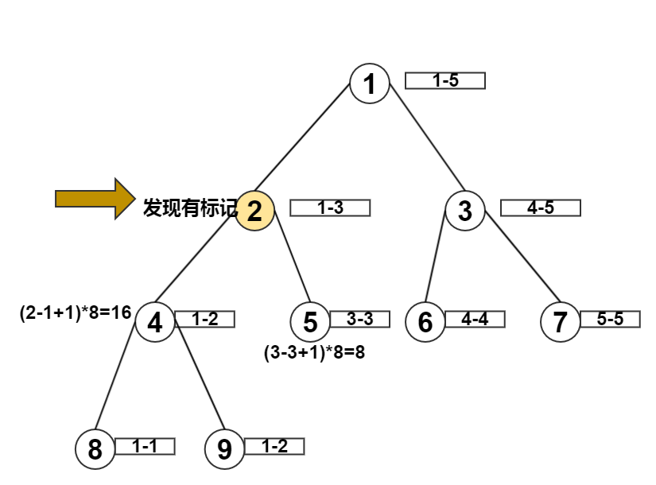

# 线段树成段更新

## 问题引入

假如我们有一段区间[1,n],我们每一次要替换区间[x,y]为一个固定值c,也会不停的查询某段区间的和?怎么做最快呢?

数据1:

```
5
1 2 3 4 5
4
c 1 3 8
q 1 3
c 1 2 5
q 1 4
```

用上面的单点更新,也可以解决这个问题.但是,当m非常大的时候,我们更新的次数太多了,一定会超时.

想一想:因为每一次更新一个区间,我们不需要把所有的叶子节点都更新,也就是不需要更新到叶子节点.**我们只需要更新到能把这段区间覆盖的节点**就行了.

我们把这个节点设一个**标记**,表明:这个节点被更新了,下次**路过**这个节点的时候,发现了这个节点有**标记**,那就把这个结点:**向下更新**(因为路过这个结点,有可能访问更下面的结点[也就是儿子],那就把这个点的标记值往下放,分给两个儿子,同时更新对就原始树上的儿子的值,这样你访问更下面的结点,发现已经被更新过了,这就叫lazy更新,可以减少很多操作)

核心：什么时候需要把标记下压？**当路过标记过的结点$u$时**。


 路过的情况:
 
 - query一个在标记结点下面的结点
 - 更新一个在标记结点下面的结点
 
当然不同的题目,有不同我们有不同的pushdown,update,query的写法

## 算法原理简单演示

如果我们有以下操作:

```
c 1 3 8   # 替换区间[1,3]的所有的数的值为8
q 1 2     # 查询区间[1,2]的数的和
```

先修改点2,区间[1,3]的值,并加上一个标记

ps：标记的点不对，路过的时候没有把标记下压。


现在进行查询操作,从根节点1来到节点2,发现这个点有**标记**,证明这个点被修改过,把这个标记往下压给两个儿子,于是两个儿子的值也被更新了



查询继续,来到点4,发现这个点的范围正好是要找的范围,直接返回一个值**16**,查询结束


## 算法原理DSA演示

面对的数据
```
5
1 2 3 4 5
4
c 1 3 8
q 1 3
c 1 2 5
q 1 4
```

代码演示：[线段树区间更新](https://dsa.slimeoj.online/#/segment_tree_range_update)

## 算法核心

那我给上面的单点更新添加两个操作:

操作1: pushdown 把flag 树的值向下push,并且更新st[lson],st[rson]的值

```c
void pushdown(int rt,int m){
	if( flag[rt]){ //如果flag的rt点有值
		/* 向下更新 */
		flag[lson(rt)] = flag[rson(rt)] = flag[rt];
		/* 更新左孩子*/
		st[lson(rt)] = flag[rt] *(m-(m>>1));
		/* 更新右孩子*/
		st[rson(rt)] = flag[rt] *(m>>1);
		flag[rt] = 0;/* 自己清空 */
	}
}
```

操作2: update 更新一段区间,当然要用到lazy方法

```c
void update(int l1,int r1,int c,int l,int r,int rt){
	if(l1 <= l && r <= r1 ){ //到了能覆盖区间的的结点
		flag[rt] = c;        //留下标记
		st[rt] = (r-l+1)*c;  //更新当前ST结点的值
		return ;
	}
	pushdown(rt,r-l+1);
	int m = (l+r) >>1;
	if( l1 <=m) update(l1,r1,c,l,m,lson(rt));
	if( r1 > m) update(l1,r1,c,m+1,r,rson(rt));
	pushup(rt);
}
```

修改query操作

操作3: query 和单点更新的query 差不多,但是我们要注意,query也会路过flag点

```c
int query(int l1,int r1,int l,int r,int rt){
	if(l1<= l && r<=r1){
		return st[rt];
	}
	pushdown(rt,r-l+1);
	int m =(l+r)>>1;
	int ret = 0;
	if(l1 <=m) ret+=query(l1,r1,l,m,lson(rt));
	if(r1 >m ) ret +=query(l1,r1,m+1,r,rson(rt));
	return ret;
}	
```


整体代码:

```c
/*============================================================================
* Title : 线段树 成段替换
* Author: Rainboy
* Time  : 2016-05-27 13:05
* update: 2016-05-27 13:05
* ? Copyright 2016 Rainboy. All Rights Reserved.
*=============================================================================*/

#include <cstdio>
#include <cstring>
const int maxn = 1000;
int st[maxn<<2];
int flag[maxn<<2];
#define lson(rt) (rt<<1)
#define rson(rt) ((rt<<1)|1)
int n,m;
void pushup(int rt){
    st[rt] = st[lson(rt)] + st[rson(rt)];
}
void pushdown(int rt,int m){
    if(flag[rt]){
        flag[lson(rt)] = flag[rson(rt)] = flag[rt];
        st[lson(rt)] = flag[rt]*(m-(m>>1));
        st[rson(rt)] = flag[rt]*(m>>1);
        flag[rt] = 0;
    }
}
void update(int l1,int r1,int c,int l,int r,int rt){
    if(l1 <=l && r<=r1){
        flag[rt] = c; //我们到达一个点
        st[rt] = (r-l+1)*c;
        return ;
    }
    pushdown(rt,(r-l+1)); //查看当前点对应标记树是不是有标记,如果有就往下压
    int m = (l+r)>>1;
    if( l1 <= m) update(l1,r1,c,l,m,lson(rt));
    if( r1 > m) update(l1,r1,c,m+1,r,rson(rt));
    pushup(rt);
}
int query(int l1,int r1,int l,int r,int rt){
    if(l1<=l && r <= r1){//包含
        return st[rt];
    }

    //路过
    pushdown(rt,(r-l+1));
    int ret = 0;
    int m = (l+r)>>1;
    if(l1 <= m) ret+= query(l1,r1,l,m,lson(rt));
    if(r1 > m ) ret+= query(l1,r1,m+1,r,rson(rt));
    return ret;
}
void build(int l,int r,int rt){
    if( l==r){
        scanf("%d",&st[rt]);
        return ;
    }
    int m = (l+r)>>1;
    build(l,m,lson(rt));
    build(m+1,r,rson(rt));
    pushup(rt);
}
int main(){
    memset(flag,0,sizeof(flag));
    scanf("%d",&n);
    build(1,n,1);
    scanf("%d",&m);
    int i,j,k;
    char c;
    while(m--){
        scanf("%c",&c); //读两次,滤掉\n
        scanf("%c",&c);
        if( c == 'c' ){
            scanf("%d%d%d",&i,&j,&k);
            update(i,j,k,1,n,1);
        }else {
            scanf("%d%d",&i,&j);
            int ans = query(i,j,1,n,1);
            printf("%d\n",ans);
        }
    }
    return 0;
}

```

数据生成+对拍程序

https://yunpan.cn/cSESkjm538AfK （提取码：fdbb）

## 加深自己的理解

 1. 用纸和笔把数据1和整个过程模拟出来
 2. 把下面的数据,用纸和笔把整个过程模拟出来
 
数据2: 相加

数据3: 相减


## 相关练习题目

 - [hdu1698 just a hook](https://vjudge.net/problem/HDU-1698)
 - [poj3468 A simple problem with integers](https://vjudge.net/problem/poj-3468)
 - cojs 2319 地球往事 (http://cogs.pro:8080/cogs/problem/problem.php?pid=2319)


