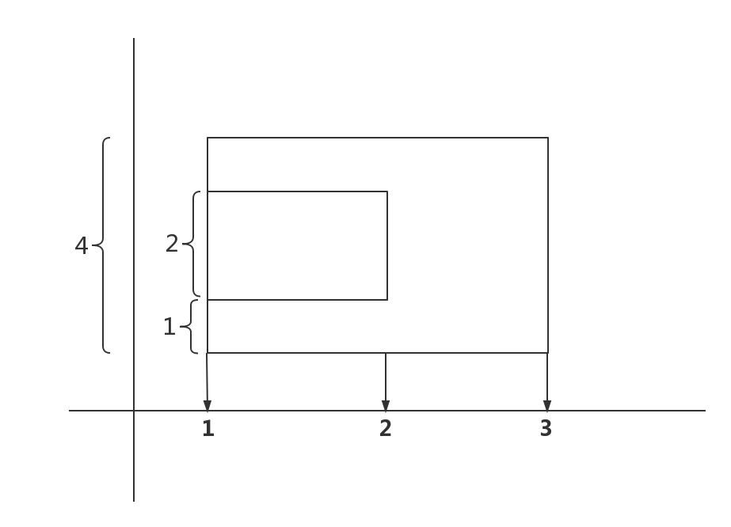
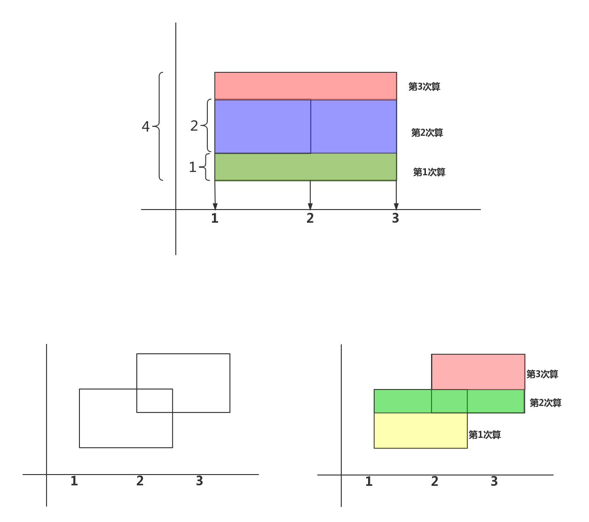
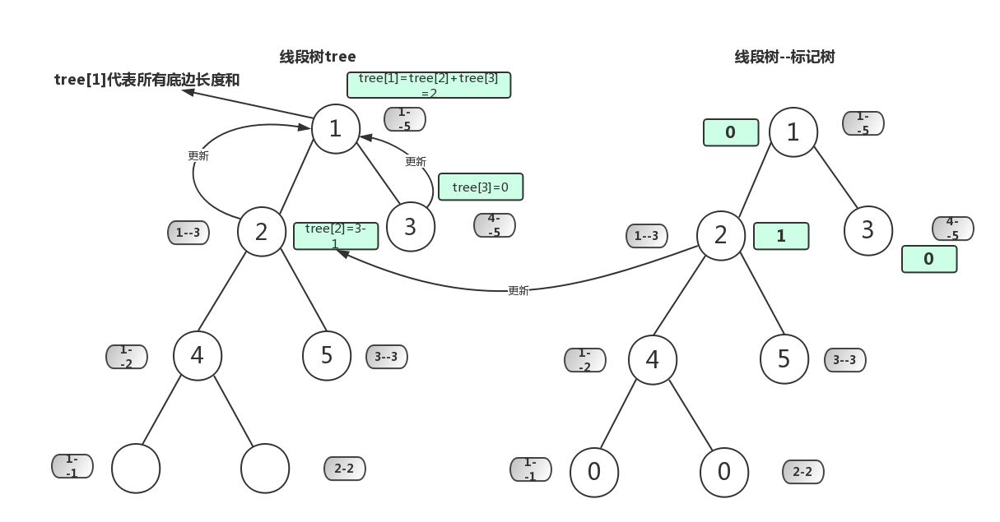
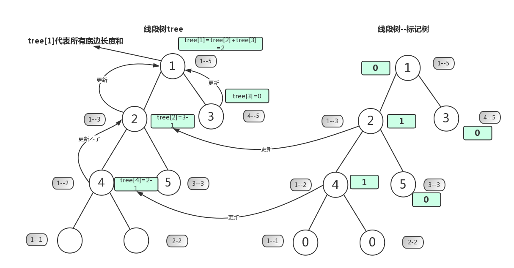
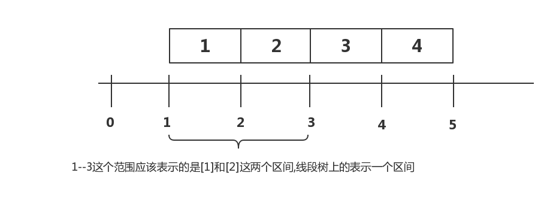

# 扫描线


## 题目

来源[poj1151](http://poj.org/problem?id=1151)

### 亚特兰蒂斯

There are several ancient Greek texts that contain descriptions of the fabled island Atlantis. Some of these texts even include maps of parts of the island. But unfortunately, these maps describe different regions of Atlantis. Your friend Bill has to know the total area for which maps exist. You (unwisely) volunteered to write a program that calculates this quantity.
Input

这里有一些古代希腊文书,包含了对寓言中的岛屿亚特兰蒂斯的描述.甚至有一些文书中包含这个岛屿一部分地图.但是不幸的这些地图描述的区域不同,你的朋友Bill必须弄清楚存在的 地图的总面积,你(愚笨地)自愿去写一个程序来计算这个值

The input consists of several test cases. Each test case starts with a line containing a single integer n (1 <= n <= 100) of available maps. The n following lines describe one map each. Each of these lines contains four numbers x1;y1;x2;y2 (0 <= x1 < x2 <= 100000;0 <= y1 < y2 <= 100000), not necessarily integers. The values (x1; y1) and (x2;y2) are the coordinates of the top-left resp. bottom-right corner of the mapped area. 
The input file is terminated by a line containing a single 0. Don't process it.

输入包含多个测试,每个测试包含一个整数n(1<=n<=100)的一行数据开始,n代码有多少个地图,接下来n行每行描述一个地图.其中每行有4个数字`x1,y1,x2,y2 (0 <= x1 < x2 <= 100000;0 <= y1 < y2 <= 100000)`,不一定是整数.`(x1,y1)`和`(x2.y2)`分别是地图左上角和右下角的坐标.输入文件以包含一个0整数的一行结束.

Output
输出

For each test case, your program should output one section. The first line of each section must be "Test case #k", where k is the number of the test case (starting with 1). The second one must be "Total explored area: a", where a is the total explored area (i.e. the area of the union of all rectangles in this test case), printed exact to two digits to the right of the decimal point. 
Output a blank line after each test case.


对于每一个测试,你的程序应该输出一节:每一节的第一行必须是`Test case #k`,k是测试的序号(以1开始),第二行必须是:`Total explored area: a`,a是整个区域,保留两个小数


Sample Input

```
2
10 10 20 20
15 15 25 25.5
0
```

Sample Output

```
Test case #1
Total explored area: 180.00 
```


Source
Midu-Central European Regional Contest 2000

## 题目解析

### 离散化

如果x轴的数据比较分散,将所有的x轴坐标存在一个数组里..排序,离散化


### 扫描线


假如我们有这样的一个区域要算,我们可以使用以下方法

扫描线法：假想有一条扫描线，从左往右（从右往左），或者从下往上（从上往下）扫描过整个多边形（或者说矩形。。多个矩形叠加后的那个图形）。如果是竖直方向上扫描，则是离散化横坐标，如果是水平方向上扫描，则是离散化纵坐标。下面的分析都是离散化横坐标的，并且从下往上扫描的。




分割区域来做



扫描之前还需要做一个工作，就是保存好所有矩形的上下边，并且按照它们所处的高度进行排序，另外如果是上边我们给他一个值-1，下边给他一个值1，我们用一个结构体来保存所有的上下边 

```c++
struct segment
{
    double l,r,h;   //l，r表示这条上下边的左右坐标，h是这条边所处的高度
    int f;   //所赋的值，1或-1
}

```
接着扫描线从下往上扫描，每遇到一条上下边就停下来，将这条线段投影到总区间上（总区间就是整个多边形横跨的长度），这个投影对应的其实是个插入和删除线段操作。还记得给他们赋的值1或-1吗，下边是1，扫描到下边的话相当于往总区间插入一条线段，上边-1，扫描到上边相当于在总区间删除一条线段（如果说插入删除比较抽象，那么就直白说，扫描到下边，投影到总区间，对应的那一段的值都要增1，扫描到上边对应的那一段的值都要减1，如果总区间某一段的值为0，说明其实没有线段覆盖到它，为正数则有，那会不会为负数呢？是不可能的，可以自己思考一下）。


每扫描到一条上下边后并投影到总区间后，就判断总区间现在被覆盖的总长度，然后用下一条边的高度减去当前这条边的高度，乘上总区间被覆盖的长度，就能得到一块面积，并依此做下去，就能得到最后的面积

（这个过程其实一点都不难，只是看文字较难体会，建议纸上画图，一画即可明白，下面献上一图希望有帮组）


### 扫描线过程

我们对第一个图进行具体的扫描线过程,我们先建立下面这两个树,一个是**线段树**,一个是**线段树的标记树**(想想我们讲过的线段树区间更新)
其中`tree[1]`表示某个时候**可用的**底边的长度和,标记树`mark[i]==0`表示这段区间**不可用**,`mark[i]>0`表示**可用**


我们读取第一条底边`1--3`,使`mark[2]+=1`表示这个区间可用,所以`tree[2] = right -left =2`,同时更新父亲点`tree[1] = tree[2]+tree[3] = 2+0 =2`



我们读取第二条底边`1--2`,使`mark[4]+=1`表示这个区间可用,所以`tree[4] = right -left =1`,同时**相要**更新父亲点`tree[2]`,但是发现父亲点的标记`mark[2] !=0`表示父亲代表的区间可用,想一想,父亲的区间是比自己大的,这个时候我们用最长的可用的区间来做底边,所以更新不了(也可以说不用更新)




我们要注意一个细节问题,如果我们要求图1上的`1--3`的这个线段的长度,我们知道线段树`tree`上的每个点表示的是一个区间的含义,如果我们想`1---3`这个范围的线段,那它所对应在线段树tree上的区间点应该是`tree[2]`(代表的范围1-2),表示的是求第一个区间(`1--2`)和第二个区间(`2--3`)区间的长度和




那我们可以知道更新父亲的策略是:

```c++
#define lson(rt) (rt<<1)
#define rson(rt) ((rt<<1)|1)

void upfater(int n,int left,int right){
    if(mark[n])
        tree[n]=right+1-left;//表示该区间整个线段长度可以作为底边
    else if(left == right)
        tree[n]=0;//叶子结点则底边长度为0(区间内线段长度为0)
    else            //这个点mark[n] == 0,就用孩子来更新自己
        tree[n]=tree[lson(n)]+tree[rson(n)];
}
```

## 亚特兰蒂斯--代码解析

```c++

#include<iostream>
#include<cstdio>
#include<cstdlib>
#include<cstring>
#include<string>
#include<queue>
#include<algorithm>
#include<map>
#include<iomanip>
#define INF 0x3f3f3f3f
using namespace std;

#define lson(rt) (rt<<1)
#define rson(rt) ((rt<<1)|1)

const int MAX=200+10;
int mark[MAX<<2];//底边个数
double tree[MAX<<2]; //线段树,记录底边的长度
double _hash[MAX]; //离散化用

//存线段
struct segment{
    double l,r,h; //l，r表示这条上下边的左右坐标，h是这条边所处的高度
    int f;//上边为-1,下边为1

    //初始化
    segment(){}
    segment(double x1,double x2,double H,int c):l(x1),r(x2),h(H),f(c){}
    //重载
    bool operator<(const segment &a) const {
        return h < a.h;
    }
}s[MAX];

void upfather(int n,int l,int r){
    if(mark[n]) 
        //tree[2] 1--3 should == 50
        tree[n] = _hash[r+1] - _hash[l];//表示该区间整个线段长度可以作为底边
    else if (l ==r )//叶子结点则底边长度为0(区间内线段长度为0)
        tree[n] = 0;
    else
        tree[n] = tree[lson(n)] + tree[rson(n)];
}


//区间更新
void update(int L,int R,int d,int rt,int l,int r){
    if(L <=l && r <=R){ //该区间是当前扫描线段的一部分,则该区间下底边总长以及上下底边个数差更新
        mark[rt] +=d;
        upfather(rt,l,r); //更新当前点
        return;
    }

    int mid = (l+r) >>1;
    
    if( L <=mid)
        update(L,R,d,lson(rt),l,mid);
    if(R >mid)
        update(L,R,d,rson(rt),mid+1,r);
    upfather(rt,l,r);
}

//二分查找
int search(double key,double* x,int n){
    int left=1,right=n;         //数组从1开始
    while(left<=right){
        int mid=(left+right)>>1;
        if(x[mid] == key)return mid;
        if(x[mid]>key)right=mid-1;
        else left=mid+1;
    }
    return -1;
}
int main(){
    memset(mark,0,sizeof(mark));
    memset(tree,0,sizeof(tree));
    int n,num=0;

    double x1,x2,y1,y2;

    scanf("%d",&n);
    while(n){
        int k =0;
        int i;
        for(i=0;i<n;i++){
            scanf("%lf%lf%lf%lf",&x1,&y1,&x2,&y2);
            _hash[k]=x1;
            s[k++] = segment(x1,x2,y1,1);
            _hash[k]=x2;
            s[k++] = segment(x1,x2,y2,-1);
        }
        sort(_hash,_hash+k);//从小到大排
        sort(s,s+k);        //从小到大排

        int m =1;
        for(i=1;i<k;i++){   //去重
            if(_hash[i] != _hash[i-1])
                _hash[m++] = _hash[i];
        }

        for(i=m;i>=1;i--){
            _hash[i]= _hash[i-1];
        }

        double ans = 0;

        for(i=0;i<k;i++){
            int L = search(s[i].l,_hash,m);
            int R = search(s[i].r,_hash,m)-1;//1--3 范围就是 第1个和第2个区间
            update(L,R,s[i].f,1,1,m);//扫描线段时更新底边长度和底边相差个数
            ans += tree[1]*(s[i+1].h-s[i].h);//新的面积
        }
        printf("Test case #%d\nTotal explored area: %.2lf\n\n",++num,ans);
    }
    return 0;
}


```
