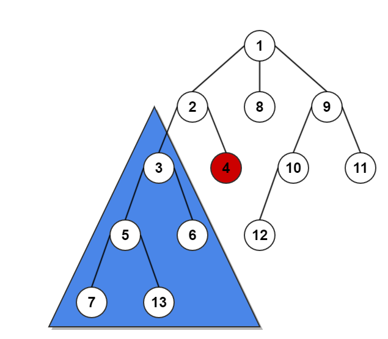
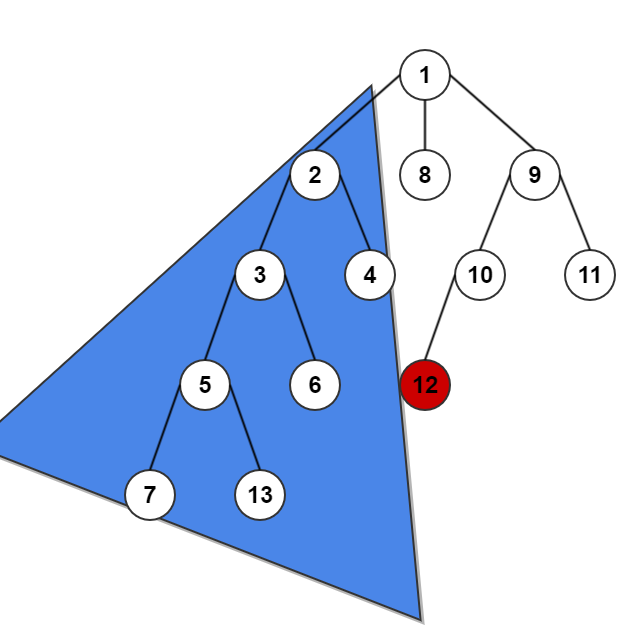
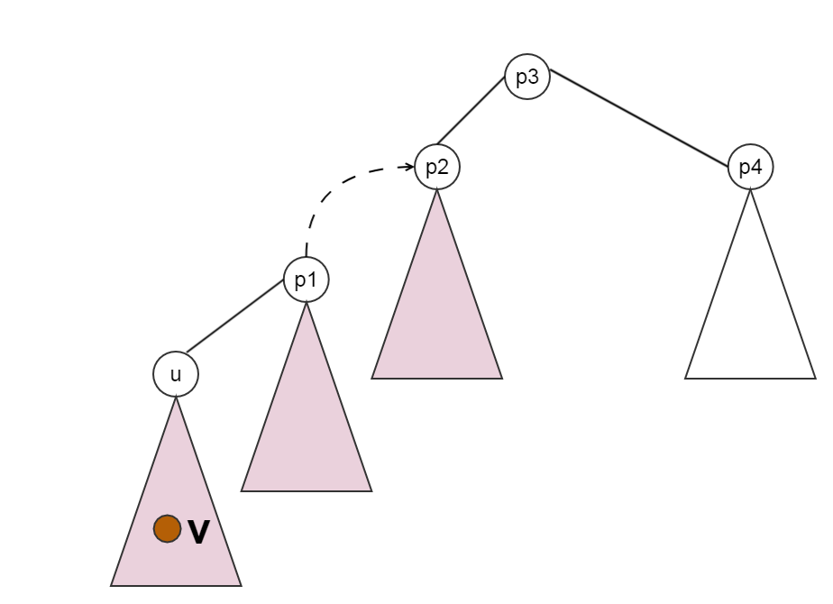
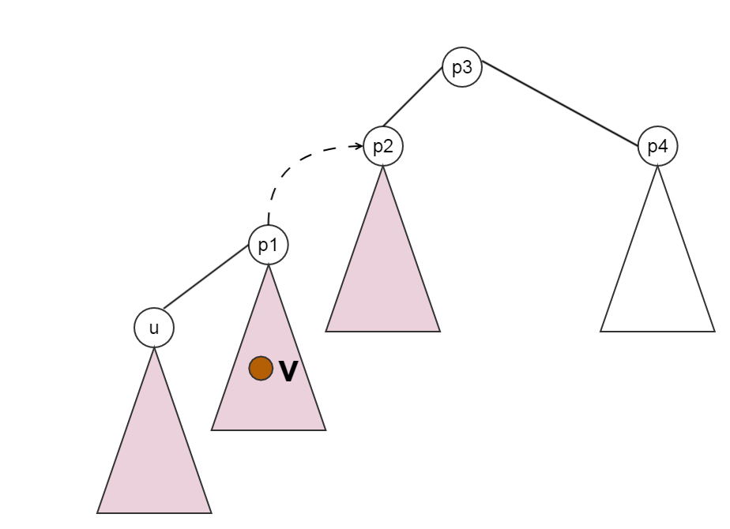
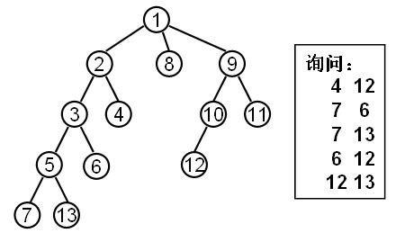

## tarjan算法

解决LCA问题的Tarjan算法利用并查集在一次DFS（深度优先遍历）中完成所有询问。它是时间复杂度为O(Na(N)+Q)的离线算法


## tarjan入门

如下面的两个图,蓝色区域是DFS过程中已经访问过的点,红色是正在访问过的点,问此时`lca(7,4)`和`lca(7,12)`是谁?仔细想一想为什么是这样,有什么样的规律?




**一个点什么时候被访问过呢?**  当dfs回溯退出这个点的时候


**重要点:正在访问的点u和已经访问过点v的lca(u,v)就是v所在的已经访问过的点组成的子树的父亲(就是根)**


## 如何在DFS的过程中知道已经访问过的点形成的子树的父亲?

当一个点u退出(回溯退出时),它就已经访问了,它和它所有的子树都应该访问完了,那它们的根应该是u的父亲,为了可以快速已经访问过的点的形成的子树的根,我们用**并查集**

数据:

```
13
1 2
1 8
1 9
2 3
2 4
9 10
9 11
3 5
3 6
10 12
5 7
5 13
```

代码
```c
#include <cstdio>
#include <cstring>

int n;

struct Edge {
    int u,v;
    int next;
}E[100];
int size =0;
int head[100];

int fa[100] = {0};

void addedge(int x,int y){
    size++;
    E[size].u = x;
    E[size].v = y;
    E[size].next = head[x];
    head[x] = size;
}

void dfs(int x){
    int i;
    fa[x] = x;
    for(i = head[x];i!= -1;i=E[i].next){
        int y = E[i].v;
        dfs(y);
        //点y 和它的子树都应该访问过了
        //这里点y退出访问
        //设 fa[y] = x;
        fa[y] = x;
    }
    printf("%d ",x);
}

int main(){
    memset(head,-1,sizeof(head));
    scanf("%d",&n);
    int i,j;
    for(i=1;i<n;i++){
        int x,y;
        scanf("%d%d",&x,&y);
        addedge(x,y);
        fa[y] = x;
    }

    int root = 1;
    while( fa[root] != 0)
        root = fa[root];
    dfs(root);
    
    return 0;
}
```
## tarjan算法正确性证明



证明1:**dfs的过程正在访问点U,这个时候点V是U的子树,那么V就是已经访问过的点,那么LCA(U,V)=U**




证明2:**u是点p1的子树中的点,V是点p1的另一个子树中的点,dfs的过程正在访问点U,这个时候点V是所在的子树点全部被访问过,那么V就是已经访问过的点,那么LCA(U,V)=p1**


**我们发现所有的lca都可以概括成上面的两种情况**


**情况1:如果$u$和$v$不在同一个子树的时候**

我们发现如果设$p = lca(u,v)$,那么$v$,$u$一定$p$的子树上的点.我们规定$DFS$过程中先访问$v$,后访问$u$,那么在访问到$u$,且要回溯退出$u$时

 - 那么$v$所在的子树上的点w一定都被访问完了,**这个子树的根是就所求lca**
 - 你在回溯的过程可以把所有的点$w$值所在的并查集的根应该是$p$
 - 那么$lca(u,v) = find(v)$

<center>
# 在dfs的过程中,即将回溯退出某个点x的时候,如果存在一个点u,且u是已经访问过的点,那么lca(x,u)就是 u所在的已经访问过的点的集合 形成的子树的父亲
</center>


为什么是 **即将回溯退出某个点x的时候** 这个时刻呢?
 > 这个点x的所有子树上的点y都已经访问过了, 那lca(x,y)就是x

如何得知 **u所在的已经访问过的点的集合 形成的子树的父亲**
 > 点y退出返回到上一层点x的时候,f[y] = x

## 具体代码


数据
```
13 5
1 2
1 8
1 9
2 3
2 4
9 10
9 11
3 5
3 6
10 12
5 7
5 13
4 12
7 6
7 13
6 12
12 13
```

```c
#include <cstdio>
#include <cstring>


#define N 100

int n,m,root;//n个点,m个询问

bool vis[N] = {0};
struct Edge {
    int u,v,w;
    int next;
}E[100];
int size = 0;
int head[N];


void addEdge(int x,int y,int z){
    size++;
    E[size].u =x;
    E[size].v =y;
    E[size].w =z;
    E[size].next = head[x];
    head[x] = size;
}

struct query {
    int u,v;
    int next;
    int num; // 第几个询问
}q[2*N];
int qhead[N];
int qsize=0;;
int ans[2*N];

void addQuery(int x,int y,int num){
    qsize++;
    q[qsize].u =x;
    q[qsize].v =y;
    q[qsize].num = num;
    q[qsize].next = qhead[x];
    qhead[x]  =qsize;
}

//并查集数据
int fa[N] = {0};

int find(int x){
    if( fa[x] == x) return x;
    fa[x]  = find(fa[x]);
    return fa[x];
}

void tarjan(int x){
    int i,y;
    fa[x]  =x; // 正在访问的点 设为自己根

    for(i=head[x];i!=-1;i=E[i].next){
        y = E[i].v;
        tarjan(y);
        fa[y] = x; //子树的点集,变成x的集合
    }
    //x是正在访问的点
    //如果另外一个点u已经访问过
    //那lca(x,u) == fa[u]

    vis[x]=1;//标记 放这里的原因就是 求lca(6,6)这种点
    for(i=qhead[x];i!=-1;i=q[i].next){
        y = q[i].v;
        if( vis[y])
            ans[q[i].num] =find(y);
    }
}

int main(){
    memset(head,-1,sizeof(head));
    memset(qhead,-1,sizeof(qhead));
    scanf("%d%d",&n,&m);
    int i,j;
    for(i=1;i<n;i++){ //n-1条边
        int x,y;
        scanf("%d%d",&x,&y);
        addEdge(x,y,1);//默认边权为1
        fa[y] = x;
    }

    root =1;
    while( fa[root] != 0)
        root = fa[root];//停下来的时候root 就是根的编号

    for(i=1;i<=m;i++){
        int x,y;
        scanf("%d%d",&x,&y);
        addQuery(x,y,i);
        addQuery(y,x,i);
    }
    tarjan(root);
    for(i=1;i<=m;i++){
        printf("%d\n",ans[i]);
    }
    return 0;
}
```

