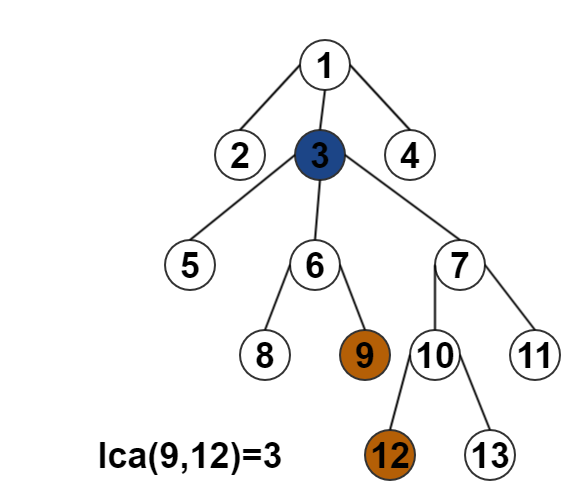

@[toc]

## 什么是lca

LCA：Lowest Common Ancestor  基于有根树最近公共祖先问题。

LCA(u,v)：给定一棵有根树T和两个结点u和v, 找到距离u和v的最近的共同祖先结点，称为LCA问题。

树的最近公共祖先问题是树结构上最经典的问题之一。 求解lca的算法有很多。

```viz-dot
<%- include("dot/doubly_tree.dot") %>
```

如图1所示：

 - $lca(4,5) = 2$
 - $lca(4,6) = 1$
 - $lca(5,6) = 1$
 - $lca(4,2) = 2$


## 倍增思想

问题：在如下图一个数轴上，起点$x$上有一个小人，他每次可以向右跳$2^x$远的距离，问到达$y$最少跳几次？

```viz-dot
<%- include("dot/doubly_bar1.dot") %>
```

$x \rightarrow y$的距离是$6$,显然跳两次，第一次跳$2^2$，第二次跳$2^1$，正好可以跳到点$y$。

如何写出一个算法，求出最少跳的次数呢？


<<<< viz-gallery(title="跳的过程",engine="dot",height="400")

<% 
var log =["","过程1","过程2","过程3","过程4"]
var engine = "dot"
for(let i=2;i<=5;i++){
    var page = `dot/doubly_bar${i}.dot`
%>

``` <%= engine || ""%> <%= log[i-1] || "" %>
<%- include(page) %>
```
<%}%>

<<<<

 1. $x$能跳到的最远距离是$2^3 = 8$，不然会超出数轴，但是会到达红色的区域，所以不能跳
 1. $x$接下尝试跳到的距离是$2^2 = 4$，可以跳，于是跳。
 1. $x$接下尝试跳到的距离是$2^1 = 2$，可以跳，于是跳。
 1. $x$接下尝试跳到的距离是$2^0 = 1$，不可以跳。

::: info
提出疑问，是不是数轴上的任意点都可以按这种方法跳到呢？隐含着什么样的规律呢？

你可以自己在数轴上多找几个点尝试一下。
:::

::: blackboard
结论：
如果数轴上的一最远可以跳的距离是$2^x$，那接下来只要不停的按$[2^x,2^{x-1},...,2^0]$去尝试，只要能跳就跳，最后一定会停在可行区域的最后一个位置，也就是不可行区域的前一个位置，且速度很快。


这种方法我们称为倍增法。
:::

而且发现，最后所以的可行跳跃加起就是两点距离的二进制表示，如$x \rightarrow y = 6 = 2^2+2^1$，这就是倍增法快的原因。

例如：一个32位长的int型整数的大小，只要走32次就可以达到。


可以写出一个大概的伪代码如下：
```c
int k = 0;
while( (1<<(k+1)) < maxLen ) k++;
for(int i=k; i>=0;--i)
    if( a[x+(1<<i)] is right)
        x  = a[x + (1<<i)]
```
也可以用：
```c
int k = (int)(log(n)/log(2));
```

## 倍增(爬树)法求lca


在我们学习倍增法之后，完全可以这种倍增跳跃的方式应用在树上，从一个点快速的向上爬，如下。

::: lb


:::

尝试用这种方法来求树的lca。方法如下，

求两个点$u,v$的$lca$

1. 两个$u,v$点爬到同一层，如果变成同一个点，证明$u,v$在现人在同一条链上，返回这个点。
2. $u,v$在同一深度后，一起向上爬，但不可以到爬到同一点（公共祖先）
3. 返回停下来的点的父亲



显然最后的时间复杂度为:$O(m \cdot log(n))$，$m$表示询问次数。

## 代码模板

<!-- template start -->
```c
struct Lca {
    int N,d[maxn],f[maxn][50]; //f[i][j] i点的2^j祖先
    // 初始化，算出的理论跳的最远可能，与f[][]
    inline void init(){
        for(N=0; (1<<(N+1)) < n ;N++);
        dfs(1,0,1);
    }

    //树上的遍历来求 f[][] 与d[]每个点的深度
    void dfs(int u,int fa,int dep){
        d[u] = dep;
        f[u][0] = fa;
        // 显示u点到root路径上的点都已经求出来f[][]
        for(int j=1;j<=N;++j) f[u][j] = f[ f[u][j-1] ][j-1];
        for(int i=e.h[u];~i;i=e[i].next){
            int &v = e[i].v;
            if( v == fa) continue; //是父亲 就什么也不做
            dfs(v,u,dep+1);
        }
    }

    //重载(),找到两个点的lca
    int operator()(int a,int b){
        if( d[a] > d[b]) swap(a,b); //保证b是深的点
        for(int i=N;i>=0;--i){ // b 跳到和a一样深
            if( d[ f[b][i] ] >= d[a]) // a深度以下是可行区域,包括a
                b = f[b][i];
        }
        if( a == b) return a; //在同一条链上
     
        for(int i=N;i>=0;--i){ // 同时跳
            if( f[a][i] != f[b][i] ){ //不相同就跳
                a = f[a][i];
                b = f[b][i];
            }
        }
        return f[a][0]; //返回停下来时候的父亲，就是lca
    }

} lca;
```
<!-- template end -->
## 具体代码


数据如下

  - 第一行两个数n,m,表示树有n个点,m个查询
  - 接下来的n-1行表示树的边
  - 接下来的m行表示查询两个点的lca

```
13 5
1 2
1 8
1 9
2 3
2 4
9 10
9 11
3 5
3 6
10 12
5 7
5 13
4 12
7 6
7 13
6 12
12 13
```

代码

```c++
<%- include("code/lca_offline_1.cpp") %>
```

## FAQ: 为什么就在线算法

因为可以边读数据边求lca。

## 模板题目

## 练习
