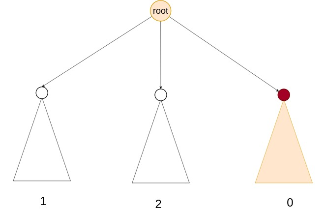

## 题目地址

题目地址:[CF741D Arpa’s letter-marked tree and Mehrdad’s Dokhtar-kosh paths](https://www.luogu.com.cn/problem/CF741D)

题目大意: 一棵根为1 的树，每条边上有一个字符（a-v共22种）。 一条简单路径被称为Dokhtar-kosh当且仅当路径上的字符经过重新排序后可以变成一个回文串。 求每个子树中最长的Dokhtar-kosh路径的长度。

## 解析

有难度,难度在于需要多重思路:

 1. 用二进制表示路径(u,v)的是否合法状态
 2. 利用异或运算的性质,简化运算公式
 3. 差分
 4. 点分治的思想
 5. dsu on tree 加速暴力运算

对于任意一个结点x来说,路径分为两种,

1. $Dokhtar-kosh$路径经过根结点x
2. $Dokhtar-kosh$路径不经过根结点x,在子树上


 - 路径长度计算:$dep[x] +dep[y] -2*dep[lca]$
 - $dis_u \bigoplus dis_v \in right\_ans\_23$
   $dis_u \bigoplus right\_ans\_23$ 的答案存在


**如何避免(u,v)在同一棵轻儿子子树里?**




## 代码

```c
<%- include("code/cf741d.cpp") %>
```
