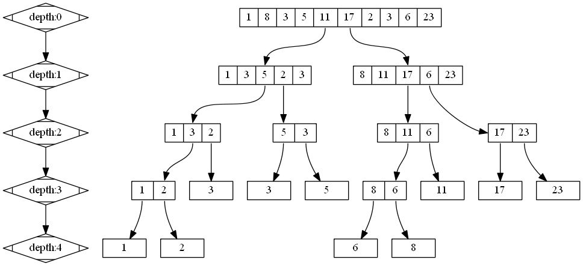
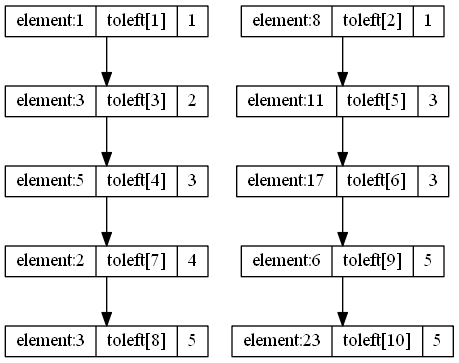

## 题目引入

luogu 3834


## 建立

如何划分



$toleft$含义



```c
void build(int l,int r,int dep){
    if( l == r ) return;
    int mid = ( l + r ) >> 1;
    int same = mid-l+1;
    int i,ls = l,rs = mid+1;
    for(i=l;i<=r;i++){
        int flag = 0;
        if( tree[dep][i] <= sorted[mid] && same > 0){
            flag = 1;
            tree[dep+1][ls++] = tree[dep][i];
            same--;
        }
        else
            tree[dep+1][rs++]= tree[dep][i];
        toleft[dep][i] = toleft[dep][i-1] +flag;
    }
    build(l, mid, dep+1);
    build(mid+1, r, dep+1);
}
```

## 查询

基本思想:查询是在每一层的$toleft$的基础上进行区间的缩小，直到待查询区间缩小为$1$即为查询结果

```viz-dot
<%- include("dot/1.dot") %>
```

设总区间为$[L,R]$,待查区间为$[l,r]$,在待查区间上查找是第$K$大值,那么可以得到:

 - $toleft[r]-toleft[l-1]$为区间$[l,r]$内被分配到左子数的个数.

### **情况1:** $toleft[r]-toleft[l-1]>=K$

说明第$K$大值一定在左子树,此时就可以更新区间，首先大区间二分为[L,L+R>>1],然后考虑小区间，可以确定的是，$[l,r]$分配在左子树的元素一定在区间
[L,L+R>>1]内，所以:

#### 确定左边界:

$$sl=L+toleft[l-1]-toleft[L-1]$$

$toleft[l-1]-toleft[L-1]$为$[L,l-1]$内被分配到左子树的个数，他们不在查找之列，但相对位置不变，这些元素一定排在前面，以此来确定左边界，

#### 确定右边界:

右边界就好确定了，因为$toleft[r]-toleft[l-1]>=K$，所以左边界加上toleft[r]-toleft[l-1]-1即可，即

$$sr=sl+toleft[r]-toleft[l-1]-1$$

同时必有$L<=sl,sr<=(L+R)>>1$;

### **情况2:** $toleft[r]-toleft[l-1]<K$

此时，元素在右子树，二分大区间$[(L+R)>>1|1,R]$
#### 确定右边界

$$sr=r+toleft[R]-toleft[r]$$

$toleft[R]-toleft[r]$表示区间$[r+1,R]$内应该放到左子树的数目

因为相对位置不变，toleft[R]-toleft[r]是分配在左子树的必定会往前移动，所以右边界往后移动，

#### 确定左边界

右边界确定后，确定左边界:

$$sl=sr-(l-r-toleft[l-1]-toleft[L-1])$$

减去分配到左子树的，剩下就在右子树。注意，此时要更新K:

$$K=K--toleft[l-1]-toleft[L-1]$$

已经确定前面有toleft[l-1]-toleft[L-1]比其小，所以就是求右子树内区间[sl,sr]第K--toleft[l-1]-toleft[L-1]小。

#### 大=>小

求区间第k大可以转成求区间第$r-l+1-k+1$小

```c
int query(int L,int R,int l,int r,int dep,int k){

    if(L == R ) return tree[dep][L];
    int mid = (L+R) >> 1;
    int x = toleft[dep][l-1] - toleft[dep][L-1]; //[L,l-1] 去左儿子的个数
    int y = toleft[dep][r] - toleft[dep][L-1];   //[L,r]   去左儿子的个数
    int ry = (r-L+1)-y;     // [L,r] 去右儿子的个数
    int rx = (l-1-L+1)-x;   // [L,l-1] 去右儿子的个数
    int cnt = y - x;        // [l,r] 去左儿子的个数
    if(cnt >= k) //在左边
        return query(L,mid,L+x, L+y-1 ,dep+1, k);
    else
        return query(mid+1,R,mid+1+rx, mid+1+ry-1,dep+1, k-cnt);
}
```


## 完整代码

```c
#include <cstdio>
#include <algorithm>
using namespace std;

const int maxn = 1e5+5;
int n;
int tree[20][maxn];
int toleft[20][maxn];
int sorted[maxn];
void init(){
    scanf("%d",&n);
    int i;
    for(i=1;i<=n;i++){
        scanf("%d",&tree[1][i]);
        sorted[i] = tree[1][i];
    }
    sort(sorted+1,sorted+1+n);
}

void build(int l,int r,int dep){
    if( l == r ) return;
    int mid = ( l + r ) >> 1;
    int same = mid-l+1;
    int i,ls = l,rs = mid+1;
    for(i=l;i<=r;i++){
        int flag = 0;
        if( tree[dep][i] <= sorted[mid] && same > 0){
            flag = 1;
            tree[dep+1][ls++] = tree[dep][i];
            same--;
        }
        else
            tree[dep+1][rs++]= tree[dep][i];
        toleft[dep][i] = toleft[dep][i-1] +flag;
    }
    build(l, mid, dep+1);
    build(mid+1, r, dep+1);
}

//查询 区间[l,r]内的第k大
int query(int L,int R,int l,int r,int dep,int k){

    if(L == R ) return tree[dep][L];
    int mid = (L+R) >> 1;
    int x = toleft[dep][l-1] - toleft[dep][L-1]; //[L,l-1] 去左儿子的个数
    int y = toleft[dep][r] - toleft[dep][L-1];   //[L,r]   去左儿子的个数
    int ry = (r-L+1)-y;     // [L,r] 去右儿子的个数
    int rx = (l-1-L+1)-x;   // [L,l-1] 去右儿子的个数
    int cnt = y - x;        // [l,r] 去左儿子的个数
    if(cnt >= k) //在左边
        return query(L,mid,L+x, L+y-1 ,dep+1, k);
    else
        return query(mid+1,R,mid+1+rx, mid+1+ry-1,dep+1, k-cnt);
}

int main(){
    init();
    build(1, n, 1);
    printf("%d\n",max_dep);
    int i,j;
    for(i=1;i<=5;i++){
        for(j=1;j<=n;j++){
            printf("%d ",tree[i][j]);
        }
        printf("\n");
    }
    int ans = query(1, n, 4, 8, 1, 3);
    printf("%d\n",ans);

    return 0;
}

```

## 参考/引用

- [Oi Wiki 划分树](https://oi-wiki.org/ds/dividing/)
- [划分树 by 十年换你一句好久不见](https://www.cnblogs.com/shinianhuanniyijuhaojiubujian/p/9157906.html)

## 练习题目

- poj-2104
- poj 2761
- hdu 2665
- hdu 4251
- hdu 3473
- hdu 4417
