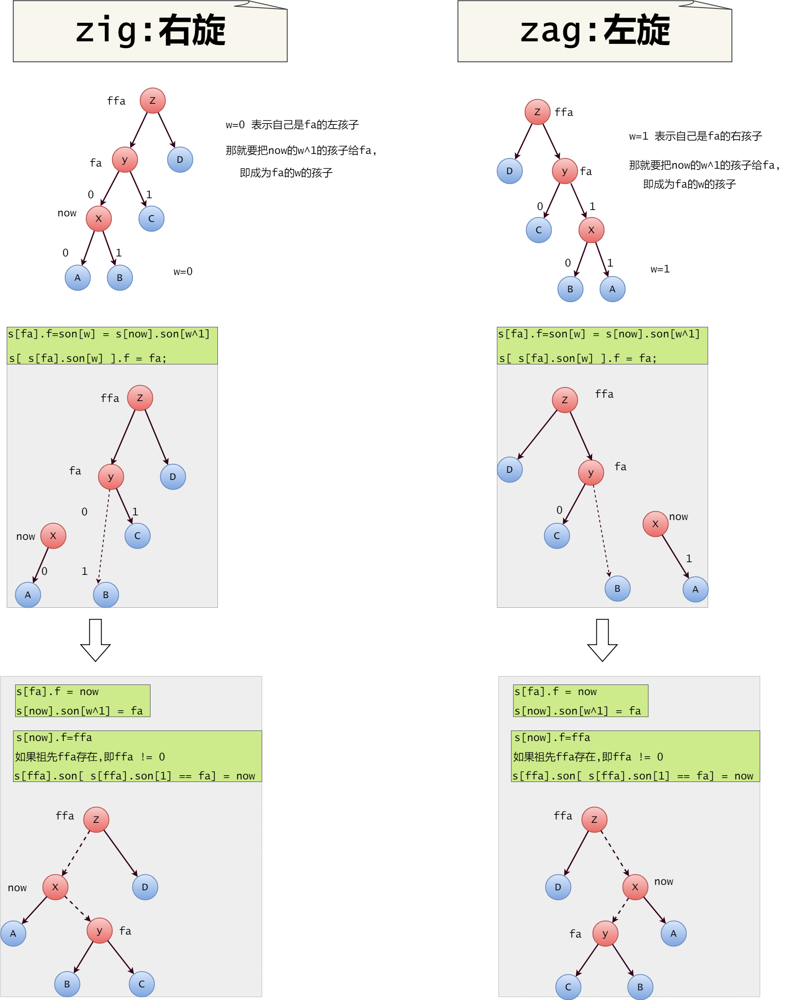

Splay又叫做: 文艺平衡树, 伸展树

基本的操作:

zig 左旋转
zag 右旋转

## 核心操作:旋转

## 然后, 把某个结点翻转上去?

## 练习题目

 - [luogu P3391 【模板】文艺平衡树（Splay）](https://www.luogu.org/problemnew/show/P3391)
 - 序列终结者,bzoj 1251,luogu P4146
 - 郁闷的出纳员,SlimeOJ,loj,luogu,根据标题查找
 - 湖南省选:宠物饲养所, SlimeOJ 1566,BZOJ 1208,luogu P2286,loj 10144

## 参考/引用

 - [Splay树及其应用--朱全民](https://wenku.baidu.com/view/c3b4e02f5a8102d276a22feb.html)
 - [More Senior Data Structure · 特别浅地浅谈Splay by _pks 'w'](https://pks-loving.blog.luogu.org/more-senior-data-structure-te-bie-qian-di-qian-tan-splay)
 - [伸展树的基本操作与应用 IOI2004 国家集训队论文 杨思雨](https://wenku.baidu.com/view/7f0ff024ccbff121dd3683ac.html)
