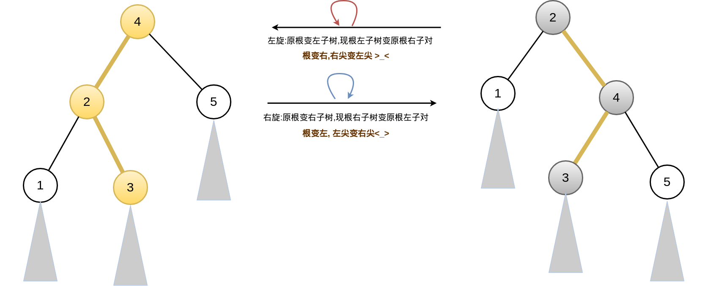
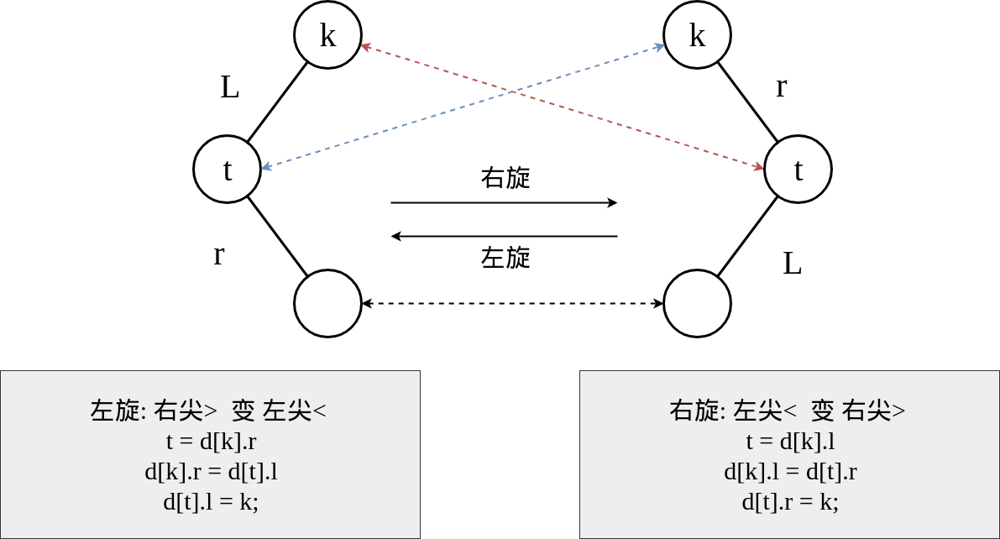
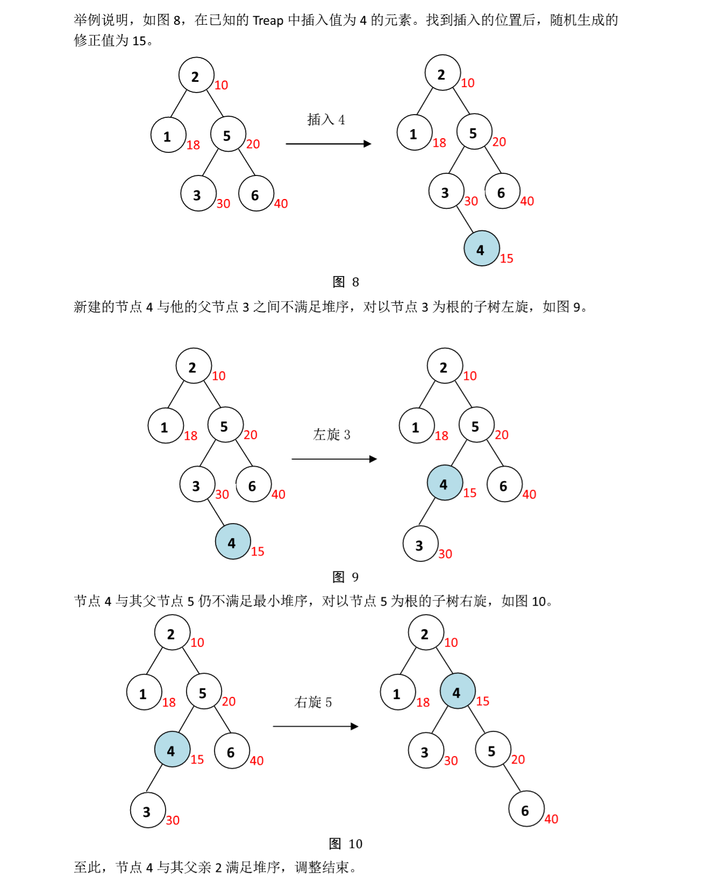
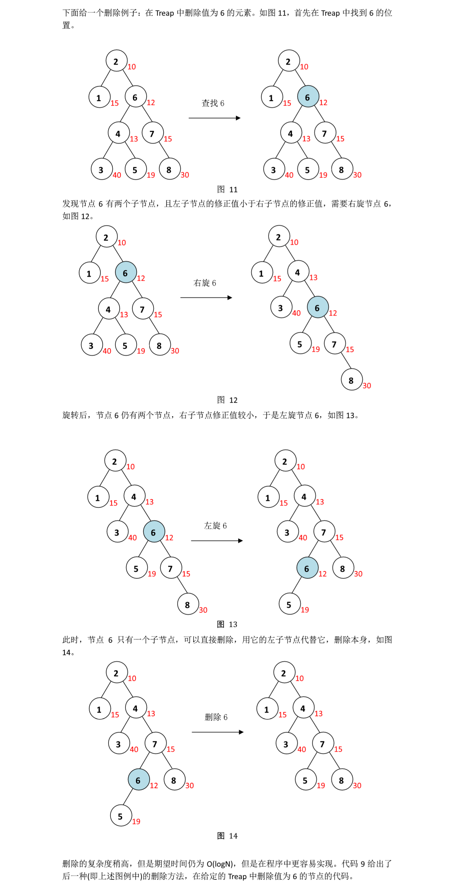
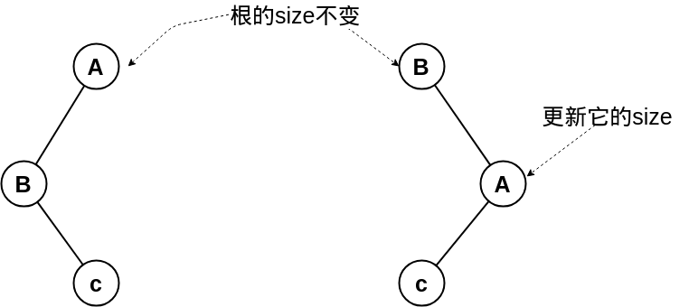
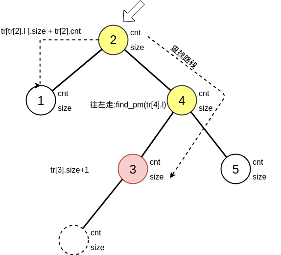

# Treap

树堆，在数据结构中也称Treap，是指有一个随机附加域满足堆的性质的二叉搜索树，其结构相当于以随机数据插入的二叉搜索树。其基本操作的期望时间复杂度为$$O(logn)$$。相对于其他的平衡二叉搜索树，Treap的特点是实现简单，且能基本实现随机平衡的结构。


**学会Treap的前提条件/前置算法:**
 - 二叉查找树(BST)
 - 手写堆(Heap)

Treap 作为一种简洁高效的有序数据结构，在计算机科学和技术应用中有着重要的地位。它可以用来实现集合、多重集合、字典等容器型数据结构，也可以用来设计动态统计数据结构。

Treap一种期望平衡树,所以它不一下完全符合平衡树的定义  
Treap 具有可观的平衡性，且最易于编码调试等特点，因此在信息学竞赛中被广泛地使用。


```math
Treap  = Tree + heap
```

Treap 是一种平衡树。这个单词的构造选取了 Tree(树)的前两个字符和 Heap(堆)的后三个字符，$$Treap = Tree + Heap$$。顾名思义，Treap 把 BST 和 Heap 结合了起来。它和 BST 一样满足许多优美的性质，而引入堆目的就是为了维护平衡。Treap 在 BST 的基础上，添加了一个修正值。在满足 BST 性质的基础上，Treap 节点的修正值还满足最小堆性质
。最小堆性质可以被描述为每个子树根节点都小于等于其子节点。于是，Treap 可以定义为有以下性质的二叉树：

<center>

</center>

1. 若它的左子树不空，则左子树上所有结点的值均小于它的根结点的值，而且它的根节点的修正值小于等于左子树根节点的修正值；
2. 若它的右子树不空，则右子树上所有结点的值均大于它的根结点的值，而且它的根节点的修正值小于等于右子树根节点的修正值；
3. 它的左、右子树也分别为 Treap。

** 为什么平衡**

我们发现，BST 会遇到不平衡的原因是因为有序的数据会使查找的路径退化成链，而随机的数据使 BST 退化的概率是非常小的。在 Treap 中，修正值的引入恰恰是使树的结构不仅仅取决于节点的值，还取决于修正值的值。然而修正值的值是随机生成的，出现有序的随机序列是小概率事件，所以 Treap 的结构是趋向于随机平衡的。

## 一.定义Treap上的一个点

```c
struct {
    int l,r,val; //左右结点的下标,本身存的值
    int fix;     //修正值
}
```


## 二.随机数的产生


`< cstdlib >` 中的`rand()` 速度比较慢， 而在数据结构中对于素的如果要求过高， 可以使用手写 `rand()`。

```c
inline int rand ( )  {
    static int seed = 233;
    return seed = ( int ) seed * 482711LL % 2147483647; 
}
```
其中 `seed` 为随机种子，可以随便填写[原理](https://blog.csdn.net/h348592532/article/details/52837228)

## 三.构建 Treap 

### (1).旋转



**旋转的性质 1**

左旋一个子树，会把它的根节点旋转到根的左子树位置，同时根节点的右子节点成为子树的根；右旋一个子树，会把它的根节点旋转到根的右子树位置，同时根节点的左子节点成为子树的根。

我们可以从图中清晰地看出,因为点的左右相对位置没有改变，左旋后的根节点降到了左子树，右旋后根节点降到了右子树,**仍然满足 BST 性质**

**旋转的性质 2**

对子树旋转后，子树仍然满足 BST 性质。


所示的左边的一个 Treap，它仍然满足 BST 性质。但是由于某些原因，节点 4 和节点2 之间不满足最小堆序，4 作为 2 的父节点，它的修正值大于左子节点的修正值。我们只有将 2 变成 4 的父节点，才能维护堆序。根据旋转的性质我们可以知道，由于 2 是 4 的左子节点，为了使 2 成为 4 的父节点，我们需要把以 4 为根的子树右旋。右旋后，2 成为了 4 的父节点，满足堆序。


**旋转的意义在于：**  
*旋转可以使不满足堆序的两个节点通过调整位置，重新满足堆序，而不改变 BST 性质。*


**旋转简图与口决:**


**代码:**
```c
//右旋:右尖变左尖,先变孩子后变根
void rturn(int &k){ //右旋
    int t = d[k].l;  
	d[k].l = d[t].r;
	d[t].r = k;	
    d[t].siz = d[k].size;
    //update(k);
    k = t;      //改变当根的编号
}

void lturn(int &k){ //左旋
    int t = d[k].r;
	d[k].r = d[t].l;
	d[t].l = k;	
    d[t].siz = d[k].siz; 
    //update(k); 
    k = t;      //改变当根的编号
}
```


### (2). 节点的插入

在 Treap 中插入元素，与在 BST 中插入方法相似。首先找到合适的插入位置，然后建立新的
节点，存储元素。但是要注意建立新的节点的过程中，会随机地生成一个修正值，这个值可
能会破坏堆序，因此我们要根据需要进行恰当的旋转。具体方法如下：

1. 从根节点开始插入；
2. 如果要插入的值小于等于当前节点的值，在当前节点的左子树中插入，插入后如果左子
节点的修正值小于当前节点的修正值，对当前节点进行右旋；
3. 如果要插入的值大于当前节点的值，在当前节点的右子树中插入，插入后如果右子节点
的修正值小于当前节点的修正值，对当前节点进行左旋；
4. 如果当前节点为空节点，在此建立新的节点，该节点的值为要插入的值，左右子树为空，
插入成功。

**「节点的插入」**是一个递归的过程，我们从根节点开始，逐个判断当前节点的值与插入值的大小关系。如果插入值小于当前节点值，则递归至左儿子；大于则递归至右儿子



时间复杂度均为 $$O(log2n)$$ 。


```c
#define ls tr[u].l
#define rs tr[u].r

void insert(int &u,int x){
    if( u == 0){ //边界
        u= ++cnt; //新的编号,且会修改传入的参数
        tr[u].fix= rand(); //fix 修正值
        return;
    }

    if( x > tr[u].val){ // 比当前点大,进入右子树
        insert(tr[u].r,x);
        //回溯后,右孩子比自己小,左旋
        if( tr[rs].fix < tr[u].fix) lturn(u);
    }
    else {  // 比当前点小于等于,进入左子树
        insert(tr[u].l,x);
        //回溯后,左孩子比自己大 ,右旋
        if(tr[ls].fix > tr[u].fix) rturn(u);
    }
}
```

## 删除

首先要在 Treap 树中找到待删除节点的位置，然后分情况讨论：

**情况一**，该节点为叶节点或链节点，则该节点是可以直接删除的节点。若该节点有非空子节点，用非空子节点代替该节点的，否则用空节点代替该节点，然后删除该节点。  
**情况二**，该节点有两个非空子节点。我们的策略是**通过旋转，使该节点变为可以直接删除的节点**。如果*该节点的左子节点的修正值小于右子节点的修正值，右旋该节点*，使该节点降为右子树的根节点，然后访问右子树的根节点，继续讨论；*反之，左旋该节点*，使该节点降为左子树的根节点，然后访问左子树的根节点，继续讨论，知道变成可以直接删除的节点。




**代码**

```c
#define ls tr[u].l
#define rs tr[u].r

void del(int &u,int x){
    if( u ==0 ) return ; //边界
    if( tr[u].val == x){ //边界2
        if( ls ==0 || rs == 0)
            u = ls +rs; //单节点或者空的话直接儿子移上来或者删去即可
        else if(tr[ls].rand < tr[rs].rand)
            rturn(u),del(u,x);
        else
            ltrun(u),del(u,x);
    }
    
    else if ( x > tr[u].val)
        del(rs,x); //进入右子树
    else
        del(ls,x); //进入左子树
}
```
## 为什么要用 Treap

**(1) Treap 的特点**

1. Treap 简明易懂。Treap 只有两种调整方式，左旋和右旋。而且即使没有严密的数学证明和分析，Treap 的构造方法啊，平衡原理也是不难理解的。只要能够理解 BST 和堆的思想，理解 Treap 当然不在话下。
2. Treap 易于编写。Treap 只需维护一个满足堆序的修正值，修正值一经生成无需修改。相随机平衡二叉查找树 Treap 的分析与应用比较其他各种平衡树，Treap 拥有最少的调整方式，仅仅两种相互对称的旋转。所以 Treap 当之无愧是最易于编码调试的一种平衡树。
3. Treap 稳定性佳。Treap 的平衡性虽不如 AVL，红黑树，SBT 等平衡树，但是 Treap 也不 会退化，可以保证期望 $$O(logN)$$的深度。Treap 的稳定性取决于随机数发生器。
4. Treap 具有严密的数学证明。Treap 期望 O(logN)的深度，是有严密的数学证明的。但这不是本文介绍的重点，大多略去。
5. Treap 具有良好的实践效果。各种实际应用中，Treap 的稳定性表现得相当出色，没有因为任何的构造出的数据而退化。于是在信息学竞赛中，不少选手习惯于使用 Treap，均取得了不俗的表现。

## 模板题目:luogu P3369 【模板】普通平衡树

题目地址:[luogu P3369 【模板】普通平衡树](https://www.luogu.org/problemnew/show/P3369)

根据题意,**我们要对插入的数字进行快速的查询与统计**,所以我要用BST的改进算法Treap
,同时要对上面的treap的代码进行相应的修改:


**1:树的点**

```c
struct node{
    int l,r,val; //左右孩子,点的值
    int size,rand,cnt;//子树的大小,随机值,该结点出现的次数
} tr[N];
int sz = 0; //编号用
```

**2.节点信息更新**

当你的旋转后,原来的根节点$$A$$变成的$$B$$的孩子,那么$$A$$的节点$$size$$要重新得到.

 $$B$$节点的$$size$$就是原来的$$A$$的$$size$$


```c
/* 更新当前点的size */
inline void update(int p){
    tr[p].size = tr[ls].size + tr[rs].size +tr[p].cnt;
}
```

**3.左旋与右旋**

旋转之后要更新相应的信息


```c
void lturn(int &p){
    int t = tr[p].r;
    tr[p].r = tr[t].l;
    tr[t].l= p;
    tr[t].size = tr[p].size; update(p); p =t; //改变根结点
}

void rturn(int &p){
    int t = tr[p].l;
    tr[p].l = tr[t].r;
    tr[t].r = p;
    tr[t].size = tr[p].size;
    update(p);p =t;
}
```

**4.节点的插入与删除**

这里要注意的是:

- **插入与删除点如果是原来已经存在对应数值的点,那么只要更改相应的点的$$cnt$$**
- 同时插入点的时间,要修改路过的点的$$size$$

```c
/* 插入 */
void insert(int &p,int x){
    if( p == 0){ //边界 来到一个空点
        p = ++sz;
        tr[p].size = tr[p].cnt= 1;
        tr[p].val =x;tr[p].rand = rand();
        return;
    }

    tr[p].size++; //路过,所以要++
    if(tr[p].val == x) tr[p].cnt++; //来到一个相同点
    else if( x > tr[p].val){ //比当前点大,进入右子树
        insert(rs,x);
        /* 回溯 */
        if(tr[rs].rand < tr[p].rand) lturn(p);
    }
    else { //进入左子树
        insert(ls,x);
        //回溯
        if( tr[ls].rand < tr[p].rand) rturn(p);
    }
}

/* 删除 */
void del(int &p,int x)
{
    if (p==0) return;
    if (tr[p].val==x)
    {
        if (tr[p].cnt>1) tr[p].cnt--,tr[p].size--;//如果有多个直接减一即可。
        else
        {
            if (ls==0||rs==0) p=ls+rs;//单节点或者空的话直接儿子移上来或者删去即可。
            else if (tr[ls].rand<tr[rs].rand)  //有两个点情况1
                rturn(p),del(p,x); 
            else  //有两个点情况2
                lturn(p),del(p,x); 
        }
    }
    else if (x>tr[p].val) tr[p].size--,del(rs,x);
    else tr[p].size--,del(ls,x);
}
```

**5.查询数x的排名**
查询数$$x$$的排名可以利用在二叉搜索树上的相同方法实现。
具体思路为递归找到当前节点，并记录小于这个节点的节点的数量（左子树）,具体看图



```c
/* 找到排名 ,所有比x点小的点有多少个*/
int find_pm(int p,int x){
    if(p==0) return 0;
    if(tr[p].val == x) return tr[ls].size+1;
    if(x > tr[p].val ) //x比当前点大,进入右子树
        return tr[ls].size+tr[p].cnt+find_pm(rs,x);
    else        //x比当前点要小于
        return find_pm(ls,x);
}
```

**6.查询x的前驱与后继**

查询数的前驱与后继同样可以递归实现。


查询是就是**走路**的过程,只不过左偏/右偏不一样.

**前趋:**
 - 从点$$a$$往右走,证明$$tr[a].val < x$$,点$$a$$的值需要
 - 从点$$a$$往左走,证明$$tr[a].val >= x$$,点$$a$$值不需要

**后继:**
 - 从点$$a$$往右走,证明$$tr[a].val < x$$,点$$a$$的值不需要
 - 从点$$a$$往左走,证明$$tr[a].val >= x$$,点$$a$$值需要

```c
/* 找到前趋 */
int find_qq(int p,int x){
    if(p == 0 ) return -INF;
    if( tr[p].val <x )
        return rmax(tr[p].val,find_qq(rs,x));
    else
        return find_qq(ls,x);
}
/* 找到后继 */
int find_hj(int p,int x){
    if(p == 0 ) return INF;
    if( tr[p].val <= x)
        return find_hj(rs,x);
    else
        return rmin(tr[p].val,find_hj(ls,x));
}
```


**7.查询排名为x的数**

查询排名为x的数可以利用在二叉搜索树上的相同方法实现。 
具体思路为根据当前x来判断该数在左子树还是右子树 。 

```c
/* 查询排名为x的数 */
int find_sz(int p,int x){
    if(p ==0 ) return 0;
    if( x <=tr[ls].size) // 左子树的数量 ,在左子树上面
        return find_sz(ls,x);

    // 不然在根 或 右子树上
    x -= tr[ls].size;
    if(x<=tr[p].cnt ) return tr[p].val; //在根上
    x -= tr[p].cnt;
    return find_sz(rs,x); //在右子树上
}
```

**综合起来的代码:**
```c
/* Author:Rainboy 2018-09-08 00:32 */
#include <cstdio>
#include <cstring>

#define N 100005
#define ls tr[p].l      //左孩子
#define rs tr[p].r      //右孩子
const int INF = 0x7fffff7f;

int n;

struct node{
    int l,r,val; //左右孩子,点的值
    int size,rand,cnt;//子树的大小,随机值,该结点出现的次数
} tr[N];
int sz = 0; //编号用

int rmax(int a,int b){
    if(a > b ) return a;
    return b;
}
int rmin(int a,int b){
    if(a < b ) return a;
    return b;
}


inline int rand ( )  {
    static int seed = 733;
    return seed = ( int ) seed * 482711LL % 2147483647; 
}

/* 更新当前点的size */
inline void update(int p){
    tr[p].size = tr[ls].size + tr[rs].size +tr[p].cnt;
}

void lturn(int &p){
    int t = tr[p].r;
    tr[p].r = tr[t].l;
    tr[t].l= p;
    tr[t].size = tr[p].size; update(p); p =t; //改变根结点
}

void rturn(int &p){
    int t = tr[p].l;
    tr[p].l = tr[t].r;
    tr[t].r = p;
    tr[t].size = tr[p].size;
    update(p);p =t;
}

/* 插入 */
void insert(int &p,int x){
    if( p == 0){ //边界 来到一个空点
        p = ++sz;
        tr[p].size = tr[p].cnt= 1;
        tr[p].val =x;tr[p].rand = rand();
        return;
    }

    tr[p].size++; //路过,所以要++
    if(tr[p].val == x) tr[p].cnt++; //来到一个相同点
    else if( x > tr[p].val){ //比当前点大,进入右子树
        insert(rs,x);
        /* 回溯 */
        if(tr[rs].rand < tr[p].rand) lturn(p);
    }
    else { //进入左子树
        insert(ls,x);
        //回溯
        if( tr[ls].rand < tr[p].rand) rturn(p);
    }
}

/* 删除 */
void del(int &p,int x)
{
    if (p==0) return;
    if (tr[p].val==x)
    {
        if (tr[p].cnt>1) tr[p].cnt--,tr[p].size--;//如果有多个直接减一即可。
        else
        {
            if (ls==0||rs==0) p=ls+rs;//单节点或者空的话直接儿子移上来或者删去即可。
            else if (tr[ls].rand<tr[rs].rand) rturn(p),del(p,x);
            else lturn(p),del(p,x); 
        }
    }
    else if (x>tr[p].val) tr[p].size--,del(rs,x);
    else tr[p].size--,del(ls,x);
}

/* 找到排名 ,所有比x点小的点有多少个*/
int find_pm(int p,int x){
    if(p==0) return 0;
    if(tr[p].val == x) return tr[ls].size+1;
    if(x > tr[p].val ) //x比当前点大,进入右子树
        return tr[ls].size+tr[p].cnt+find_pm(rs,x);
    else        //x比当前点要小于
        return find_pm(ls,x);
}

/* 查询排名为x的数 */
int find_sz(int p,int x){
    if(p ==0 ) return 0;
    if( x <=tr[ls].size) 
        return find_sz(ls,x);

    x -= tr[ls].size;
    if(x<=tr[p].cnt ) return tr[p].val;
    x -= tr[p].cnt;
    return find_sz(rs,x);
}

/* 找到前趋 */
int find_qq(int p,int x){
    if(p == 0 ) return -INF;
    if( tr[p].val <x )
        return rmax(tr[p].val,find_qq(rs,x));
    else
        return find_qq(ls,x);
}
/* 找到后继 */
int find_hj(int p,int x){
    if(p == 0 ) return INF;
    if( tr[p].val <= x)
        return find_hj(rs,x);
    else
        return rmin(tr[p].val,find_hj(ls,x));
}


int main(){
    scanf("%d",&n);

    int i,flag,x,rt=0;
    for (i=1;i<=n;i++){
        scanf("%d%d",&flag,&x);
        if( flag == 1)
            insert(rt,x);
        else if( flag == 2)
            del(rt,x);
        else if( flag == 3)
            printf("%d\n",find_pm(rt,x));
        else if( flag == 4)
            printf("%d\n",find_sz(rt,x));
        else if( flag == 5)
            printf("%d\n",find_qq(rt,x));
        else if( flag == 6)
            printf("%d\n",find_hj(rt,x));
    }
    return 0;
}
```

## 练习题目

 - luogu P1864 [NOI2009]二叉查找树 
 - luogu P2286 [HNOI2004]宠物收养场

## 引用资料

 - [最强平衡树——Treap 以我的最弱击败你的最强](https://blog.csdn.net/lemonoil/article/details/71816386)
 - [百度百科-Treap](https://baike.baidu.com/item/Treap)
 - [随机平衡二叉查找树 Treap 的
分析与应用--byvoid](https://www.byvoid.com/upload/wp/2010/12/treap-analysis-and-application.pdf)
 - [关于Treap学习总结- 普通平衡树](https://www.cnblogs.com/fengzhiyuan/articles/7994428.html)
