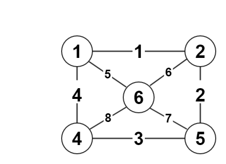
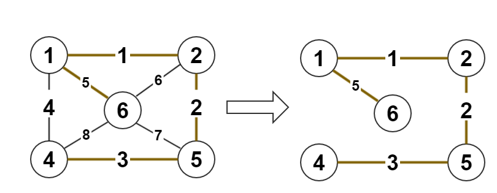

# 最小生成树

## 问题引入

你有一个n个点形成的城市网络图,你是个货车司机,每条路上都有一个收费站,收费的价格就是图上边的权,且只收费一次(第二次走这条路不会收费),问你怎么走能把所有的城市走完,且花费最小.

## 想一想

设最优路径所形成的图为G,那么

 - G有几条边
 - G是什么样子的图

## 生成树定义

**生成树**：一个|V|个点的无向连通图中，取其中|V|-1条边，并连接所有的顶点，则为原图的一棵生成树。

**树的属性**：树是图的一种特殊形态。一个图G是树当且仅当以下任意一个条件成立：

 - ①G是连通的无环图；
 - ②G有V-1条边，连通；
 - ③任意两点间只有唯一的简单路径；
 - ④G连通，但任意删除一条边后不连通；

## 最小生成树

**最小生成树**：在一张带权的无向连通图中，各边权和为最小的一棵生成树即为最小生成树。

**简单讲**：找出连接所有点的最低成本路线

无向图-->最小生成树（贪心思想）,我们在做生成树的时候有两种方法,一:避圈法,二:破圈法.下面的两种方法都是避圈法

 - Prim算法，适用于点少的图
 - Kruskal算法，适用于边少的图

有向图-->最小树形图

