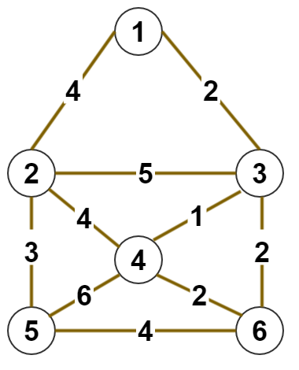

@[toc]

# kruskal 算法

## 算法原理

避圈法,从小到大枚举每一条边,如果边的两个端点,不在同一个集合内,就可以选这个边.


[kruskal算法动画](https://www.cs.usfca.edu/~galles/visualization/Kruskal.html)


## 模板

<!-- template start -->
```c
// 向量星 略

/* ================= 并查集 =================*/
const int maxn = 1e5+5;
int fa[maxn];
//并查集 初始化
inline void bcj_init(int x){ for(int i=1;i<=x;i++) fa[i] = i; }
//查找 and 路径压缩
int find(int x){ 
    if( x == fa[x]) return x;
    return fa[x] = find(fa[x]);
}
/* ================= 并查集 end =================*/

bool cmp( edge a,edge b) {return a.w < b.w;}
// 传入点数，返回mst的值，不连通返回-1
int Kruskal(int n){
    bcj_init(n); //初始化
    sort(e+1,e+1+edge_cnt,cmp); //对边从小到大排序
    int ans = 0,cnt = 0; //答案，选边的数量

    for(int i = 1; i<=edge_cnt ; ++i){
        int u =e[i].u, v =e[i].v, w =e[i].w; 
        int f1 =find(u),f2 = find(v);
        if( f1 != f2){ //不再同一个集合
            ans+=w;
            cnt++;
            fa[f2] = f1;
        }
        if( cnt == n-1) break;
    }
    if( cnt < n -1) return -1;
    return ans;
}
```
<!-- template end -->

## 具体代码

图:



数据:

```
6 10
1 2 4
1 3 2
2 3 5
2 4 4
2 5 3
3 4 1
3 6 2
5 4 6
5 6 4
6 4 2
```

```c
<%- include("kruskal_code.cpp") %>
```

## 练习题目

 - luogu P2126 Mzc家中的男家丁
 - luogu P1550 [USACO08OCT]打井Watering Hole
 - luogu P1265 公路修建 
