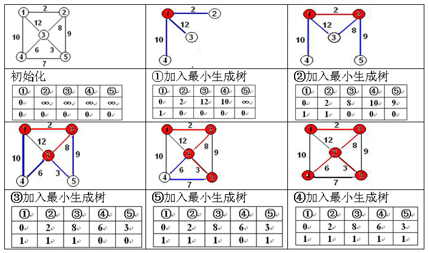

## prime 算法

## 核心思想


```viz-dot
```

## prime算法过程

 - 将1号节点置入集合S中。
 - 找到所有连接S中的节点和非S中的节点的边中的权值最小的那一条，并标记这条边，同时将连接的非S中的节点加入S集合。
 - 重复2步骤，直到所有节点都在S中了



具体见prim算法演示:[链接](1)

## 具体代码

图:


数据:

```
6 10
1 2 4
1 3 2
2 3 5
2 4 4
2 5 3
3 4 1
3 6 2
5 4 6
5 6 4
6 4 2
```

```c
#include <cstdio>
#include <cstring>


#define N 100 //点的数量

int n,m;
int head[N];
struct edge {
    int u,v,w;
    int next;
}E[N];
int size = 0;

void addEdge(int x,int y,int z){
    size++;
    E[size].u = x;
    E[size].v = y;
    E[size].w = z;
    E[size].next = head[x];
    head[x] = size;
}

int dis[N];
bool vis[N] = {0};

int prim(int s){
    memset(dis,0x7f,sizeof(dis));
    dis[s] = 0;

    int i,j,k;
    int ans = 0;
    for(i=1;i<=n;i++){ // 每次加入一个点,有n个点,加n次
        int min=0x7f7f7f7f;
        for(j=1;j<=n;j++)//找到最小未标记的点
            if( min > dis[j] && vis[j] == false){
                min = dis[j];
                k = j;
            }

        vis[k] = 1; //标记
        ans += dis[k]; //加入最小生成树
        for(j=head[k];j!= -1 ;j = E[j].next){ // 更新周围的点
            int v = E[j].v;
            int w = E[j].w;
            if( vis[v] == false && dis[v] > w)
                dis[v] = w;
        }
    }
    return ans;
}

int main(){
    memset(head,-1,sizeof(head));
    scanf("%d%d",&n,&m);
    int i,j;
    //读入图
    for(i=1;i<=m;i++){
        int x,y,z;
        scanf("%d%d%d",&x,&y,&z);
        addEdge(x,y,z);
        addEdge(y,x,z);
    }
    int ans = prim(1);
    printf("%d",ans);
    return 0;
}
```

