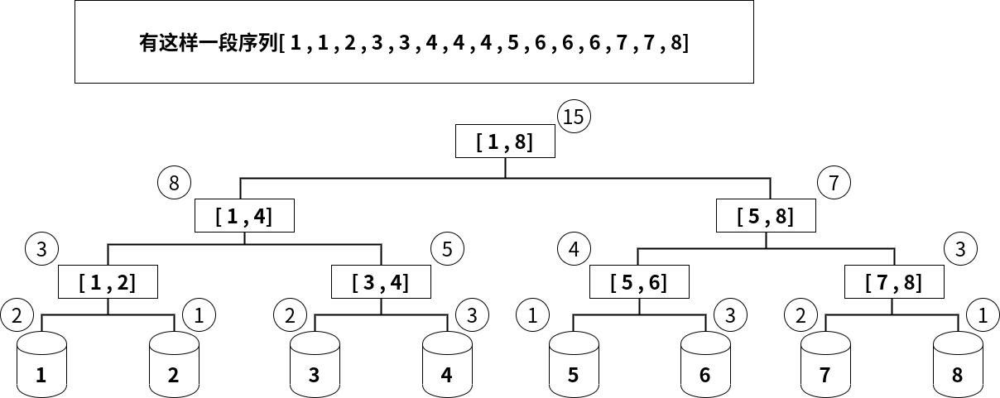

@[TOC]

## 一.什么是权值线段树？

珂朵莉有一个可爱的无序序列,当她开心时 她会向序列中插入一个随机数.相反,当她难过时会从中取走一个随机数
她要求你维护这段序列,同时还要求你能很快查询到序列中任一数的名次 以及在这段序列中第k大/小的数...
如果你用数组进行操作,那么每次在珂朵莉插入一个数后 你都要重新对这段序列进行排序...
但是这样很浪费时间 所以我们可以使用权值线段树 来 维护这段区间(~~满足珂朵莉的要求~~

而你学过线段树,它是一种高级数据结构,可以维护一段区间的最值或者总和
利用二分的思想,使之更新和查询拥有良好的时间复杂度

而**权值线段树**,顾名思义它也是一颗线段树 同是也可以用来维护一段区间
而它与线段树的区别在于:
**->线段树 每个节点用来维护一段区间的和或最值**
**->权值线段树 每个节点表示在一段区间内出现的数的总个数**
(所以说 权值线段树像一个桶一样 储存区间中所有数的个数或该数在整个序列中的大小/位置



我们可以根据上面的这幅图来理解权值线段树
同线段树一样 每次对区间进行二分 把区间划分成两段...直到把区间拆成数个独立元素为止, 同时 我们把这些独立元素存储到相应的桶中
最下面的每个桶 表示每个整数 而桶旁边的圈代表桶中有多少个元素 也就是 这一段区间中任意一个数的数量(出现的次数

---

## 二.权值线段树有么用？

既然权值线段树表示的是一段区间中所有数的总和
那么我们可以用权值线段树~~搞~~干什么？
首先,我们需要了解权值线段树的性质:
·权值线段树的 左子树中的任意区间值一定比右子树中的小
所以如果想要维护一段**有序序列**,权值线段树要比平衡树更优

---

## 三.权值线段树怎么用？

```cpp
#define lson (rt)<<1    //根节点的左儿子和右儿子
#define rson (rt)<<1|1
```
### 1.向树中添加/删除一个点

```cpp
//add的值只有1/-1 表示添加或删除
void update(int add,int pos,int rt,int l,int r){
    if(r<pos or l>pos)return;
    if(l==r){
        st[rt]+=add;
        return;
    }
    int mid=(l+r)>>1;
    update(add,pos,lson,l,mid);//左右递归建子树
    update(add,pos,rson,mid+1,r);
    st[rt]=st[lson]+st[rson];//更新根节点的值
}
```
### 2.查询区间中第k小/大的值

```c++
//查询第k小的值
int find_kth(int k,int rt,int l,int r){
    if(l==r and l==pos)return 0;
    if(l==r)return l;
    int mid=(l+r)>>1;
    if(st[lson]>=k) //如果左区间中数的个数比要找的k值大 那就在左子树中找
        return find_kth(k,lson,l,mid);    
    return find_kth(k-st[lson],rson,mid+1,r);
    //否则在右子树中找(注:这里在右子树中 应当寻找第 k-st[lson] 大的数
}

//查询第k大的值
int find_kth(int k,int rt,int l,int r){
    if(l==r)return l;
    int mid=(l+r)>>1;
    if(st[rson]>=k)return find_kth(k,rson,mid+1,r);
  	find_kth kth(k-st[rson],lson,l,mid);
}
```
### 3.查询pos在区间中的位次

```cpp
//如果区间中有多个相同的数 则输出最小的位次
int get_rank(int pos,int rt,int l,int r){
    if(r<pos)return st[rt];
    int mid=(l+r)>>1;
    int pos_rank=0;//记录当前的排名也就是前面的数出现的总次数(类似线段树的区间查询)
    pos_rank+=get_rank(pos,lson,l,mid);
    //↑pos只会受到它前面的区间的影响 鹅不会受到它后面的区间的影响
    if(pos>mid+1)pos_rank+=get_rank(pos,rson,mid+1,r);
    //↑如果pos>区间中点 左边界变为mid+1 _(:зゝ∠)_)
    return pos_rank;
}
//注:get_rank()最终返回的是pos前面一个数的位次 所以pos的位次要+1
```
### 4.查询pos的前驱与后继

```cpp
//===========前驱==========
//前驱 为小于 pos 且最大的数
//查找前驱点
int findpre(int rt,int l,int r){
    if(l==r)return l;//查询尽量靠右的点
    int mid=(l+r)>>1;
    if(st[rson])//如果右子树非空 则优先查询
        return findpre(rson,mid+1,r);
    return findpre(lson,l,mid);
}

int pre(int pos,int rt,int l,int r){
    if(r<pos){//如果 这个点的前驱在[l,r]区间内里面 数学模型:[1--[l--r]-p--n]
        if(st[rt])return findpre(rt,l,r);
        //*(重点!)在权值线段树中的节点不为0 说明子树非空 辣么就在该区间内继续找 
        return 0;
        //因为 线段树模型是一个满二叉树 但实际存储上是完全二叉树 只是那些点被无视了 所以要返回0
    }//如果我们能在[l,r]区间中找到一个数恰好满足 辣么就返回这个数
    int mid=(l+r)>>1;
    int pos_pre;//这个点的前驱点
    if(pos>mid+1 and st[rson] and (pos_pre=pre(pos,rson,mid+1,r)))
        //因为我们要找的小于pos且最大的树 所以优先查询右子树 
        //把这层递归写在这里的好处 如果前两个条件不满足 辣么就不会执行递归
        return pos_pre;//如果右子树非空 并且我们可以查到一个值 辣么返回这个值
    return pre(pos,lson,l,mid);//否则 查询左子树
}
//=========================

//===========后继==========
//后继 为大于 pos 且最小的数
//后继 与 前驱正好相反 优先查询左子树
int findnex(int rt,int l,int r){
    if(l==r)return l;
    int mid=(l+r)>>1;
    if(st[lson]!=0)//左子树非空
        return findnex(lson,l,mid);
    return findnex(rson,mid+1,r);
}

int nex(int pos,int rt,int l,int r){
    if(l>pos){//数学模型:[1--p--[l--r]--n]  
        if(st[rt]!=0){
            return findnex(rt,l,r);
        }
        return 0;
    }
    int mid=(l+r)>>1;
    int pos_nex;
    if(pos<mid and st[lson]!=0 and (pos_nex=nex(pos,lson,l,mid)))
        return pos_nex;
    return nex(pos,rson,mid+1,r);
}
//=========================
```
### 5.查询区间中有多少个元素

```cpp
//查询区间中有多少个元素
int query(int x,int y,int rt,int l,int r){
    if(st[rt]==0)return 0;
    if(x<=l and r<=y)return st[rt];
    int mid=(l+r)>>1;
    int sum=0;
    if(x<=mid)sum+=query(x,y,lson,l,mid);
    if(y> mid)sum+=query(x,y,rson,mid+1,r);
    return sum;
}
```


### 6. 删除连续区间中小于任一值的所有点

```cpp
//删除连续区间中小于任一值的所有点
void del(int x,int y,int rt,int l,int r){
    if(l==r and l!=0){
        st[rt]=0;
        return;
    }
    int mid=(l+r)>>1;
    if(x<=mid and st[lson])del(x,y,lson,l,mid);
    if(y> mid and st[rson])del(x,y,rson,mid+1,r);
    st[rt]=st[lson]+st[rson];
}
```


## 四.注意事项！

权值线段树的实质是对**值域**建线段树
权值线段树不能维护负数 所以在处理负数时应加上一个基数

每次更新的时间复杂度 $O(nlog^[l,r]^)$,$[l,r]$是值域
单点修改/插入就是$log[l,r]$。

当值域非常大时,由于它的空间复杂度为$O([l,r])$所以会炸掉

所以可以采用两种优化方式:

### 优化方式

1.**离散化**:

考虑序列不一定连续,使用离散化进行优化可以使区间变为[1,n] 然后在[1,n]区间上建树
此时,建树的时间复杂度降为O(nlogn) 单次操作复杂度为O(logn) 空间复杂度降为O(n)
由此可见离散化可以大幅减少复杂度(比动态数组更优
劣势:因为每次操作都是处理离散化后的值 所以只能离线

2.**动态数组**:

使用动态数组进行操作
优点:可以在线

写法:

```cpp
int *st;
int maxn=-1;
//找出最大值 更新maxn
st = new int [maxn<<2];
```
3.彭政离散法 动态开点 (可在线操作)
因为是彭政蒟da蒻lao想出的 所以我们称他为彭政离散法
用vector储存 在每次读入时 把它压入,使用时 再取出
这样的操作可以巨幅度的减少所需空间
例如.权值线段树模板题普通平衡树
```cpp
vector<int> v;

int getidx(int x){
    return lower_bound(v.begin(),v.end(),x)-v.begin()+1;
}

void prep(){
    sort(v.begin(),v.end()),v.erase(unique(v.begin(),v.end()),v.end());
    st=new int [v.size()<<2];
}

//每次操作时再取出 getidx(x)
```

## 五.可用权值线段树解决的题目&部分题解

具体来说，权值线段树可以处理以下问题：

1. 某个数在一个序列中出现的次数
2. 某个序列的第k小(大)的数
3. 删除或添加序列中的某数或第k小(大)的数
4. 查询有序序列中某个数的前驱或后继
5. 查询某个数在有序序列中的位置

### 例题1: 营业额统计

[P2234 「HNOI2002」营业额统计](https://www.luogu.org/problem/P2234)


::: fold
```cpp
<%- include("code/luogu2234.cpp") %>
```
:::

### 例题2: 普通平衡树

[P3369 「模板」普通平衡树](https://www.luogu.org/problem/P3369)

#### 1.普通在线写法

::: fold
```cpp
<%- include("code/luogu3369_1.cpp") %>
```
:::

#### 2.使用了彭政想出的强制离线写法

::: fold
```cpp
<%- include("code/luogu3369_2.cpp") %>
```
::: 
