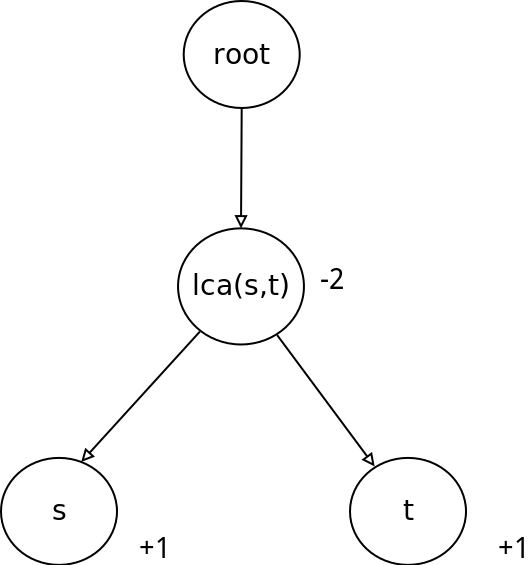
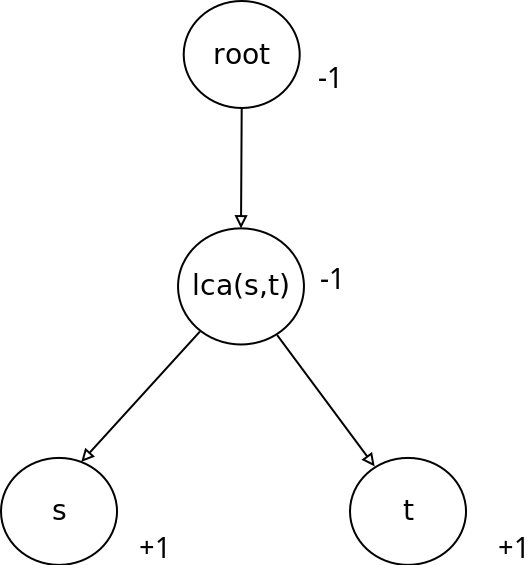

# 树上差分

树上差分是一种技巧,它可以解决以下问题


## 找出树上的边被几条路径覆盖

**如何给树的边编号**:点$i$的编号就代表$i \rightarrow fa[i] $这条边的编号

操作:将所有路径上的起点s,终点t的权值加1,$lca(s,t)$的权值减2,然后从叶结点开始把权值向上累加



原理:todo!

练习题目: [luogu P2608 NOIp2015 运输计划（树上差分+二分](https://www.luogu.org/problemnew/show/P2680)

**解析**

**代码**

## 将路径上的所有点权值加一，求最后点的权值。

所有路径的起点$s$,终点$t$的权值$+1$,$lca(s,t)$的权值$-1$,$lca(s,t)$的父亲的权值$-1$

点$i$这个点有几条路径经过:**把$i$点为根的子树上的点的和加上$i$的值**

**原理:**

 - $s,t +1 $ 表示到上面的关键点$lca$上的每个点的值都要$+1$
 - $lca -1$ 表示$lca$被加了两次,要去掉一次
 - $father[lca] - 1 $ 表示把$lca$上剩余的那一次也减掉



**练习题目:**[JLOI2014 松鼠的新家]( https://www.luogu.org/problemnew/show/P3258)

**解析**

**代码**

```c
```

## 练习题目

 - luogu P3128 [USACO15DEC]最大流Max Flow
 - luogu P2608 NOIp2015 运输计划（树上差分+二分）
 - luogu P1600 noip2016 天天爱跑步(不属于上面两种差分)

## 参考

 - http://blog.csdn.net/y__xv/article/details/52473888
 - http://blog.csdn.net/y__xv/article/details/52680326
 - http://blog.csdn.net/zhayan9qvq/article/details/54999472
