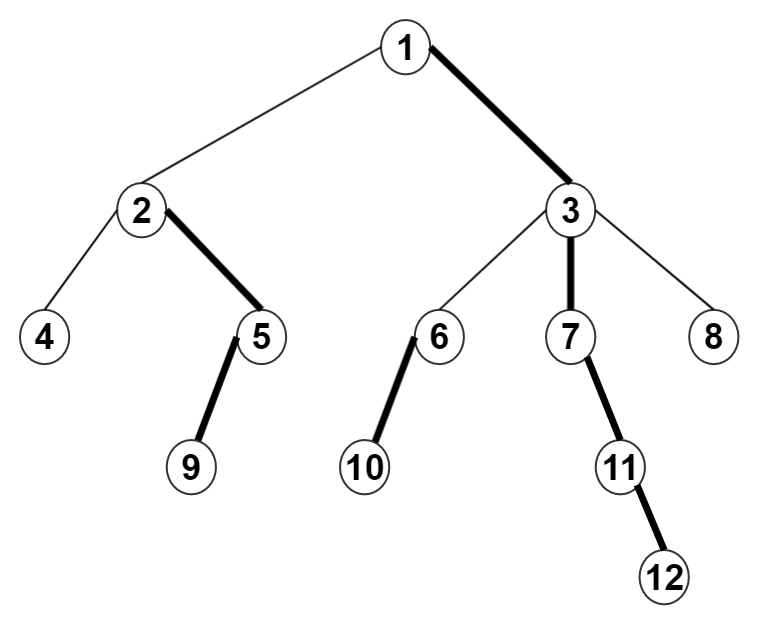

# 树链剖分

## 定义

**树链剖分**，计算机术语，指一种对树进行划分的算法，它先通过轻重边剖分将树分为多条链，保证每个点属于且只属于一条链，然后再通过数据结构（树状数组、SBT、SPLAY、线段树等）来维护每一条链。

将一棵树划分成若干条链，用数据结构去维护每条链，复杂度为$O(logN)$.其实质是一些数据结构/算法在树上的推广

## 相关概念

 - **size[i]**:用来保存以i为根的子树节点个数
 - **重边**:节点j是节点i的子节点中size[x]最大的节点,边(i,j)为一条重边，由定义发现除了叶子节点其他节点只有一条重边
 - **轻边**:除重边之外的边
 - **重链**:全部由重边组成的路径
 - **top[i]**:用来保存当前节点的所在重链的顶端节点,如果i不为重儿子,那么$top[i] = i$
 - **son[i]**用来保存重儿子
 - **dep[i]**:用来保存节点i的深度
 - **fa[i]**:用来保存节点i的父亲
 - **index[i]**:用来保存树中节点i(或边)剖分后的新编号
 - **rank[]**:用来保存当前节点在线段树中的位置



如图:黑色的粗边就是重链

## 轻重边性质

 - 轻边$(u,v)$中，$size(v)<=size(u/2)$。 用反证法显然。 
 - 从根到某一点的路径上，不超过logn条轻边和不超过logn条重路径。虽然我不会证这个，但我知道这就保证了『每次尽量多的访问重边』。


## 练习

**画出下面数据的重链**


```
5
1 2
1 3
1 4
1 5
```

```
12
1 2
1 3
2 4
2 5
5 9
3 6
3 7
3 8
6 10
7 11
11 12
```


## 练习题目

- luogu P3979 遥远的国度
- luogu P3384 【模板】树链剖分
- luogu
- luogu
- luogu

## 引用

 - [树链剖分ppt](https://wenku.baidu.com/view/a088de01eff9aef8941e06c3.html)

