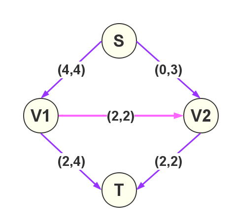

<p style="text-align: center;font-size:35px">网络流</p>


## 引用:一个题目

如下图,可以想像成一个输水网络,$S$是起点,$T$是终点.每一条边上有两个值$(x,y)$,$x$表示这条边现在的流量,$y$表示这条边的最大流量.$T$结点现在接收的流量为$4$.

问:$T$结点能接收的最大流量为多少?



如下图所示,最大为$6$!


## 定义：什么是网络流


**网络:** 网络是一个有向带权图，包含一个源点和一个汇点，没有反平行边。

```viz-dot
digraph hello {
    rankdir=LR;
    a->b[minlen=3];
    b->a[headlabel="反平行边",labeldistance=5,labelangle=8,style="dashed"];
}
```


**网络流** :网络流即网络上的流，是定义在网络边集$E$上的一个非负函数$fow＝\{fow (u,v)\}$，$flow(u，v)$是边上的流量。

**可行流** :满足以下两个性质的网络流flow称为可行流。


## 2.网络流中的约束条件


### 网络流中的常用名词

 - $V$表示整个图中的所有结点的集合.
 - $E$表示整个图中所有边的集合.
 - $G = (V,E)$,表示整个图.
 - $s$表示网络的源点,$t$表示网络的汇点.
 - 对于每条边$(u,v)$,有一个容量$c(u,v)   (c(u,v)>=0)$
 - 如果$c(u,v)=0$，则表示$(u,v)$不存在于网络中。
 - 如果原网络中不存在边$(u,v)$，则令$c(u,v)=0$
 - 对于每条边$(u,v)$,有一个流量$f(u,v)$.


## 3.网络流的三个限制限制条件

一个**网络流**必须满足下面的条件

 - 1、容量限制:$f(u,v)<=c(u,v)$
 - 2、反对称性:$f(u,v) = - f(v,u)$
 - 3、流量平衡:  对于不是源点也不是汇点的任意结点,**流入该结点的流量和等于流出该结点的流量和**。

结合反对称性,流量平衡也可以写成:

$$
\sum_{u\epsilon V} f(v,u)=0
$$

只要满足这三个性质,就是一个合法的网络流,也称为**可行流**。


### 弧的分类

若给定一个可行流$F=(F_{ij})$,我们把网络中$F_{ij}=C_{ij}$的弧称作饱和弧， $F_{ij}<C_{ij}$的弧称作非饱和弧， $F_{ij}=0$的弧称作零流弧,$F_{ij}>0$的弧称作非零流弧

若$P$是网络中联结源点$s$和汇点$t$的的一条路(不用管边的有向性)，我们定义路的方向是从$s$到$t$，则路上的弧被分为两类：一类与路的方向一致，称为**前向弧**；另一类和路的方向相反，称为**后向弧**


## 知识点思维导图

```viz-dot
digraph G {

    ranksep=0.74;
    node[shape="box"];
    "网络"->"网络流";
    edge[samehead=h1,sametail=t1,headport=n,tailport=s];
    "网络流"->"满足的性质"->{"容量约束":s,"流量守恒"}->"网络最大流"[tailport=same];
    "网络流"->"相关名词"->{"源点:s","汇点:t"};
    "网络最大流"->"增广路算法"[label="解决思路"];
    subgraph a1 {
        rankdir=LR;
        "增广路算法"->"相关概念"->{"实流网络","残余网络","可增广路","可增广量",t1}->t2;
    }
    t1[label="残余网络上的增广路的增流,减流操作",shape=plain];
    t2[label="增广路算法:Ford-Fullkerson"]
    t3[label="不是一种具体的算法,而是一种思路",shape=plain]

    {
        rank=same;
        t2,t3;
    }

    t5[label="随意找增广路:可能有很高的复杂度",shape=plain]
    t2->t5->{"最短路径优先","最大容量优先"};

    t4[label="SAP"];
    "最短路径优先"->t4[headlabel="最短增广路算法",labeldistance=6,labelangle=60];
    "最短路径优先"->"朴素Dinic"[label="最短增广路算法"];
    t4->"ISAP"[label="优化"];
    "ISAP"->"gap优化"[label="优化"];
    "朴素Dinic" ->"多路增广Dinic"[label="优化"];
    "多路增广Dinic" -> "当前弧优化"[label="优化"];
}
```

--------------

## 经典的网络流24题

| 问题编号 | 题目地址 | 问题名称            | 问题模型                | 转化模型       |
|----------|----------|---------------------|-------------------------|----------------|
| 1        | loj6000  | 飞行员配对方案问题  | 二分图最大匹配          | 网络最大流     |
| 2        | loj6001  | 太空飞行计划问题    | 最大权闭合图            | 网络最小割     |
| 3        | loj6002  | 最小路径覆盖问题    | 有向无环图最小路径覆盖  | 网络最大流     |
| 4        | loj6003  | 魔术球问题          | 有向无环图最小路径覆盖  | 网络最大流     |
| 5        | loj6004  | 圆桌问题            | 二分图多重匹配          | 网络最大流     |
| 6        | loj6005  | 最长递增子序列问题  | 最多不相交路径          | 网络最大流     |
| 7        | loj6006  | 试题库问题          | 二分图多重匹配          | 网络最大流     |
| 8        |          | 机器人路径规划问题  | (未解决),具说不是网络流 | 最小费用最大流 |
| 9        | loj6007  | 方格取数问题        | 二分图点权最大独立集    | 网络最小割     |
| 10       | loj6008  | 餐巾计划问题        | 线性规划网络优化        | 最小费用最大流 |
| 11       | loj6009  | 航空路线问题        | 最长不相交路径          | 最小费用最大流 |
| 12       | loj6010  | 软件补丁问题        | 最小转移代价            | 最短路径       |
| 13       | loj6011  | 星际转移问题        | 网络判定                | 网络最大流     |
| 14       | loj6012  | 孤岛营救问题        | 分层图最短路径          | 最短路径       |
| 15       | loj6013  | 汽车加油行驶问题    | 分层图最短路径          | 最短路径       |
| 16       | loj6014  | 数字梯形问题        | 最大权不相交路径        | 最小费用最大流 |
| 17       | loj6015  | 运输问题            | 网络费用流量            | 最小费用最大流 |
| 18       | loj6121  | 分配问题            | 二分图最佳匹配          | 最小费用最大流 |
| 19       | loj6122  | 负载平衡问题        | 最小代价供求            | 最小费用最大流 |
| 20       | loj6223  | 深海机器人问题      | 线性规划网络优化        | 最小费用最大流 |
| 21       | loj6224  | 最长k可重区间集问题 | 最大权不相交路径        | 最小费用最大流 |
| 22       | loj6225  | 最长k可重线段集问题 | 最大权不相交路径        | 最小费用最大流 |
| 23       | loj6226  | 火星探险问题        | 线性规划网络优化        | 最小费用最大流 |
| 24       | loj6227  | 骑士共存问题        | 二分图最大独立集        | 网络最小割     |


**费用流**

 - 洛谷 P2488 [SDOI2011]工作安排
 - 洛谷 P2050 [NOI2012]美食节
 - 洛谷 [SCOI2007]修车
## 引用/参考

 - [ 网络流 学习笔记：一次理解网络流！](https://blog.csdn.net/A_Comme_Amour/article/details/79356220)
 - [最小费用最大流 (Dinic + SPFA) + 模板 + 拓展 + 超详细解释](https://blog.csdn.net/Frocean/article/details/81543757)
 - [网络流入门到熟练](https://www.cnblogs.com/fzl194/p/8859308.html)
 - http://www.aiuxian.com/article/p-1041515.html
 - [最大流算法的选择：Dinic还是SAP？](http://fanhq666.blog.163.com/blog/static/81943426201072554322479/)

结论：学Dinic 代码量少,容易记忆！
