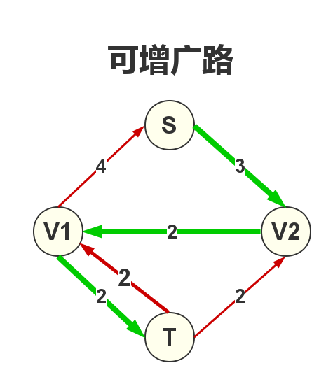

<p style="text-align: center;font-size:35px">最大流</p>

## 1.最大流问题

**最大流问题**，就是求在满足网络流的**容量约束**和**流量守恒**的条件下，在网络中找一个网络流使**汇点的流入量最大**。


有如下的一个网络,其中的每一条有向边,你可以理解成一个水管,其中:

  - 边的方向代表水流的方向
  - 边上的值,代表水管的最大流量,我们称为**容量**,记为$cap$
  - $S$点代表**起点**,它可以流出无限流量的水(但注意水管的流量的限制)
  - $T$代表**汇点**,它可以接收无限流量的水

问:$T$ **点最多能接收的流量是多大?** 这种问题我们称为网络流中的最大流问题.

```viz-neato
digraph G {
    S[pos="-1,1!"];
    v1[pos="1,2!"];
    v2[pos="1,0!"];
    v3[pos="3,2!"];
    v4[pos="3,0!"];
    T[pos="5,1!"];


    edge[arrowhead=open]
    S->v1[label=12];
    v1->v3[label=8];
    v3->T[label=18];


    v2->v1[label=2];

    v4->v3[label=6];
    v3->v2[label=5];

    S->v2[label=10];
    v2->v4[label=13];
    v4->T[label=4];
}
```

## 2. $Ford-Fullerson$方法

如何找到最大流呢?

$1957$年，$Ford$和 $Fullkerson$提出了求解网络最大流的方法。该方法的基本思想是在残余网络中找可增广路，然后在实流网络中沿可增广路增流，直到不存在可增广路为止.

## 3. 基本概念

### 3.1 实流网络

**实流网络:** 即只显示实际流量的网络


```viz-neato
digraph G {
    S[pos="-1,1!"];
    v1[pos="1,2!"];
    v2[pos="1,0!"];
    v3[pos="3,2!"];
    v4[pos="3,0!"];
    T[pos="5,1!"];


    edge[arrowhead=open]
    S->v1[label="(12,3)"];
    v1->v3[label="(8,3)"];
    v3->T[label="(18,6)"];


    v2->v1[label="(2,0)"];

    v4->v3[label="(6,4)"];
    v3->v2[label="(5,1)"];

    S->v2[label="(10,4)"];
    v2->v4[label="(13,5)"];
    v4->T[label="(4,1)"];
}
```

### 3.2 残余网络

网络上每一个流$G$,都对应一个残余网络$G*$, $G*$和$G$结点集相同，而网络$G$中的每条边对应$G$中的一条边或两条边.

 - 为了更方便算法的实现，一般根据原网络定义一个残余网络。其中$r(u,v)$为残余网络的容量。
 - $r(u,v) = c(u,v) – f(u,v)$
 - 通俗地讲：就是对于某一条边（也称弧），还能再有多少流量经过。


```viz-dot
digraph {
    rankdir=LR;
    a1[label="V1"];
    b1[label="V2"];
    a[label="V1"];
    b[label="V2"];

    a1->b1[label="6(可增量)",minlen=2];
    b1->a1[xlabel="4(流量)"];
    a ->b[label="(容量,流量)\n(10,4)",minlen=2];

}
```

在残余网络中，与网络边对应的**同向边是可增量**（即还可以增加多少流量），**反向边是实际流量**。


### 3.3 增广路(可改进路)

可增广路是残余网络$G$中一条从源点到汇点的简单路径.



### 3.4 可增广量

可增广量是指在可增广路$P$上每条边可以增加的流量最小值。那么对于一条可增广路 $S \to V2 \to V1 \to T$可以增加的最大流量是多少呢？


 - $S \to V2$最多可以增加的流量为$3$
 - $V2 \to V1$最多可以增加的流量为$2$
 - $V1 \to T$最多可以增加的流量为$2$

所以在**满足流量约束**的条件下,这条可增广路最多可以增加的流量是$2$

可增广量$d$等于可增广路$P$上每条边值的最小值.

求网络$G$的最大流，首先在残余网络中找可增广路，然后在实流网络$G$中沿可增广路增流，直到不存在可增广路为止。 这时实流网络G就是最大流网络.

### 3.5 可增广路增流

在残余网络中,如果你找到了一条可增广路,那应该如何增流呢?

**1.残余网络**

```viz-neato
digraph G {
    S[pos="-1,1!"];
    v1[pos="1,2!"];
    v2[pos="1,0!"];
    v3[pos="3,2!"];
    v4[pos="3,0!"];
    T[pos="5,1!"];


    edge[arrowhead=open]
    S->v1[label="9"];
    v1->v3[label="5"];
    v3->T[label="12"];


    //v2->v1[label="(2,0)"];

    v4->v3[label="2"];
    v3->v2[headlabel="4",labelangle=-6,labeldistance=8];

    S->v2[label="6"];
    v2->v4[label="8"];
    v4->T[label="3"];

    edge[labelangle=-8,labeldistance=5,style="dashed"];
    v1->S[headlabel="3"];
    v3->v1[headlabel="3"];
    T->v3[headlabel="6"]

    v2->v1[headlabel="2"];
    v2->S[headlabel="4"];

    v4->v2[headlabel="5"];

    v2->v3[headlabel="1"];

    v3->v4[headlabel="4"];

    T->v4[headlabel="1"];

}
```

**2.找到一条增广路**
```viz-neato
digraph G {
    S[pos="-1,1!"];
    v1[pos="1,2!"];
    v2[pos="1,0!"];
    v3[pos="3,2!"];
    v4[pos="3,0!"];
    T[pos="5,1!"];


    edge[arrowhead=open]
    S->v1[label="9",color="red",penwidth=3];
    v1->v3[headlabel="5(最小量)",color="red",penwidth=3];
    v3->T[label="12",color="red",penwidth=3];


    //v2->v1[label="(2,0)"];

    v4->v3[label="2"];
    v3->v2[headlabel="4",labelangle=-6,labeldistance=8];

    S->v2[label="6"];
    v2->v4[label="8"];
    v4->T[label="3"];

    edge[labelangle=-8,labeldistance=5,style="dashed"];
    v1->S[headlabel="3"];
    v3->v1[headlabel="3"];
    T->v3[headlabel="6"]

    v2->v1[headlabel="2"];
    v2->S[headlabel="4"];

    v4->v2[headlabel="5"];

    v2->v3[headlabel="1"];

    v3->v4[headlabel="4"];

    T->v4[headlabel="1"];


}
```
**3.同向边减少流量5,反向边增加流量5**


```viz-neato
digraph G {
    S[pos="-1,1!"];
    v1[pos="1,2!"];
    v2[pos="1,0!"];
    v3[pos="3,2!"];
    v4[pos="3,0!"];
    T[pos="5,1!"];


    edge[arrowhead=open]
    S->v1[label="4",color="red",penwidth=3];
    //v1->v3[headlabel="0",color="red",penwidth=3];
    v3->T[label="7",color="red",penwidth=3];


    //v2->v1[label="(2,0)"];

    v4->v3[label="2"];
    v3->v2[headlabel="4",labelangle=-6,labeldistance=8];

    S->v2[label="6"];
    v2->v4[label="8"];
    v4->T[label="3"];

    edge[labelangle=-8,labeldistance=5,style="dashed"];
    v1->S[headlabel="8"];
    v3->v1[headlabel="8"];
    T->v3[headlabel="11"]

    v2->v1[headlabel="2"];
    v2->S[headlabel="4"];

    v4->v2[headlabel="5"];

    v2->v3[headlabel="1"];

    v3->v4[headlabel="4"];

    T->v4[headlabel="1"];
}
```


## Ford-Fullkerson 方法找最大流

增广路算法不一种算法,而是一中**方法**,因为$Ford-Fullerson$并没有说明如何找可增广路,而找增广路的算法不同,算法的时间复杂度相差很大.


1. 在**残量网络**中找到一条**增广路**,这条**增广路**上边的可以可以增加的最小流量:**可增广量**,记为flow
2. 在**实流网络**中沿可**增广路**增流
3. 在**残流网络**中沿可**增广路**减流(.将这条路径上的每一条有向边u->v的残量减去flow，同时对于起反向边v->u的残量加上flow)
4. 重复上面的过程,直到找不到**增广路**时,那么当前的**实流网络**就是最大流.


## 随意找增广路

有如下的一个残余网络$G*$:

```viz-dot
digraph {
    rankdir=LR;
    edge[minlen=2,label="1000"];
    S ->{v1,v2}->T;


    {
        rank=same;
        v1,v2;
    }

    v1->v2[minlen=3,label="1"];
    
}
```

如果我们再它上面随意找一条可增广路:$s \to v1 \to v2 \to t$

```viz-dot
digraph {
    rankdir=LR;
    edge[minlen=2,label="1000"];

    { rank=same; v1,v2; }

    S->v2;
    v1->T;

    edge[color="red",penwidth=5];
    S->v1;
    v1->v2[minlen=3,label="1"];
    v2->T;
    
}
```

沿可增广路$P$增流后的残余网络:

```viz-dot
digraph {
    rankdir=LR;

    { rank=same; v1,v2; }

    S->v2[label="1000"];
    v1->T[label="1000"];

    //edge[color="red",penwidth=5];
    S->v1[label="999"];
    v1->v2[minlen=3,label="1",style="invis"];
    v2->T[label="999"];

    edge[constraint=false,style="dashed"];
    v1->S[xlabel="1"];
    v2->v1[xlabel="1"];
    T->v2[xlabel="1"];

    edge[style="invis"];
    T->v1[xlabel="1"];
    v2->S[xlabel="1"];
    
}
```

如果我们再随意找一条可增广路:$s \to v2 \to v1 \to t$

```viz-dot
digraph {
    rankdir=LR;

    { rank=same; v1,v2; }

    S->v2[label="1000",color="red",penwidth=5];
    v1->T[label="1000",color="red",penwidth=5];

    //edge[color="red",penwidth=5];
    S->v1[label="999"];
    v1->v2[minlen=3,label="1",style="invis"];
    v2->T[label="999"];

    edge[constraint=false,style="dashed"];
    v1->S[xlabel="1"];
    v2->v1[xlabel="1",color="red",penwidth=5];
    T->v2[xlabel="1"];

    edge[style="invis"];
    T->v1[xlabel="1"];
    v2->S[xlabel="1"];
    
}
```


如果继续按这种方法来找增广路,本图的最大流为$2000$,那么就要执行$2000$次,效率很低!

 - 最大容量优先
 - 最短路径优先
    - $SAP$
    - $ISAP$
    - $Dinic$

这些最短路径优先的算法,我们称为**最短增广路算法**.

## 为会要建立反向边?


提供了一种反悔的能力(机制),


```viz-dot
digraph G {
    rankdir= LR;
    edge[minlen=2];
    node[shape="circle"];
    { rank=same; 1,3; }
    { rank=same; 2,4; }

    { rank=same; 5,6; } 
    edge[label="2"]
    1->2->4->6;
    edge[label="1"]
    1->3->4;
    2->5->6;

}
```

如果我们第一次找到这条`1->2->4->6`路径之后

```viz-dot
digraph G {
    rankdir= LR;
    edge[minlen=2];
    node[shape="circle"];
    { rank=same; 1,3; }
    { rank=same; 2,4; }

    { rank=same; 5,6; } 
    1->2->4->6[label="2",color="red:invis:red"];
    edge[label="1",penwidth=1]
    1->3->4;
    2->5->6;
}
```

在图中我们找到一个容量为$2$的流,但是同样你无法进一步进行**增广**,最终的答案是$2$,显示是不对的,如果建立反向边呢?

```viz-dot
digraph G {
    rankdir= LR;
    edge[minlen=2];
    node[shape="circle"];
    { rank=same; 1,3; }
    { rank=same; 2,4; }

    { rank=same; 5,6; } 


    edge[weight=3];
    2->5[label="1"];
    3->4[label="1"];

    1->3[label="1"];
    5->6[label="1"];


    edge[weight=1];
    1->2[label="0"];
    2->1[label="2",style="dashed"];

    2->4[label="0"];
    4->2[label="2",constraint=false,style="dashed"];

    4->6[label="0"];
    6->4[label="2",style="dashed"];
}
```

你会发现,第二次你可以找到这条路径:`1->3->4->2->5->6`这条增广路,最重要是走了`4->2`这条反向边,这时候的最大流为$3$.

```viz-dot
digraph G {
    rankdir= LR;
    edge[minlen=2];
    node[shape="circle"];
    { rank=same; 1,3; }
    { rank=same; 2,4; }

    { rank=same; 5,6; } 


    edge[weight=3];
    2->5[label="0"];
    3->4[label="0"];

    1->3[label="0"];
    5->6[label="0"];


    edge[weight=1];
    1->2[label="0"];
    2->1[label="2",style="dashed"];

    2->4[label="1"];
    4->2[label="1",constraint=false,style="dashed"];

    4->6[label="0"];
    6->4[label="2",style="dashed"];

    4->3[label="1",constraint=false,style="dashed"];
    5->2[label="1",constraint=false,style="dashed"];
    6->5[label="1",constraint=false,style="dashed"];
    3->1[label="1",constraint=false,style="dashed"];
}
```


**理解:**

 - 第一次得到的增广路径为`1->2->4->6`,代号$A$流
 - 第一次得到的增广路径为`1->3->4->2->5->6`,代号$B$流
 - $B$流相当于将经过节点$2$的$A$流从中截取流量$1$(总共$2$)走`2->5->6`,不走`2->4->6`
 - 但是节点$4$的流入量没有改变,因为原来的`1->2->4`的流入到4的流量$1$,由新的`1->3->4`的流量来代替

我们完全可以把这种操作称为:**截流替代**,**冒名顶替**


##  [USACO4.2]草地排水Drainage Ditches

DFS 写法:-- BFS写法

地址:http://www.luogu.org/problem/show?pid=2740


