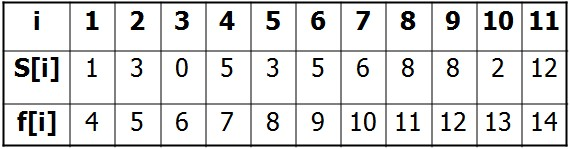
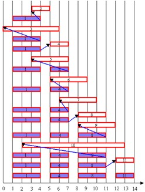

## 选择不相交问题

给定n个开区间$$(a_i,b_i)$$选择尽量多的区间,使这些区间两两没有公共点.

**思路:**按结束时间$$b_1 <= b2 <= \cdots <=b_n$$的顺序排序,依次考虑各个活动,如果没有已经选择的活动冲突,就选,否则不选.

**正确性**:选前面的对后面的影响最小


## 题目:活动安排

题目地址:[loj #10000. 「一本通 1.1 例 1」活动安排](https://loj.ac/problem/10000)

设有n个活动的集合E={1,2,…,n}，其中每个活动都要求使用同一资源，如演讲会场等，而在同一时间内只有一个活动能使用这一资源。每个活动i都有一个要求使用该资源的起始时间si和一个结束时间fi,且si <fi。如果选择了活动i，则它在半开时间区间[si, fi)内占用资源。若区间[si, fi)与区间[sj, fj)不相交,则称活动i与活动j是相容的。也就是说，当si≥fj或sj≥fi时，活动i与活动j相容。活动安排问题就是要在所给的活动集合中选出最大的相容活动子集合。 

**求解思路：**

将活动按照结束时间进行从小到大排序。然后用i代表第i个活动，s[i]代表第i个活动开始时间，f[i]代表第i个活动的结束时间。按照从小到大排序，挑选出结束时间尽量早的活动，并且满足后一个活动的起始时间晚于前一个活动的结束时间，全部找出这些活动就是最大的相容活动子集合。事实上系统一次检查活动i是否与当前已选择的所有活动相容。若相容活动i加入已选择活动的集合中，否则，不选择活动i，而继续下一活动与集合A中活动的相容性。若活动i与之相容，则i成为最近加入集合A的活动，并取代活动j的位置。
     下面给出求解活动安排问题的贪心算法，各活动的起始时间和结束时间存储于数组s和f中，且按结束时间的非减序排列。如果所给的活动未按此序排列，可以用O(nlogn)的时间重排。具体代码如下：


```c
#include "stdafx.h"
#include <iostream> 
using namespace std; 
 
template<class Type>
void GreedySelector(int n, Type s[], Type f[], bool A[]);
 
const int N = 11;
 
int main()
{
	//下标从1开始,存储活动开始时间
	int s[] = {0,1,3,0,5,3,5,6,8,8,2,12};
 
	//下标从1开始,存储活动结束时间
	int f[] = {0,4,5,6,7,8,9,10,11,12,13,14};
 
	bool A[N+1];
 
	cout<<"各活动的开始时间,结束时间分别为："<<endl;
	for(int i=1;i<=N;i++)
	{
		cout<<"["<<i<<"]:"<<"("<<s[i]<<","<<f[i]<<")"<<endl;
	}
	GreedySelector(N,s,f,A);
	cout<<"最大相容活动子集为："<<endl;
	for(int i=1;i<=N;i++)
	{
		if(A[i]){
			cout<<"["<<i<<"]:"<<"("<<s[i]<<","<<f[i]<<")"<<endl;
		}
	}
 
	return 0;
}
 
template<class Type>
void GreedySelector(int n, Type s[], Type f[], bool A[])
{
	A[1]=true;
	int j=1;//记录最近一次加入A中的活动
 
	for (int i=2;i<=n;i++)//依次检查活动i是否与当前已选择的活动相容
	{
		if (s[i]>=f[j])
		{ 
			A[i]=true;
			j=i;
		}
		else
		{
			A[i]=false;
		}
	}
}
```
由于输入的活动以其完成时间的非减序排列，所以算法greedySelector每次总是选择具有最早完成时间的相容活动加入集合A中。直观上，按这种方法选择相容活动为未安排活动留下尽可能多的时间。也就是说，该算法的贪心选择的意义是使剩余的可安排时间段极大化，以便安排尽可能多的相容活动。算法greedySelector的效率极高。当输入的活动已按结束时间的非减序排列，算法只需O(n)的时间安排n个活动，使最多的活动能相容地使用公共资源。如果所给出的活动未按非减序排列，可以用O(nlogn)的时间重排。 

例：设待安排的11个活动的开始时间和结束时间按结束时间的非减序排列如下：



算法greedySelector 的计算过程如下图所示。图中每行相应于算法的一次迭代。阴影长条表示的活动是已选入集合A的活动，而空白长条表示的活动是当前正在检查相容性的活动。



     若被检查的活动i的开始时间Si小于最近选择的活动j的结束时间fi，则不选择活动i，否则选择活动i加入集合A中。贪心算法并不总能求得问题的整体最优解。但对于活动安排问题，贪心算法greedySelector却总能求得的整体最优解，即它最终所确定的相容活动集合A的规模最大。这个结论可以用数学归纳法证明。

证明如下：设E=｛0，1，2，…，n-1｝为所给的活动集合。由于E中活动安排安结束时间的非减序排列，所以活动0具有最早完成时间。首先证明活动安排问题有一个最优解以贪心选择开始，即该最优解中包含活动0.设a是所给的活动安排问题的一个最优解，且a中活动也按结束时间非减序排列，a中的第一个活动是活动k。如k=0，则a就是一个以贪心选择开始的最优解。若k>0，则我们设b=a-｛k｝∪｛0｝。由于end[0] ≤end[k],且a中活动是互为相容的，故b中的活动也是互为相容的。又由于b中的活动个数与a中活动个数相同，且a是最优的，故b也是最优的。也就是说b是一个以贪心选择活动0开始的最优活动安排。因此，证明了总存在一个以贪心选择开始的最优活动安排方案，也就是算法具有贪心选择性质。

## 区间选点问题
## 区间覆盖问题
