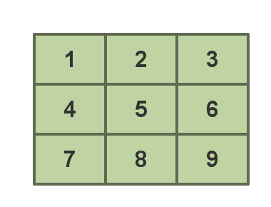

# 简单的贪心问题

## 方格取数


**例题**：有一个$$3 \times 3$$的方格，每个格子有一个正整数，要求从每行格子中取一个数，使得取出来的3个数字之和最大。





**分析:**
很简单,只要每一行取最大的数相加,最后的结构一定是最大.

这应该是最简单的贪心算法了,我们可以看到贪心算法的一个重要性质:**局部最优可以推出全局最优**,如果一个问题不具有这种性质,就不可以使用贪心算法来解决.


### 代码:


```c
/*============================================================================
* Title : 方格取数
* Author: Rainboy
* Time  : 2016-05-06 13:33
* update: 2016-05-06 13:33
* © Copyright 2016 Rainboy. All Rights Reserved.
*=============================================================================*/

#include <cstdio>

int max =-1;
int tmp;
int sum=0;

int main(){
    int i,j;
    int n,m;
    scanf("%d",&n,&m);

    for (i=1;i<=n;i++){
        max =-1;
        for (j=1;j<=m;j++){
            scanf("%d",&tmp);
            if(max < tmp)
                max=tmp;
        }
        sum+=max;
    }

    /* 输出结果 */
    printf("%d",sum);
    return 0;
}

```


## 最优装载问题

**(1).问题**

给n个物体，第i个物体重量为wi，选择尽量多的物体，使得总重量不超过C。

**(2).分析**

分析：由于只关心物体的数量，所以装重的没有装轻的划算。只需把所有物体按重量从小到大排序，依次选择每个物体，直到装不下为止。这就是一种典型的贪心算法，它只顾眼前，但却能得到最优解。

**(3).贪心策略:**

先拿轻的


## 部分背包问题


**(1).问题:**
有n个物体，第i个物体的重量为wi，价值为vi，在总重量不超过C的情况下让总价值尽量高。每一个物体可以只取走一部分，价值和重量按比例计算。

**(2).分析**
分析：由于每一个物体可以只装入一部分。因此，物体的价值/重量越大，装入的总价值就越大。这个局部的最优策略，能满足全局最优，可以用此贪心法解答。

**(3).贪心策略:**先拿性价比高的


## 乘船问题


**(1).问题:**
有n个人，第i个人重量为wi。每艘船的载重量均为C，最多乘两个人。用最少的船装载所有人。


**(2).分析**
分析：首先考虑最重的人i，他应该和谁一起坐呢？如果最轻的人都无法和他一起坐船，则唯一的方案就是他一个人坐一艘船。否则，他应该选择能和他一起坐船的人中最轻的一个j。这样的方法是贪心的，因此它只是让“眼前”的浪费最少。

**(3).贪心策略:**最轻的人和最重的人配对。
