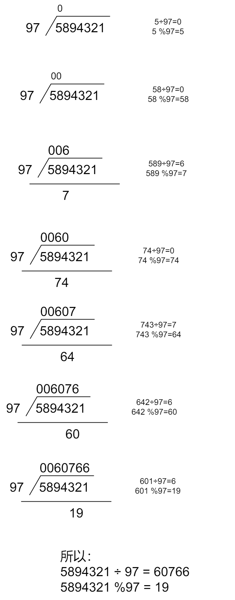

# 高精除

高精除要分为两个部分:

 - 高精除单精
 - 高精除高精

## 高精除单精

模拟除法竖式（其中除数直接用），复杂度$O(N)$

做除法时，每一次上商的值都在０～９，每次求得的余数连接以后的若干位得到新的被除数，继续做除法。因此，在做高精度除法时，要涉及到乘法运算和减法运算，还有移位处理。当然，为了程序简洁，可以避免高精度除法，用0～9次循环减法取代得到商的值。这里，我们讨论一下高精度数除以单精度数的结果，采取的方法是按位相除法

**原理图示:**



**核心思想:如果前面的余数是x,当前数是a[i],除数是b,那么**

 - **当前商是:$(x*10+a[i]) / b$**
 - **当前余数是:$(x*10+a[i]) \mod b$**

```c
    // 核心代码
    for (i=1;i<=len;i++){
        c[i] = (x*10+a[i]) / b;
        x  = (x*10 +a[i]) % b;
    }
```

数据:

```
5894321
97
```

```
60766
```

```c
#include <cstdio>
#include <cstring>

#define N 200

int a[N],b,c[N];
int len;
char stra[N];

int main(){
    int i,j,k;

    //读取数据
    scanf("%s",&stra[1]);
    scanf("%d",&b);
    len = strlen(&stra[1]); //长度

    //转换
    for (i=1;i<=len;i++){
        a[i] = stra[i] - '0';
    }

    int x=0; //余数 拼接
    // 核心代码
    for (i=1;i<=len;i++){
        c[i] = (x*10+a[i]) / b;
        x  = (x*10 +a[i]) % b;
    }

    int pos = 1;
    //去除前导0
    while( pos <= len && c[pos] == 0) pos++;

    //输出商
    for(i=pos;i<=len;i++)
        printf("%d",c[i]);
    printf("\n");
    return 0;
}
```

## 优化:万进制

存储高精度数的数组元素可以不仅仅只保留一个数字，而采取保留多位数,保留4位数,就是万进制

原理图解 todo
代码 todo


## 高精除高精

高精除以低精是对被除数的每一位（这里的“一位”包含前面的余数，以下都是如此）都除以除数，而高精除以高精则是**用减法模拟除法**，对被除数的每一位都减去除数，一直减到当前位置的数字（包含前面的余数）小于除数（由于每一位的数字小于10，所以对于每一位最多进行10次计算）

**图示原理:**


所以最后得到一个$6$位的高,$060766$,去掉前导$0$,最后得到:

  - **商为:**$60766$
  - **余数**:$19$

**输入数据:**
```
5894321
97
```

**输出数据:**

```
60766
```

**代码:**

```c
#include <cstdio>
#include <cstring>

#define N 300

int a[N],b[N],c[N];
int tmp[N];

/*  读取数字 */
void read(int a[]){
    char str[N];
    scanf("%s",&str[1]);
    int len = strlen(&str[1]);

    int i,j,k;
    for(i=1;i<=len;i++)
        a[i] = str[len-i+1] -'0';
    a[0] =len; //0 位记录位数
}

//比较大小 a>b 1,a==b 0 ,a<b -1
int compare(int a[],int b[]){
    if( a[0] > b[0])  return 1;
    if( a[0] < b[0]) return -1;

    // a[0] == b[0]
    int i,j,k;
    for(i=a[0];i>=1;i--){
        if( a[i] > b[i]) return 1;
        if( a[i] < b[i]) return -1;
    }
    return 0;
}

//减法
void jian(int a[],int b[]){
    int i,j,k;
    for (i=1;i<=a[0];i++){
        int t = (a[i+1]*10+a[i]) -b[i];
        a[i+1] = t /10;
        a[i] = t %10;
    }

    while( a[0] >=0 && a[ a[0] ] ==0) a[0]--; //去除前导0
}

//复制b到a 右对齐 到pos位
void numcpy(int a[],int b[],int pos){
    int i,j,k;
    for(i=b[0];i>=1;i--)
        a[pos--] = b[i];
}

//除法
void chu(int a[],int b[]){
    int i,j,k;
    int start = a[0];
    for(i=c[0];i>=1;i--){
        memset(tmp,0,sizeof(tmp));
        numcpy(tmp,b,start);
        tmp[0] = start--;
        while( compare(a,tmp) == 1) {
            c[i]++;
            jian(a,tmp);
        }
    }

    while(c[ c[0] ] ==0 && c[0] >=0) c[0]--;


}


int main(){
    read(a);
    read(b);

    c[0] = a[0]-b[0]+1; //记录商最长可能位数
    chu(a,b);
    int i,j,k;
    for(i=c[0];i>=1;i--)
        printf("%d",c[i]);
    printf("\n");
    return 0;
}
```
