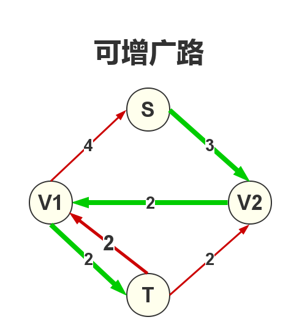

<p style="text-align: center;font-size:35px">网络流入门</p>

## 引用:一个题目

如下图,可以想像成一个输水网络,S是起点,T是终点.每一条边上有两个值(x,y),x表示这条边现在的流量,y表示这条边的最大流量.T结点现在接收的流量为4,问:T结点能接收的最大流量为多少?


最大为6!


## 入门学习

--------------

### 一些名词解释


 - V表示整个图中的所有结点的集合.
 - E表示整个图中所有边的集合.
 - G = (V,E) ,表示整个图.
 - s表示网络的源点,t表示网络的汇点.
 - 对于每条边(u,v),有一个容量c(u,v)   (c(u,v)>=0)
 - 如果c(u,v)=0，则表示(u,v)不存在于网络中。
 - 如果原网络中不存在边(u,v)，则令c(u,v)=0
 - 对于每条边(u,v),有一个流量f(u,v).

### 网络流的三个性质

 - 1、容量限制:$$f[u,v]<=c[u,v]$$
 - 2、反对称性:$$f[u,v] = - f[v,u]$$
 - 3、流量平衡:  对于不是源点也不是汇点的任意结点,流入该结点的流量和等于流出该结点的流量和。

结合反对称性,流量平衡也可以写成:

```math
\sum_{u\epsilon V} f(v,u)=0
```

只要满足这三个性质,就是一个合法的网络流,也称为可行流。可行流至少有一个零流。


### 弧的分类

若给定一个可行流$$F=(F_{ij})$$,我们把网络中$$F_{ij}=C_{ij}$$的弧称作饱和弧， $$F_{ij}<C_{ij}$$的弧称作非饱和弧， $$F_{ij}=0$$的弧称作零流弧,$$F_{ij}>0$$的弧称作非零流弧

若P是网络中联结源点s和汇点t的的一条路(不用管边的有向性)，我们定义路的方向是从Vs到Vt，则路上的弧被分为两类：一类与路的方向一致，称为前向弧；另一类和路的方向相反，称为后向弧


### 最大流问题


定义一个网络的流量(记为|f|)

```math
\left|f \right|=\sum_{v\epsilon V}f(s,v)
```

最大流问题，就是求在满足网络流性质的情况下，|f|的最大值。


### 残量网络

 - 为了更方便算法的实现，一般根据原网络定义一个残量网络。其中r(u,v)为残量网络的容量。
 - r(u,v) = c(u,v) – f(u,v)
 - 通俗地讲：就是对于某一条边（也称弧），还能再有多少流量经过。
 - Gf残量网络,Ef表示残量网络的边集.


### 增广路(可改进路)




## 练习题目


## Ford-Fullkerson 方法找最大流

1. 在**残量网络**中找到一条**增广路**,这条**增广路**上边的可以可以增加的最小流量:**可增广量**,记为flow
2. 在**实流网络**中沿可**增广路**增流
3. 在**残流网络**中沿可**增广路**减流(.将这条路径上的每一条有向边u->v的残量减去flow，同时对于起反向边v->u的残量加上flow)
4. 重复上面的过程,直到找不到**增广路**时,那么当前的**实流网络**就是最大流.

**为什么要连反向边**? 残量网络


## 低效的朴素算法

todo

**费用流**

 - 洛谷 P2488 [SDOI2011]工作安排
 - 洛谷 P2050 [NOI2012]美食节
 - 洛谷 [SCOI2007]修车


## 其它

最大流算法
sap
    isap
    gap优化isap
    
    dinic
    dinic 当前弧优化

http://www.aiuxian.com/article/p-1041515.html


最大流算法的选择：Dinic还是SAP？
http://fanhq666.blog.163.com/blog/static/81943426201072554322479/

结论：学Dinic 代码量少,容易记忆！

Sap,Isap，知道就可以

=======

**经典的网络流24题**

| 问题编号 | 题目地址 | 问题名称            | 问题模型                | 转化模型       |
|----------|----------|---------------------|-------------------------|----------------|
| 1        | loj6000  | 飞行员配对方案问题  | 二分图最大匹配          | 网络最大流     |
| 2        | loj6001  | 太空飞行计划问题    | 最大权闭合图            | 网络最小割     |
| 3        | loj6002  | 最小路径覆盖问题    | 有向无环图最小路径覆盖  | 网络最大流     |
| 4        | loj6003  | 魔术球问题          | 有向无环图最小路径覆盖  | 网络最大流     |
| 5        | loj6004  | 圆桌问题            | 二分图多重匹配          | 网络最大流     |
| 6        | loj6005  | 最长递增子序列问题  | 最多不相交路径          | 网络最大流     |
| 7        | loj6006  | 试题库问题          | 二分图多重匹配          | 网络最大流     |
| 8        |          | 机器人路径规划问题  | (未解决),具说不是网络流 | 最小费用最大流 |
| 9        | loj6007  | 方格取数问题        | 二分图点权最大独立集    | 网络最小割     |
| 10       | loj6008  | 餐巾计划问题        | 线性规划网络优化        | 最小费用最大流 |
| 11       | loj6009  | 航空路线问题        | 最长不相交路径          | 最小费用最大流 |
| 12       | loj6010  | 软件补丁问题        | 最小转移代价            | 最短路径       |
| 13       | loj6011  | 星际转移问题        | 网络判定                | 网络最大流     |
| 14       | loj6012  | 孤岛营救问题        | 分层图最短路径          | 最短路径       |
| 15       | loj6013  | 汽车加油行驶问题    | 分层图最短路径          | 最短路径       |
| 16       | loj6014  | 数字梯形问题        | 最大权不相交路径        | 最小费用最大流 |
| 17       | loj6015  | 运输问题            | 网络费用流量            | 最小费用最大流 |
| 18       | loj6121  | 分配问题            | 二分图最佳匹配          | 最小费用最大流 |
| 19       | loj6122  | 负载平衡问题        | 最小代价供求            | 最小费用最大流 |
| 20       | loj6223  | 深海机器人问题      | 线性规划网络优化        | 最小费用最大流 |
| 21       | loj6224  | 最长k可重区间集问题 | 最大权不相交路径        | 最小费用最大流 |
| 22       | loj6225  | 最长k可重线段集问题 | 最大权不相交路径        | 最小费用最大流 |
| 23       | loj6226  | 火星探险问题        | 线性规划网络优化        | 最小费用最大流 |
| 24       | loj6227  | 骑士共存问题        | 二分图最大独立集        | 网络最小割     |

## 引用/参考

 - [ 网络流 学习笔记：一次理解网络流！](https://blog.csdn.net/A_Comme_Amour/article/details/79356220)
