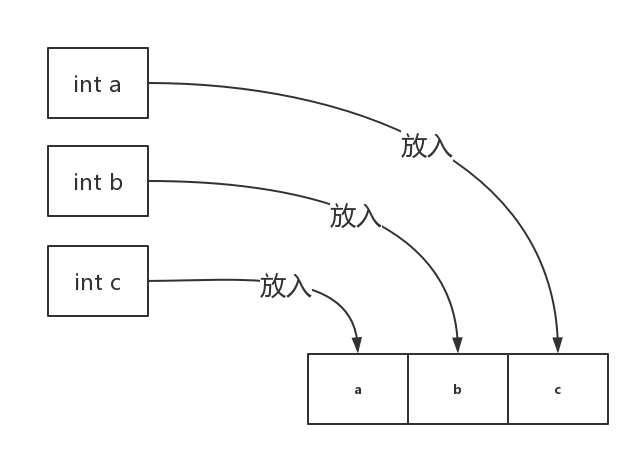

## 容器

vector是我们学习的第一容器**容器**,我们要通过**vector**了解一下**容器**概念。

**容器：**见名思意，就是一个放**东西**的器具，只不过这个**东西**是**数据**，想一想我们学过的**数据类型**有：

 - int
 - bool
 - char
 - double,float
 - struct 结构体
 - class 类类型

如下图：


一个容器只能放同一种类型的**东西（数据）**。

这种形象化的概念可以适用我们下面要学习的：

 - vector
 - deque
 - list
 - 容器适配器
    - stack
    - queue
    - priority_queue
 - map
 - set

只不过每一种类型的容器放**东西**的规则不一样，容器存放**东西**后样子不一样


## vector 容器

特点如图：




发现有以下的特点：

 - 在后面添加数据
 - 长度(或者说大小)是变化的
 - 可以使用下标读与写数据


**vector**又名**动态数组**：我们可以像数组一样通过下标来取值，但是**vector**不像数组一样大小是固定的


 **注意：**vector在末尾的操作是很快的，但是如果是在中间的操作是很慢的

## vector的定义与使用


vector的定义与初始化

| 操作                       | 含义                                                                   |
|----------------------------|------------------------------------------------------------------------|
| `vector<T> c;`             | 定义一个空的vector容器                                                 |
| `vector<T> c1(c);`         | 用容器c 初始化 c1                                                      |
| `vector<T> c2(n);`         | 定义一个容器C2,有n个值,默认的值和T的类型有关系,如果是类,由构造函数决定 |
| `vector<T> c3(n,e);`       | 定义容器c3,有n个值,初值是e                                             |
| `vector<T> c4(begin,end);` | 由迭代器[begin,end) 指向的范围内的值来初始化, 可以是数组的指针         |
| `c.~vector<T>();`          | 销毁容器c,释放空间                                                     |


使用`vector`

```c
#include <iostream>
#include <vector>
using namespace std;

struct _s{
    int a,b;
};

int main(){
    vector<int> c; //空的容器
    vector<_s> ccc; //空的容器,数据结构

    vector<int> c2(10);//10个元素,每个元素为0

    vector<int> c3(c2);//用c2来初始化c3

    vector<int> c4(10,111);//10个元素,每个都是111
    int i;
    for(i=0;i<c4.size();i++)
        cout << c4[i] << " ";
    cout << endl;

    vector<int> c5(c4.begin(),c4.end());
    for(i=0;i<c5.size();i++)
        cout << c5[i] << " ";
    cout << endl;

    //使用结构体
    _s ss;
    ss = {1,2};//结构体可以这样赋值
    vector<_s> s1(10);
    vector<_s> s2(10,{1,2});
    cout << s2[1].a << endl;
    cout << s2[1].b << endl;

    vector<_s> s3(10,{1});
    cout << s3[1].a << endl;
    cout << s3[1].b << endl;

    return 0;
}
```


可以使用数组来完成初始化

```c++
#include <iostream>
#include <string>
#include <bitset>
#include <vector>
using namespace std;

int a[] = {1,2,3,4,5};
int main(){

    //使用数组初始化
    vector<int> a_(a,a+5);//[) 左闭右开
    vector<int>::size_type i;
    for(i=0;i<a_.size();i++)
        cout << a_[i] << endl;
    return 0;
}
```


## vector操作

```
vector<T> c;//定义，声明
vector<T>::size_type k;//用以保存任意string对象或vector对象的长度,unsigned int
vector<T>::iterator iter;//迭代器(和指针的含义差不多)

|----------------------+----------------------------------------------------|
| 操作                 | 作用                                               |
|----------------------+----------------------------------------------------|
| c.size();            | 容器c的大小                                        |
| c.empty();           | 容器c是否为空                                      |
| c[]                  | 用下标来操作元素,不进行越界检查                    |
| c.at(id)             | 返回下标id的引用,进行越界检查                      |
| c.front()            | 返回第一个元素的引用                               |
| c.back()             | 返回最后一个元素的引用                             |
| c.max_size()         | 返回容器的最大数据容量                             |
|----------------------+----------------------------------------------------|
| 删除操作             |                                                    |
|----------------------+----------------------------------------------------|
| c.erase(pos)         | 删除pos位置的数据,返回下一个数据的位置             |
| c.erase(begin,end)   | 删除[begin,end)之决的数据,返回下一个数据的位置     |
| c.pop_back()         | 删除最后一个元素,不会返回元素的引用                |
| c.clear()            |清除所有的元素|
| c.resize(num)           |将元素数量改为num（增加的元素用defalut构造函数产生，多余的元素被删除）|
| c.resize(num,e)        |将元素数量改为num（增加的元素是e的副本）
|----------------------+----------------------------------------------------|
| 添加数据             |                                                    |
|----------------------+----------------------------------------------------|
| c.push_back(i)       | 在容器后部加入一个元素                             |
| c.inser(pos,e)       | 在pos位置插入e的拷贝,返回新数据的位置              |
| c.inser(pos,n,e)     | 在pos位置插入n个e,无返回值                         |
| c.inser(pos,end,end) | 在pos位置插入[begin,end)的里的值,无返回值          |
|----------------------+----------------------------------------------------|
| 迭代器               |                                                    |
|----------------------+----------------------------------------------------|
| c.begin()            | 指向第一个元素的迭代器                             |
| c.end()              | 指向最后一个元素后面一个位置的迭代器               |
| c.rebegin()          | 指向反向的第一个数据                               |
| c.rend()             | 指向反向的最后一个数据的后面                       |
|----------------------+----------------------------------------------------|
| 其它操作             |                                                    |
|----------------------+----------------------------------------------------|
| c.swap(c2)           | c ,c2交换                                          |
| swap(c,c2)           | c,c2交换                                           |
| c.reserve()          | 保留适当的容量                                     |
| >,>=,<,<=,==         | 逻辑运算                                           |
| c =  c2              | 赋值运算                                           |
|----------------------+----------------------------------------------------|
| 特殊的操作           |                                                    |
|----------------------+----------------------------------------------------|
| capacity             | 获取容器需要分配更多存储空间之前能夠存储的元素数量 |
| reserve              | 应该预留多少个元素的存储空间                       |
|----------------------+----------------------------------------------------|

```

vector模拟动态数组

 - vector的元素可以是任意类型T，但必须具备赋值和拷贝能力（具有public拷贝构造函数和重载的赋值操作符）
 - 必须包含的头文件`#include <vector>`
 - vector支持随机存取
 - vector的大小（size）和容量（capacity）
 - size返回实际元素个数，
 - capacity返回vector能容纳的元素最大数量。如果插入元素时，元素个数超过capacity，需要重新配置内部存储器。


`c.rebegin()`的操作：`c.rbegin()++` 向第一个元素靠近 
`c.resiee()` 返回元素的大小

`vector::size_type`
`vector::iterator`


## 向vector添加数据


```c
#include <iostream>
#include <vector>
using namespace std;

vector<int> v1;

int main(){
    int i;
    for(i=0;i<10000;i++)
        v1.push_back(i);

    cout << "v1.size():" << v1.size() << endl;
    cout << "v1[0]:" << v1[0] << endl;

    cout << "v1.front():" << v1.front() << endl;
    cout << "v1.back():" << v1.back() << endl;

    //下标操作
    v1[0] = 1111;
    cout << "v1.front():" << v1.front() << endl;

    return 0;
}

```

## 访问vector中的数据


```c
#include <iostream>
#include <vector>
using namespace std;

vector<int> v1;

int main(){
    int i;
    for(i=0;i<10;i++)
        v1.push_back(i);

    //使用下标操作
    for(i=0;i<v1.size();i++)
        cout<< v1[i] << " ";
    cout << endl;

    //使用 迭代器
    vector<int>::iterator iter;
    for( iter = v1.begin(); iter != v1.end();iter++)
        cout << *iter << " ";
    cout << endl;
    return 0;
}
```

## 删除vector中的数据


```c
#include <iostream>
#include <vector>
using namespace std;

vector<int> v1;


void print(vector<int> v){

    vector<int>::iterator iter;
    for(iter = v.begin();iter != v.end();iter++)
        cout << *iter <<" ";
    cout << endl;

}

int main(){
    int i;
    for(i=0;i<10;i++)
        v1.push_back(i);

    //删除某个位置的数据
    //后面的数据依次往前移动
    //这样当然慢了,想想数组
    print(v1);
    v1.erase(v1.begin()+1);
    print(v1);

    //删除末尾的数据,很快
    v1.pop_back();
    print(v1);

    //删除一段区间的值
    //同样慢
    v1.erase(v1.begin()+1,v1.end()-1);
    print(v1);

    return 0;

}
```

任何

## vector 存复杂的数据

`vector`是一种**容器**,你可以把它理解成链形的容器,在尾部的操作很快.那么这个容器可以什么样的数据就由你来指定,哪怕是很复杂的数据.

## vector 实现临接表


数据

```
5 7
1 2 2
1 3 4
1 4 7
2 3 1
3 4 1
2 5 2
3 5 6
```

代码

```c
#include <iostream>
#include <vector>
using namespace std;

#define N 100

//vector 模拟实现 邻接表
struct node {
    int tail;
    int w;
};

typedef vector<node> VNODE;

vector<VNODE> head(N);
//vector< vector<node> > head(N); //这样写也可以

int main(){
    int n,m;
    cin >> n >> m;//读入
    int s,t,w;
    int i;
    for(i=1;i<=m;i++){
        cin >> s >> t >>w;
        node tmp = {t,w};
        head[s].push_back(tmp);
    }

    //输出测试
    for(i=1;i<=n;i++){
        cout << "head[i] length: " << head[i].size() << endl;
        int j;
        for(j=0;j<head[i].size();j++)
            cout << head[i][j].tail<< " ";
        cout << endl;
    }
    return 0;
}
```

**简化版：**

数据：

```
3
1 2
1 3
2 3
```

```c
#include <iostream>
#include <vector>
using namespace std;

vector<vector<int> > head(100);

int main(){
	int m,i;
	cin >> m;
	for(i=1;i<=m;i++){
		int x,y;
		cin >> x >>y;
		head[x].push_back(y);
		head[y].push_back(x);
	}
	return 0;
}
```
