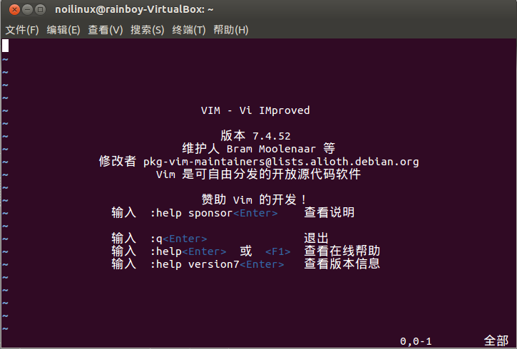
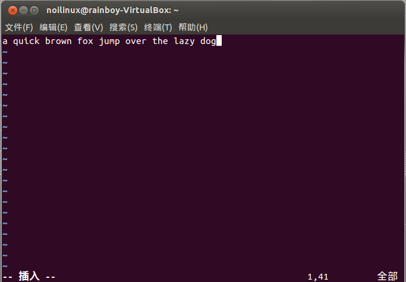
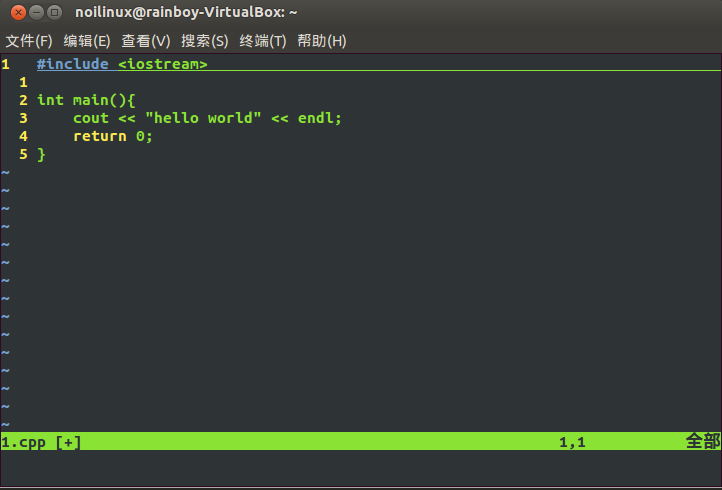
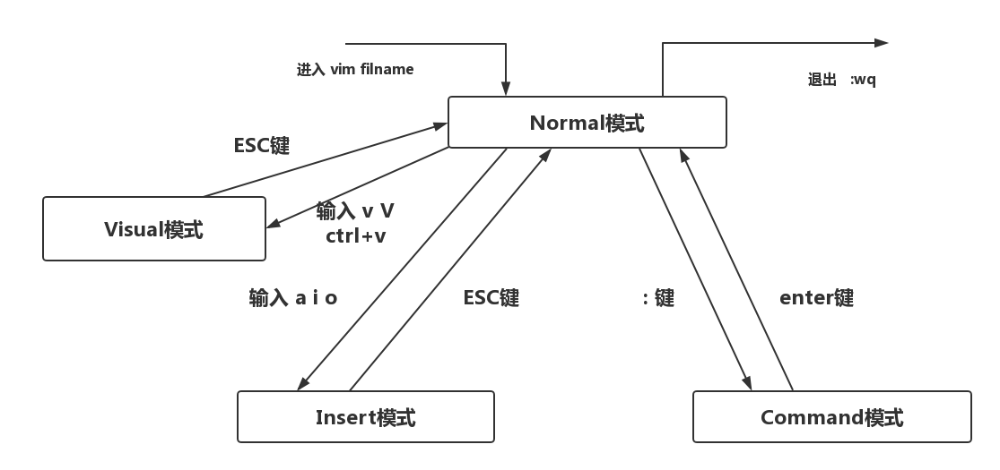

# vim简单介绍与入门

## 资源

 - Vim 官网 http://www.vim.org/
 - Vim简明教程 http://blog.csdn.net/niushuai666/article/details/7275406
 - Vim大冒险游戏 http://vim-adventures.com/
    - Vim大冒险游戏**攻略** http://blog.jobbole.com/18337/
 - vim游戏 https://github.com/jmoon018/PacVim

## 简单介绍

## 安装

### linux

linux下默认安装vim,`ctrl+alt+t`打开终端后输入`vim`命令后,即可打开.


#### 安装vim配置文件过程：

vim配置地址: [https://rainboylvx.github.io/simple-vim-config/](https://rainboylvx.github.io/simple-vim-config/)

方法一:

```
 - 打开浏览器,输入地址https://rainboylvx.github.io/simple-vim-config/,全部复制
 - ctrl+alt+t 打开终端
 - 在家目录下(~目录)下输入:vim .vimrc
 - 输入i 进入插入模式
 - ctrl+shift+v 复制
 - 输入:wq 关闭保存
```

方法二:终端直接输入

```
curl -o ~/.vimrc https://raw.githubusercontent.com/Rainboylvx/simple-vim-config/master/vimrc
```

ps:Gvim需要手动安装,这里不作讲解.

### windows

我们不使用windows来打代码,所以我们也不讲解windows下的安装

## 简单使用

你安装好VIM之后,肯定想用它来输入什么东西.我们现在使用vim来输入一个cpp的`hello word`代码,来尝试一下.


### 起动vim

在ccf提供给的官方系统中(其时是ubuntu),用快捷键`ctrl+alt+t`打开终端.然后输入`vim`命令.

```sh
vim
```



### 输入代码

 - 你刚打开vim后,处在vim的`normal`模式下.(左下角有normal的字)(也可能没有)
 - 按i键进入insert模式(左下角有insert(--插入--)的字)
 - 现在就可以像记事本一样输入文字了
 - 如果要返回normal模式,按Esc键


插入模式



输入以下代码:

```c
#include <iostream>
using namespace std;

int main(){
    cout << "hello word!" << endl;
    return 0;
}
```




保存代码:

 - 按Esc键进入Normal模式
 - 输入`:w 1.cpp` 保存代码
 - 输入`:q`退出vim


## vim 模式

vim有四种基本模式:

 - 可视模式(visual mode)
 - 正常模式(normal mode)
 - 插入模式(insert mode)
 - 命令模式(command mode)

模式之间的关系如图:



## 视频:vim的安装与模式

```video
[vim](vim2-vim的安装与模式.mp4)
```

## 基础命令

| 操作 | 模式   | 含义                   |
|------|--------|------------------------|
| hjkl | normal | 移动,左下上右          |
| Esc  | normal | 进入normal模式         |
| v    | normal | 进入visual(可视)模式   |
| V    | normal | 进入v-line(行可视)模式 |
| c-v  | normal | 进入b-line(块可视)模式 |
| :    | normal | 进入命令模式           |
| i    | normal | 进入insert(插入)模式   |
| I    | normal | 行首附加(插入)         |
| R    | normal | 进入replace(替换)模式  |
| a    | normal | 光标后附加(插入)       |
| A    | normal | 行未附加(插入)         |
| y    | normal | 复制                   |
| d    | normal | 删除/剪切              |
| D    | normal | 删除到行未             |
| c    | normal | 修改                   |
| C    | normal | 修改到行未             |
| x    | normal | 删除一个字符           |
| p    | normal | 光标后粘贴             |
| P    | normal | 光标前粘贴             |
| J    | normal | 和下一行合并           |
| >    | normal | 缩进                   |
| <    | normal | 反缩进                 |
| .    | normal | 重复上一个命令         |
| u    | normal | 撤销                   |
| c-r  | normal | 反撤销                 |
| :w   | normal | 保存                   |
| :q   | normal | 退出                   |
| :xx  | normal | 跳转到xx行             |


上面你已经最简单地使用了vim,知道了insert和normal模式,现在我学一下vim的基本命令.


这些命令你要都自己尝试一遍

## 视频:基本命令.mp4

```video
[vim](vim3-基本命令.mp4)
```

