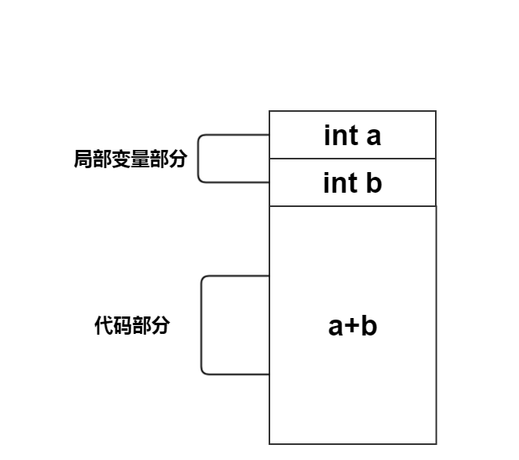
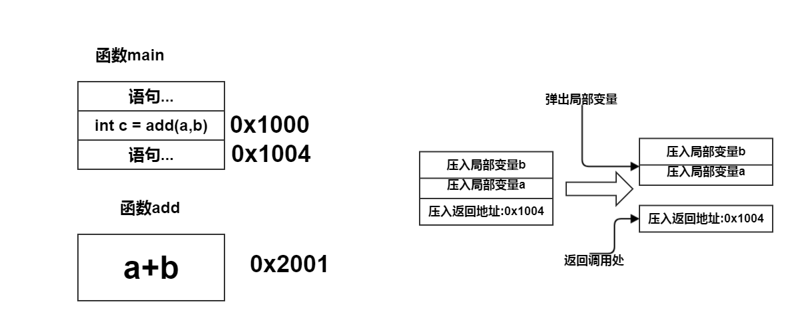

# 函数的理解

函数执行的过程到底是怎么样的呢?

## 函数运行的过程(模型)

函数为会可以被其它函数调用?函数在被调用的过程中发生了什么?函数在内存是如何存储的?

我们可以这样理解:函数本身其时分为两个部分:

 - 代码部分
 - 局部变量部分

我们知道所有的代码在运行的时候都是在内存中的,如果一个函数被调用(执行)多次,那么是不是有多个**代码部分**存在内存中呢?答案:不是,**代码部分**相当于数学上的公式,而**局部变量部分**相当于代入公式的起始变量,所以如果起始变量不同,面对同样的公式,结果不同.那么为了节省不必要的内存浪费,肯定一个函数**代码部分**在内存中只有一个,但**局部变量部分**有多个.每一次调用函数都会产生一个新的局部变量部分.


我们有如下函数,那么函数`add`是怎么样运行的呢?
```c
#include <cstdio>
int add(int a,int b){
   return a+b;
}

int main(){
   int a =1,b=2;
   int c =add(a,b);
   return 0;
}
```

**函数的内存样式**




**调用栈概念**




### 基于动画的讲解-视频

### 基于GDB的讲解-视频

### 段错误与栈溢出
