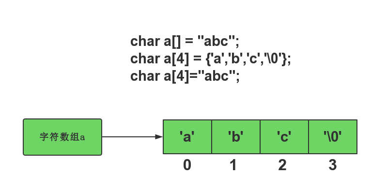

# C风格String

## 字符

我们已经学过**字符**类型和ASCII码表,看下面的代码

```c
#include <cstdio>
int main(){
    char ch;//定义一个字符类型
    ch = 'a';
    printf("%d\n",ch); // 按十进制输出
    printf("%d\n",'a'); // 按十进制输出
    printf("%d\n",int('a')); // 按十进制输出
    printf("%d\n",int('A')); // 按十进制输出
    printf("%d\n",'b'-'a'); //运算操作
    printf("%c\n",char(65)); // 整数类型强制转成字符

    return 0;
}
```

我们可以看到**字符**和**整数**有一定的关系(具体看变量-字符这一节)

## 视频:字符的含义

```video
[cpp](第十课 字符数组与字符串/10-2C风格字符串-字符的含义.mp4)
```

## 视频:存储字符串的一般方法

```video
[cpp](第十课 字符数组与字符串/10-3c风格字符串-存字符串的一般方式.mp4)
```

## 字符数组

根据我们以前学习的数组知识,看下面的代码

```c
#include <cstdio>

char s1[10] = {0}; //申请一个字符类型的数组

char s2[12] = {'h','e','l','l','o',' ','w','o','r','l','d','!'};

char s3[13] = {'h','e','l','l','o',' ','w','o','r','l','d','!','\0'};

char s4[] = "hello world!";
char s5[100] = {'h','e','l','l','o',' ','w','o','r','l','d','!','\0','h','e','l','l','o',' ','w','o','r','l','d','!'};
char s6[] = "hello world!\0hello world";
char s7[1000] = "hello world!\0hello world";


int main(){
    printf("%s\n",s1); //输出窄或者 乱码
    printf("%s\n",s2); // hello world 或者hello world+乱码
    printf("%s\n",s3); // hello world
    printf("%s\n",s4); // hello world 不指定数组长度
    printf("%s\n",s5); // hello world 中间有\0字符
    printf("%s\n",s6); // hello world 中间有\0字符
    printf("%s\n",s7); // hello world 指定长度

    printf("%d\n",sizeof(s4)/sizeof(s4[0]));
    return 0;
}
```

我们把由字符组成的数组称为**字符数组**.
**字符串**:字符的集合
**字符数组**就是C风格的字符串.

通过上面我们,加上我们学过的数组知识,字符数组有两种初始化方法:

 - 定义时使用`{}`符号来初始化
 - 定义时使用`"xxxx"`来初始化,其中`xxxx`代表字符
   - 会给字符数组的最后自动添加`\0`字符
   - 不指定长度`char a[]="xxx"`,那么初始化后,数组a的大小就是`"xxx"`的长度+1(因为自动添加`\0`)
   - 指定长度`char a[100]="xxx"`,那么a的前四个元素是`xxx\0`,后面的未知
 - `\0`是一个特殊字符,代码字符串结束,哪怕数组后面里还有内容,也不会输出



## 字符串操作

在c风格的字符串,如果我们想对字符串进行某些操作,如:比较,复制,拼接,得到长度等.我们基本上要使用标准库提供给我们的函数来完成这此操作.

### 得到字符串长度

```
> 函数:**int strlen(char a[])**
> 头文件:`<cstring>`
> 参数: 字符数组名
> 返回值:字符数组的长度,整型
```


样例代码:

```c
#include <cstdio>
#include <cstring>


char s3[13] = {'h','e','l','l','o',' ','w','o','r','l','d','!','\0'};
char s4[] = "hello world!";
char s6[] = "hello world!\0hello world";


int main(){
    printf("strlen(s3):%d\n",strlen(s3)); //12
    printf("strlen(s4):%d\n",strlen(s4)); //12
    printf("strlen(s6):%d\n",strlen(s6)); //12 想一想为什么
    return 0;
}
```


### 字符串比较

数组是不能比较的,所以c风格的字符串也是不能比较的.我们要使用strcmp函数

```
 > 函数:**bool strcmp(char a[],char b[])**
 > 头文件:`<cstring>`
 > 参数: 两个要比较大小的字符数组名
 > 返回值:bool型
 >      strcmp(s1,s2) 按字典比较s1,s2,如果s1<s2 输出负数,s1>s2输出正数,相等输出0
 > 函数:**bool strcmp(char a[],char b[],n)**
 > 把a,b的前n个进行比较
```

样列代码

```c
#include <cstdio>
#include <cstring>


char s3[13] = {'h','e','l','l','o',' ','w','o','r','l','d','!','\0'};
char s4[] = "hello world!";
char s6[] = "hello world!\0hello world";

char a[] = "abc";
char b[] = "bc";


int main(){
    printf("stcmp(s3,s4):%d\n",strcmp(s3,s4)); //0
    printf("strcmp(s4,s6):%d\n",strcmp(s4,s6)); //0
    printf("strcmp(a,b):%d\n",strcmp(a,b)); //-1 想一想为什么
    return 0;
}
```

### 字符串拼接

我们不能直接使用s1+s2,我们要用strcat函数

```
 > 函数:**char * strcat(char a[],char b[])**
 > 头文件:`<cstring>`
 > 参数: 两个字符数组名
 > 返回值:a的起始地址
 > 作用:将b复制到a字符串的后面,a要足够大,不然会错


 > 函数:**char * strcat(char a[],char b[],n)**
 > 头文件:`<cstring>`
 > 参数: 两个字符数组名
 > 返回值:a的起始地址
 > 作用:将b的前n个字符复制到a字符串的后面,a要足够大,不然会错
```

样列代码

```c
#include <cstdio>
#include <cstring>


char s3[13] = {'h','e','l','l','o',' ','w','o','r','l','d','!','\0'};
char s4[100] = "hello world!";
char s6[100] = "hello world!\0hello world";

char a[] = "abc";
char b[] = "bc";
char c[] = "abcd";


int main(){
   // printf("stcmp(s3,a):%d\n",strcat(s3,s4)); //wrong
    printf("strcat(s4,a):%s\n",strcat(s4,a));
    strcat(s6,a);
    printf("strcat(s6,a):%s\n",s6); //猜一猜输出什么
    strncat(s6,a,2);
    printf("strcat(s6,a):%s\n",s6); //猜一猜输出什么
    return 0;
}
```

## 赋值与拷贝

`s1 = s2,s1[]= s2`这样写都是错误的

```
 > 函数:**char * strcpy(char a[],char b[])**
 > 头文件:`<cstring>`
 > 参数: 两个字符数组名
 > 返回值:a的起始地址
 > 作用:将b的所有字符复制到a起始后面,a要足够大,不然会错


 > 函数:**char * strcpy(char a[],char b[],n)**
 > 头文件:`<cstring>`
 > 参数: 两个字符数组名
 > 返回值:a的起始地址
 > 作用:将b的前n个字符复制到a起始后面,a要足够大,不然会错,不会在末尾加'\0'
```

样列代码

```c
#include <cstdio>
#include <cstring>


char s3[13] = {'h','e','l','l','o',' ','w','o','r','l','d','!','\0'};
char s4[100] = "hello world!";
char s6[100] = "hello world!\0hello world";

char a[] = "abc";
char b[] = "bc";
char c[] = "abcd";


int main(){
    printf("strcpy(s4,a):%s\n",strcpy(s4,a));
    strcpy(s6,a);
    printf("strcpy(s6,a):%s\n",s6); //猜一猜输出什么
    strncpy(s6,a,2);
    printf("strcpy(s6,a):%s\n",s6); //猜一猜输出什么
    return 0;
}
```

