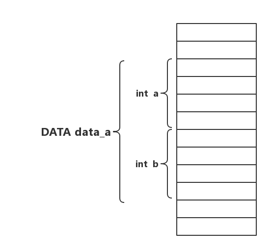

## 结构体引入

如果我们想录入一个班级学生(60人)的数学和语文成绩,那我们要定义两个数组:

```c
int shuXue[60];
int yuWen[60];
```

但是这个样定义,数据之间都是分开放置的,没有关联性,很容易就找错.能不能有一个数据类型可以**同时**存数学和语文成绩呢?

有,那就是数据结构:

```c
struct _student{
    int shuXue;
    int yuWen;
};

//声明变量
_student XueShen[60];
int i;

for(i =0;i<60;i++){ //存入成绩
    scanf("%d%d",&XueShen[i].shuXue,&XueShen[i].yuWen)
}
```

## 结构体定义

### 定义结构体的同时定义结构体变量

```c
struct 结构体名 { //struct 是关键字
    成员表        //可以有多个成员
    成员函数      //可以有多个成员函数,也可以没有
} 结构体变量表;   //可以同时定义多个变量
```

实例:

```c
#include <cstdio>

struct DATA {
    int a[2];
    int c;
}data_a,data_b;//定义多个变量时,用,号隔开

int main(){}
```

### 先定义结构体再定义结构体变量

```c
struct 结构体名 {
    成员表
    成员函数
};
结构体名 结构体变量表;
```

实例:

```c
#include <cstdio>

struct DATA {
    int a[2];
    int c;
};
DATA data_a,data_b;//定义多个变量时,用,号隔开

int main(){}
```

## 结构体变量内存模型

我们如下定义一个结构体变量`data_a`,那它在内存中是什么样子的呢?

```c
struct DATA {
    int a;
    int b;
}data_a;
```

内存中的样式:



## 结构体成员调用

使用`.`操作符来访问内部成员.

结构体成员的操作和该成员的类型所具有的操作是一致的.

```c
#include <cstdio>
struct DATA {
    int a
    int b;
}data_a;

int main(){
    scanf("%d",&data_a.a); //读入
    data_a.b = 111; //赋值
    int x = data_a.a +data_b.b;
    printf("%d\n",x);
    return 0;
}
```

## 结构体操作实例

输入一些学生的信息,然所按从总成绩从小到大输出每个学生的信息.

### [输入数据]

```
2
Tom m 18 100
Jerry m 18 90
```
### [输出数据]

```
Jerry m 18 90
Tom m 18 100
```

其中m代码`male`,f代表`female`


### 解题代码

```c
#include <cstdio>

struct _stu { //定义结构体
    char name[10];
    char sex;
    int age;
    int score;
}student[1000];

void qsort(int l,int r){
    if( l < r){
        int i =l,j=r;
        _stu key = student[l];
        while(i < j ){
            while(i<j && student[j].score >=  key.score) j--;
            if(i < j ) student[i++] = student[j];
            while(i < j && student[i].score <= key.score) i++;
            if(i < j ) student[j--] = student[i];
        }
        student[i] = key;
        qsort(l,i-1);
        qsort(i+1,r);
    }
}

int main(){
    int n;
    int i;
    scanf("%d",&n);
    for(i=1;i<=n;i++){ //读入
        scanf("%s",student[i].name);
        scanf(" %c ",&student[i].sex);
        scanf("%d",&student[i].age);
        scanf("%d",&student[i].score);
    }
    qsort(1,n);
    for(i=1;i<=n;i++){//输出
        printf("%s",student[i].name);
        printf(" %c ",student[i].sex);
        printf("%d ",student[i].age);
        printf("%d \n",student[i].score);
    }
    return 0;
}
```
