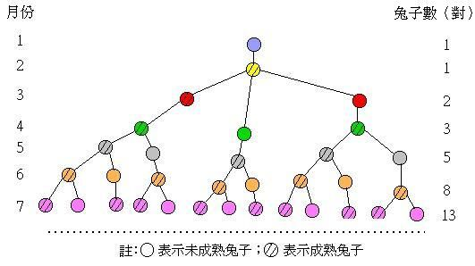
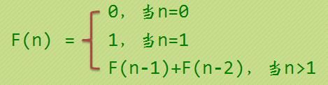

# 斐波那契数列

## 问题

 - 第一个月有一对兔子
 - 第二个月后(第三个月初)它们可以生育一对兔子
 - 以后每个月可以生育的兔子都可以生育一对兔子
 - 兔子不会死去
 - 问每n个月有多少对兔子




或者这样说: 有一组数列$a[i]$,其中$a[0] = 0,a[1] = 1$,$a[i] = a[i-1] + a[i-2]$,问$a[k]$是多少?





```c
#include <cstdio>

int fab(int n){
    if( n == 1 || n == 2)
        return 1;
    return fab(n-1) + fab(n-2);
}

int main(){
    int n;
    scanf("%d",&n);
    int ans = fab(n);
    printf("%d\n",ans);
    return 0;
}

```


## 拓展

- http://v.youku.com/v_show/id_XMTgwNTIwMTI4.html
- https://www.zhihu.com/question/28062458


## 题目

 - [骨牌覆盖](https://www.cnblogs.com/tjsudys/p/4427861.html)
