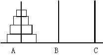
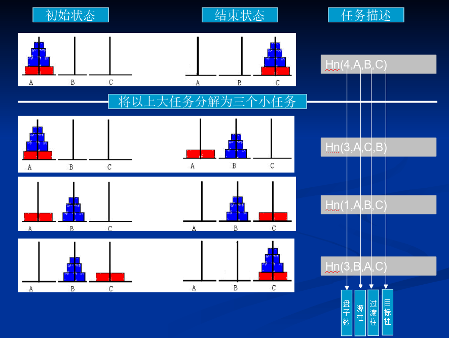

## 题目描述

汉诺塔（tower of Hanoi）问题。有n个大小不等的中空圆盘，按照从小到大的顺序迭套在立柱A上，另有两根立柱B和C。现要求把全部圆盘从A柱移到C柱的过程，移动过程中可借助B柱（中间柱）。

移动时有如下的要求：

 - ①一次只移动一个盘；
 - ②不允许把大盘放在小盘上边；
 - ③可使用任意一根立柱暂存圆盘 

如输入  2

输出

```
    A-->B
    A-->C
    B-->C
```



## 解析




## 代码

```c
#include <cstdio>

int n; //有几层

// 层数 源  辅助 目的
void hnt(int x,char a,char b,char c){
    if(x == 1) {
        printf("%c --> %c\n",a,c);
        return ;
    }
    hnt(x-1,a,c,b);
    printf("%c --> %c\n",a,c);
    hnt(x-1,b,a,c);
}

int main(){
    scanf("%d",&n);
    hnt(n,'a','b','c');
    return 0;
}
```
