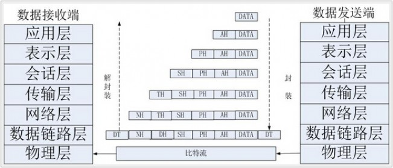

# 初赛知识点

## 计算机编码

## 进制转换


## 小数的进制转换

十进制的小数转换为二进制，主要是小数部分乘以2，取整数部分依次从左往右放在小数点后，直至小数点后为0。例如十进制的0.125，要转换为二进制的小数。

 - $$0.125 \times 2 = 0.25$$ 取$$0$$
 - $$0.25 \times 2 = 0.5$$ 取$$0$$
 - $$0.25 \times 2 = 1 $$ 取$$1$$
 - 即为$$0.001$$(二进制)

进行二进制到十进制的转换

```math
0.001 = 0 \times 2^{-1} + 0 \times 2^{-2} + 1 \times 2^{-3} = 0.125
```


## 前后缀表达式

## P类问题和NP类问题

P就是能在多项式时间内解决的问题，NP就是能在多项式时间验证答案正确与否的问题。
P是否等于NP实质上就是在问，如果对于一个问题我能在多项式时间内验证其答案的正确性，那么我是否能在多项式时间内解决它？这个表述不太严谨，但通俗来讲就是如此。

再说说NP-hardness和NP-completenes. 这里涉及一个概念，不妨称为问题之间的归约。可以认为各个问题的难度是不同的，表现形式为，如果我可以把问题A中的一个实例转化为问题B中的一个实例，然后通过解决问题B间接解决问题A，那么就认为B比A更难。通过对归约过程做出限制可以得到不同类型的归约。复杂度理论里经常用到的规约叫polynomial-time Karp' reduction。其要求是转化问题的过程必须是多项式时间内可计算的。到这为止NP-hardness和NP-completeness就很好理解了。称问题L是NP-hard，如果任意一个NP的问题都可以多项式规约到L。如果一个NP-hard的问题L本身就是NP的，则称L是NP-complete。这个定义可以推广到所有复杂度类。所以compleness的直观解释就是，我能解决这个问题就相当于具备了用相同级别的计算资源解决这个复杂度类里所有问题的能力

最简单的解释：
P：算起来很快的问题
NP：算起来不一定快，但对于任何答案我们都可以快速的验证这个答案对不对
NP-hard：比所有的NP问题都难的问题
NP-complete：满足两点：

  1. 是NP hard的问题
  2. 是NP问题

## 常用协义

| 名字 | 英文                             | 中文             | 作用                                                                                                                                                                |
|------|----------------------------------|------------------|---------------------------------------------------------------------------------------------------------------------------------------------------------------------|
| http | HyperText Transfer Protocol      | 超文本传输协义   | 通常在浏览网页时用                                                                                                                                                  |
| pop3 | Post Office Protocol - Version 3 | 邮局协议版本3    | 它规定怎样将个人计算机连接到Internet的邮件服务器和下载电子邮件的电子协议                                                                                            |
| ip   |                                  |                  | 是用于将多个包交换网络连接起来的，它在源地址和目的地址之间传送一种称之为数据包的东西，它还提供对数据大小的重新组装功能，以适应不同网络对包大小的要求。,运行在网络层 |
| tcp  | Transmission Control Protocol    | 传输控制协议     | 是一种面向连接(连接导向)的、可靠的、 基于IP的传输层协议                                                                                                             |
| udp  | User Datagram Protocol           | 用户数据报协议   | osi 参考模型中一种无连接的传输层协议，提供面向事务的简单不可靠信息传送服务                                                                                          |
| smtp | Simple Mail Transfer Protocol    | 简单邮件传输协议 | 帮助每台计算机在发送或中转信件时找到下一个目的地                                                                                                                    |
| ftp  | File Transfer Protocol           | 文件传输协议     | 应用层                                                                                                                                                              |

## OSI七层网络模型




## 资料

 - [ NOIP 提高组 初赛 三、问题求解 习题集（四）NOIP2010-NOIP2015](http://blog.csdn.net/mrcrack/article/details/53759826)
